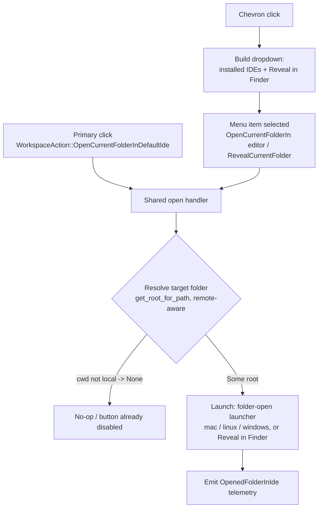

# Open Folder in IDE - Plan

## Goal Capsule

- **Objective:** Add a split-button to Warp's top-right toolbar (next to Settings) that opens the current folder in an external IDE (VS Code, Zed, Cursor, …) or Finder, Supacode-style.
- **Product authority:** Vinh Nguyen (this brainstorm).
- **Depth:** Standard. **Platforms:** macOS, Linux, Windows.
- **Open blockers:** None. Both prior open questions resolved during planning (see Planning Contract).

**Product Contract preservation:** changed — dropdown contents: "Open with…" (OS app picker) **deferred to follow-up** (per-platform feasibility uneven for folders; user decision at plan time). All other Product Contract content unchanged.

---

## Product Contract

### Problem & context

Users working in a repo inside Warp have no one-click way to open that folder in their editor. Today the external-editor subsystem (`app/src/util/file/external_editor/`) opens **files** only — the launcher gates on `full_path.is_file()` (`app/src/util/file/external_editor/mac.rs:332`, `linux.rs:333`, `windows.rs:217`) — so there is no folder-open path and no toolbar affordance. This feature closes that gap by reusing the existing cross-platform editor machinery.

### Primary actor & outcome

- **Actor:** Warp desktop user with one or more repos/folders open in tabs.
- **Outcome:** From a single toolbar control, open the active tab's project folder in their preferred IDE (one click), or pick another installed IDE / Finder from a dropdown.

### Requirements

- **R1** — A split-button renders in the top-right toolbar, adjacent to the Settings control, gated behind a feature flag.
- **R2** — Primary click opens the resolved target folder in the "Default folder IDE".
- **R3** — Chevron opens a dropdown listing installed IDEs + Reveal in Finder/Explorer; selecting an entry opens the target folder there.
- **R4** — Target folder = deepest-ancestor repo root of the active tab's cwd; if under no known repo, the cwd itself.
- **R5** — The button is disabled when the active session cwd is not local (remote/SSH).
- **R6** — "Default folder IDE" is a new, local-only setting, user-managed via a Settings control (the toolbar dropdown opens one-off and never rewrites it — fixed default, not last-used); first-run seed = the user's file editor if it is an IDE, else the first installed IDE.
- **R7** — Folder-open works on macOS, Linux, Windows.
- **R8** — An open action emits a telemetry event (which app, primary vs dropdown).

### Scope Boundaries

**In scope:** R1–R8 above; reuse of `CompactibleSplitActionButton`, `SUPPORTED_EDITORS`/`Editor::is_installed`, `open_file_path_in_explorer`, `repo_mode_tab_partition`.

**Deferred to Follow-Up Work:**
- "Open with…" OS app-picker entry in the dropdown (per-platform feasibility uneven for folders; revisit after core ships).
- ~~Per-IDE brand icons for the primary button, if not already present in the icon set (start with a generic editor icon + IDE-naming tooltip).~~ *Amended 2026-07-28: pulled into scope and shipped. Eight bundled marks under `app/assets/bundled/svg/editor_logos/`, `Editor::logo_asset()`, and image-icon plumbing through `ActionButton` / `CompactibleActionButton` / `CompactibleSplitActionButton`; the marks appear on both the primary button and every dropdown row. Reason for the reversal: with a generic glyph, the primary button gave no indication of which IDE it would launch until hover, which made the whole default-editor setting invisible. Two costs to record. (1) A new `crates/warp_assets/build.rs` was needed so `rust_embed` re-runs when a bundled asset changes — a genuine upstream-infrastructure change, worth upstreaming on its own. (2) The marks are Simple Icons monochrome brand glyphs with hardcoded fills, rendered un-tinted, so they are not theme-aware and the darker ones are low-contrast on dark themes; calling them "full-color logos" in code overstates them.*
- Pinning multiple IDEs directly onto the toolbar.
- User-configurable dropdown ordering.

**Out of scope (non-goals):**
- Changing how existing **file** links open.
- Opening multiple folders / multi-root workspaces at once.

### Success criteria

- One click on the primary opens the resolved target folder in the default IDE on all three platforms.
- Dropdown lists exactly the installed IDEs + Reveal in Finder/Explorer, each launching the same target folder.
- Button disabled (not hidden) for remote-cwd sessions.
- Nothing renders when the feature flag is off.

---

## Planning Contract

### Resolved open questions

- **Toolbar injection point** — Add the button inside `add_configurable_right_side_tab_bar_controls` (`app/src/workspace/view.rs:21261`) as a `target.add_child(...)` sibling immediately before the Settings button (`app/src/workspace/view.rs:21328`; `render_settings_button` at `:21757`). Two call sites feed this function (`:20942`, `:21120`).
- **Setting sync scope** — Local-only. The existing IDE-choice settings `open_file_editor` / `open_code_panels_file_editor` are `SyncToCloud::Never` (`app/src/util/file/external_editor/settings.rs:76`, `:88`) because a named app may not exist on another machine. Mirror that for "Default folder IDE".

### Key Technical Decisions

- **KTD1 — Reuse, don't invent.** Split-button = `CompactibleSplitActionButton` with a separate `Menu` view toggled by the chevron `menu_action` and anchored via a shared save-position id. Mirror the concrete pattern at `app/src/ai/blocklist/inline_action/run_agents_card_view.rs:339` (construction), `:353` (menu view + subscription), `:1049` (item build on toggle), `:1145` (positioning).
- **KTD2 — Folder support needs a launch-method switch, not just a gate relaxation.** Relaxing `if full_path.is_file()` to accept `is_dir()` (`mac.rs:332`, `linux.rs:333`, `windows.rs:217`) is necessary but **insufficient** for the URL-scheme editors. VS Code / VSCode Insiders / Cursor / Windsurf launch via `<scheme>://file<path>`: on macOS that maps to plain `/usr/bin/open <scheme>://file<dir>` (`mac.rs:46`, the `AppUrl(None)` branch), not the `open -a <bundle>` branch (`mac.rs:48`); on Windows `Editor::command` returns `explorer.exe <scheme>://file/<dir>` for those three and `None` for every other editor (`windows.rs:164`) — there is no exe-launch path today. `<scheme>://file<dir>` folder behavior is version-dependent and unreliable. So directories must route through a real folder-launch: macOS via the `FromApplicationBundleInfo` / `AppUrl(Some(bundle))` branch (`open -a <bundle> <dir>`); Windows via a new exe launch using the registry `executable_path` (`windows.rs:22`, currently `#[allow(unused)]`); Linux `.desktop` `Exec` field-code expansion already handles a directory (`linux.rs:197`). Omit file-only args (JetBrains `--line`, line/column) for directories.
- **KTD3 — Shared open action, no sticky default.** Primary, every dropdown IDE entry, and Reveal funnel through one handler that (a) resolves the target folder, (b) checks local, (c) launches, (d) emits telemetry. It does **not** rewrite the default setting — a dropdown pick opens one-off; the default folder IDE is user-managed in Settings (U3). This honors the brainstorm's **fixed-default-from-Settings** decision (last-used was explicitly rejected). Reveal shares the handler minus the launcher step (no IDE).
- **KTD4 — Repo-root resolver + remote guard.** Resolve the active tab's folder from `active_session_view(ctx).canonical_session_pwd_if_local(ctx)` (`app/src/terminal/view.rs:7847`; call pattern `app/src/workspace/view.rs:5707`); `None` ⇒ remote/unknown ⇒ disabled button and no target. For `Some(cwd)`, resolve the deepest-ancestor repo root via `DetectedRepositories::get_root_for_path` (`crates/repo_metadata/src/repositories.rs:228`; wrapper used at `working_directories.rs:893`) — **not** `repo_mode_tab_partition`, which partitions tabs against a caller-supplied entry list and returns empty when `FeatureFlag::RepoMode` is off, so reusing it would couple this feature to RepoMode and silently open the cwd for any unregistered repo. *Amended 2026-07-28, two notes. (1) The shipped call is `get_root_for_canonical_path`, not `get_root_for_path`; both are cache-only ancestor walks with no I/O and the cwd is already canonical at that point, so this is a naming correction, not a behavior change — it applies everywhere this plan names `get_root_for_path`. (2) The R4 guarantee is weaker than stated, because `DetectedRepositories::repository_roots` is populated only from the async `BlockMetadataReceived` path. The common case is covered — the cwd comes from the same block metadata, so a tab with no metadata yet has no target and the button is simply disabled — but two gaps remain: detection is spawned inside `if let Some(prev) = active_block_metadata.take()`, so the very first metadata never triggers it, and `find_git_repo` stops at `$HOME`, so a repo rooted at or above `$HOME` (a dotfiles repo) is never registered and the button opens the raw cwd forever. The second is a pre-existing `repo_metadata` limitation, not introduced here.*
- **KTD5 — Primary icon & fallback state.** Use a generic editor/code `icons::Icon` glyph. When a default IDE is set, the tooltip names it and the primary opens it. When unset / no IDE installed, the primary **reveals in Finder** and the tooltip reads the OS reveal label ("Reveal in Finder / Explorer / file manager"). Per-IDE brand icons deferred (see Scope Boundaries) unless an `Icon` variant already exists. *Amended 2026-07-28: brand icons shipped instead of the generic glyph (see amended Scope Boundaries). The "unset ⇒ reveal in Finder" fallback is **specified but not reachable from the UI**: `folder_editor_dropdown_items` emits a row per installed editor and no "None" row, so a user with at least one IDE installed cannot clear the default, and `resolve_default_folder_editor_with_installed`'s `Warp | EnvEditor | SystemDefault => None` arm is dead from the UI. Worse, the arm for an explicitly-set-but-uninstalled editor falls through to the seed and silently substitutes the first entry in `SUPPORTED_EDITORS` rather than revealing in Finder, so uninstalling your chosen IDE quietly re-points the button at a different one. Both are defects against this KTD, tracked in the remediation plan; not amended away.*

### Sources & Research

Local repo only; external research skipped (machinery established in-repo). Grounding dossier corroborated by direct reads — see `file:line` pointers throughout.

---

## High-Level Technical Design

Click-to-launch flow (both entry points converge on the shared handler, KTD3):

Button enable/disable is computed at render time from the same local-cwd check, so a remote tab shows the control greyed rather than firing a no-op. The default folder IDE is managed in Settings (U3) — the handler never rewrites it.

---

## Implementation Units

### U1. Feature flag `OpenFolderInIde`

- **Goal:** Gate the entire feature behind a new flag, default off until promoted.
- **Requirements:** R1.
- **Dependencies:** none.
- **Files:** `crates/warp_features/src/lib.rs`, `app/src/features.rs`, the crate `Cargo.toml` declaring the `open_folder_in_ide` cargo feature.
- **Approach:** Mirror `FeatureFlag::RepoMode` exactly — declare the enum variant (`crates/warp_features/src/lib.rs:870` neighborhood) and register it in the compiled-in list gated by its cargo feature (`app/src/features.rs:448`). Runtime check is `FeatureFlag::OpenFolderInIde.is_enabled()`. The `add-feature-flag` skill automates the Cargo wiring.
- **Patterns to follow:** `FeatureFlag::RepoMode` declaration + registration.
- **Execution note:** Prefer using the `add-feature-flag` skill so the compile-time/runtime bridge and Cargo feature are wired consistently.
- **Test scenarios:** `Test expectation: none — pure flag wiring; behavior is exercised by the flag-gated render test in U6.`
- **Verification:** Project builds with the new cargo feature on and off; `FeatureFlag::OpenFolderInIde.is_enabled()` resolves per flag state.

### U2. Folder-open launcher capability

- **Goal:** Let the external-editor launchers accept a **directory** path, not just a file, on all three platforms.
- **Requirements:** R2, R3, R7.
- **Dependencies:** none.
- **Files:** `app/src/util/file/external_editor/mac.rs`, `app/src/util/file/external_editor/linux.rs`, `app/src/util/file/external_editor/windows.rs`, and their existing unit-test modules. Keep the `mod.rs` dispatch entry (`mod.rs:311`) — do **not** add a new public folder-specific entry point unless a directory genuinely needs a distinct signature.
- **Approach (KTD2):** Two changes per platform, not one. (1) Relax the `if full_path.is_file()` gate to also accept `is_dir()` at `mac.rs:332`, `linux.rs:333`, `windows.rs:217`. (2) Add a real directory-launch path, because the `<scheme>://file<dir>` URL is unreliable for folders: **macOS** — route directories through the `FromApplicationBundleInfo` / `AppUrl(Some(bundle))` branch (`open -a <bundle> <dir>`) instead of the `AppUrl(None)` plain-`open` URL path that VS Code / Cursor / Windsurf otherwise hit; **Windows** — author an exe launch from the registry `executable_path` (`windows.rs:22`), since `Editor::command` has no non-URL branch and returns `None` for non-VSCode/Cursor/Windsurf editors; **Linux** — reuse the `.desktop` `Exec` `%f/%F` substitution (`linux.rs:197`), which already accepts a directory. Omit line/column and JetBrains `--line` args for directories. On Linux, `get_app_for_file_from_mime` won't classify a dir — folder launch must come from the explicit editor (the new setting), never MIME inference.
- **Patterns to follow:** `Editor::open` / bundle-launch method (`mac.rs:48`, `:243`), `Editor::command` (`linux.rs:517`, `windows.rs:164`), field-code expansion `process_field_code` (`linux.rs:197`), registry `executable_path` (`windows.rs:22`).
- **Test scenarios:**
  - Happy path: given an installed IDE and an existing directory, the launcher builds the **folder-launch** command via the bundle/exe/`.desktop` path — NOT `<scheme>://file` — targeting that directory (assert command/args), per platform.
  - Edge: a URL-scheme editor (VS Code, Cursor, Windsurf) opens a directory through the bundle (mac) / exe (windows) path, not `<scheme>://file<dir>`.
  - Edge: a path that is neither file nor dir (deleted) → launcher does not construct a command; falls through to `ctx.open_file_path`.
  - Edge: directory launch omits line/column and `--line` args that only apply to files.
  - Error: requested editor not installed → no command built (windows already filters via `is_installed`; assert mac/linux behave equivalently for the folder path).
- **Verification:** Unit tests pass on each platform's launcher module; a real directory opens in the chosen IDE at the folder root (not a stray file), including for a URL-scheme editor.

### U3. "Default folder IDE" setting

- **Goal:** Add a new, local-only setting naming the IDE the primary button opens folders in, plus the Settings-page control to manage it, with a sensible first-run seed.
- **Requirements:** R6.
- **Dependencies:** none.
- **Files:** `app/src/util/file/external_editor/settings.rs`; `app/src/settings_view/features/external_editor.rs` (the GUI control); and their test modules.
- **Approach:** Add a setting to the `define_settings_group!(EditorSettings, ...)` block (`settings.rs:70`) typed to hold an IDE choice (reuse `EditorChoice`, but the feature only ever writes `ExternalEditor(Editor)`), `sync_to_cloud: SyncToCloud::Never` (mirror `open_file_editor` at `:76`), `supported_platforms: SupportedPlatforms::ALL`, `surface: GUI`, `toml_path: "code.editor.default_folder_editor"`. Read via `EditorSettings::as_ref(ctx).<field>`; write via `EditorSettings::handle(ctx).update(...)` + `set_value` (pattern at `app/src/settings_view/features/external_editor.rs:184`). **Add a settings-page dropdown** to choose the default — mirror `init_editor_dropdown` (`external_editor.rs:140`), listing `SUPPORTED_EDITORS.filter(is_installed)`; this is how the user manages the fixed default (the brainstorm's chosen behavior — the toolbar dropdown never mutates it). Seed on first read when unset: use the existing `open_file_editor` if it is an `ExternalEditor`, else the first `SUPPORTED_EDITORS` entry passing `is_installed(ctx)`; if none installed, leave unset so the primary falls back to Reveal in Finder.
- **Patterns to follow:** `open_file_editor` spec (`settings.rs:76`); `init_editor_dropdown` installed-filter (`external_editor.rs:140`, `:161`).
- **Test scenarios:**
  - Happy path: setting round-trips (write an IDE, read it back).
  - Settings control: the dropdown lists only installed IDEs; selecting one writes the setting.
  - Seed: unset + file editor is an IDE → seed equals that IDE.
  - Seed: unset + file editor is non-IDE (Warp/System/Env) → seed equals first installed IDE.
  - Edge: unset + no IDE installed → resolves to "none" (primary uses Finder fallback, U5).
  - `Covers AE` n/a — no origin AEs.
- **Verification:** Setting persists locally across restart; does not appear in synced settings payload; the Settings dropdown changes which IDE the primary opens.

### U4. Target-folder resolver

- **Goal:** One helper that returns the folder to open for the active tab, or `None` when the cwd is remote/unknown.
- **Requirements:** R4, R5.
- **Dependencies:** none.
- **Files:** a small helper on `WorkspaceView` (`app/src/workspace/view.rs`) or a sibling module, and a test module. **Fix placement before U5/U6 start** (both depend on it).
- **Approach (KTD4):** Get the active tab's local cwd via `active_session_view(ctx).canonical_session_pwd_if_local(ctx)` (call chain at `app/src/workspace/view.rs:5707`). `None` → return `None` (remote/unknown). `Some(cwd)` → resolve the deepest-ancestor repo root via `DetectedRepositories::get_root_for_path` (`crates/repo_metadata/src/repositories.rs:228`; wrapper used at `working_directories.rs:893`); if no repo owns the cwd, return the cwd itself. Do **not** use `repo_mode_tab_partition` — it is a tab-partitioner keyed on a caller-supplied entry list and yields nothing when `FeatureFlag::RepoMode` is off, which would wrongly couple this feature to RepoMode and open the raw cwd for unregistered repos.
- **Patterns to follow:** `DetectedRepositories::get_root_for_path` (`crates/repo_metadata/src/repositories.rs:228`), its use in `working_directories.rs:893`; local-cwd guard `canonical_session_pwd_if_local` (`app/src/terminal/view.rs:7847`). (`selected_repo_root` at `app/src/workspace/view.rs:1157` is the persisted sidebar-selection field, not a resolver — do not call it here.)
- **Test scenarios:**
  - Happy path: cwd inside a known repo → returns the repo root (deepest ancestor when nested repos).
  - Happy path: cwd under no known repo → returns the cwd.
  - Edge: remote/SSH session → returns `None`.
  - Edge: cwd deleted / not a dir → returns `None`.
- **Verification:** Unit tests cover local-repo, local-loose, and remote cases; result matches sidebar partition for the same tab.

### U5. Open actions, handlers & telemetry

- **Goal:** The logic layer — actions that open the target folder in the default IDE, in a specific IDE, or reveal it in Finder; each emits telemetry. None mutate the default setting (that is Settings-only, U3).
- **Requirements:** R2, R3, R8.
- **Dependencies:** U2, U3, U4.
- **Files:** `app/src/workspace/view.rs` (new `WorkspaceAction` variants + handlers), `app/src/server/telemetry/events.rs` (new `TelemetryEvent` variant + `name()` arm).
- **Approach (KTD3):** Add `WorkspaceAction::OpenCurrentFolderInDefaultIde`, `OpenCurrentFolderIn(Editor)`, `RevealCurrentFolder`, and `ToggleOpenFolderMenu`. The three open/reveal handlers call U4 (resolve) → early-return on `None` → launch (U2 launcher for IDEs, `open_file_path_in_explorer` for reveal, `crates/warpui_core/src/platform/mod.rs:203`) → emit telemetry. They **do not write the default setting** — a dropdown pick opens one-off; the default is managed in Settings (U3), per the brainstorm's fixed-default (not last-used) decision. The default action reads the IDE from U3's setting; when it is unset / no IDE installed, it reveals in Finder. Declare the telemetry variant `OpenedFolderInIde { target: String, from_dropdown: bool }` — `target` = the editor name or `"finder"` for reveal, so R8's "which app" is recorded for every path and stays UGC-free (no path in the payload) — at `events.rs:1242`, add its `name()` arm (`:5669`), emit via `send_telemetry_from_ctx!` (pattern `external_editor.rs:188`).
- **Patterns to follow:** existing `WorkspaceAction` handler dispatch; `send_telemetry_from_ctx!` call site (`app/src/settings_view/features/external_editor.rs:188`).
- **Execution note:** Start with an integration-style test for the default-open handler asserting resolve→launch→telemetry ordering, since the value is in the handoff between layers that mocks alone won't prove.
- **Test scenarios:**
  - Happy path: default-open with an IDE default → resolves folder, invokes launcher with that IDE + folder, emits telemetry `target:<ide>`, `from_dropdown:false`.
  - Happy path: open-in-specific from menu → launches that IDE one-off; **does not change** the default setting; emits `target:<ide>`, `from_dropdown:true`.
  - Happy path: reveal → calls `open_file_path_in_explorer` with the target folder; emits telemetry `target:"finder"`.
  - Edge: resolver returns `None` (remote) → handler no-ops, no launch, no telemetry.
  - Edge: default setting unset + no IDE installed → default action reveals in Finder (`target:"finder"`), does not launch or persist.
  - Integration: telemetry payload contains no user-generated content (path is not included).
- **Verification:** Handlers exercised by tests; opening from primary and from a menu entry both launch and both record telemetry; no open action rewrites the default folder IDE.

### U6. Toolbar split-button + dropdown UI

- **Goal:** Render the flag-gated split-button next to Settings, with the installed-IDE + Finder dropdown, disabled for remote tabs.
- **Requirements:** R1, R3, R5.
- **Dependencies:** U1, U5; the resolver (U4) for the disabled/enabled computation.
- **Files:** `app/src/workspace/view.rs` (new `render_open_folder_button` + menu view state on `WorkspaceView`), plus the split-button component `app/src/view_components/compactible_split_action_button.rs` (reused, likely unchanged).
- **Approach (KTD1, KTD5):** In `add_configurable_right_side_tab_bar_controls` (`app/src/workspace/view.rs:21261`), when `FeatureFlag::OpenFolderInIde.is_enabled()`, `target.add_child(Container::new(self.render_open_folder_button(...)).with_margin_left(TAB_BAR_PADDING_LEFT).finish())` immediately before the Settings button (`:21328`). Build the button with `CompactibleSplitActionButton::new(...)` — primary `action = OpenCurrentFolderInDefaultIde`, `menu_action = ToggleOpenFolderMenu`, `compact_icon` a generic editor glyph. **Tooltip states:** default IDE set → tooltip names it; unset / no IDE installed → primary reveals in Finder and the tooltip reads the OS reveal label; remote/disabled → tooltip "Not available for remote sessions". Add a `Menu` view (toggled by `ToggleOpenFolderMenu`, subscription per `run_agents_card_view.rs:353`); on toggle, build items from `SUPPORTED_EDITORS.filter(is_installed)` (each → `OpenCurrentFolderIn(editor)`), then a **visual separator/divider**, then the Reveal in Finder/Explorer item (OS-aware label, `app/src/code/view.rs:2143`), and anchor via shared save-position id (`:1145`). With **0 installed IDEs** the menu shows only the Reveal item (no IDE rows, no hint row — the primary already carries the Finder fallback). Compute disabled state from U4 (`None` ⇒ `set_disabled(true)` / pass `disable:true`).
- **Patterns to follow:** split-button construction + menu at `app/src/ai/blocklist/inline_action/run_agents_card_view.rs:339`; icon-button cluster helper `render_tab_bar_icon_button` (`app/src/workspace/view.rs:21941`); disable hook `CompactibleSplitActionButton::set_disabled` (`compactible_split_action_button.rs:110`); menu divider per existing `Menu` usage.
- **Test scenarios:**
  - Happy path: flag on + local tab + default IDE set → button renders, enabled, tooltip names the default IDE.
  - Unset state: flag on + no default IDE (or none installed) → primary tooltip = OS reveal label; primary click reveals in Finder.
  - Flag gate: flag off → button does not render (nothing added to the control cluster).
  - Edge: remote/None tab → button renders disabled with tooltip "Not available for remote sessions".
  - Dropdown: menu lists exactly the installed IDEs, a divider, then one Reveal-in-Finder entry; uninstalled IDEs absent.
  - Dropdown: 0 installed IDEs → menu shows only the Reveal item.
  - Dropdown: OS-aware reveal label ("Reveal in Finder" / "Explorer" / "file manager") matches platform.
- **Verification:** With the flag on, the split-button sits left of Settings; primary opens the folder (or reveals in Finder when no default IDE); chevron shows installed IDEs, a divider, then Finder; a remote tab greys the control with an explanatory tooltip; flag off hides it entirely.

---

## Verification Contract

- Full build passes with the `open_folder_in_ide` cargo feature both enabled and disabled.
- Presubmit (fmt, clippy, tests) green; new unit/integration tests in U2–U6 pass on the CI matrix (mac/linux/windows where applicable).
- Manual smoke on macOS: flag on, local repo tab → primary opens the repo root in the default IDE (set via Settings); chevron lists installed IDEs, a divider, then Reveal in Finder; each launches the same folder; a URL-scheme editor (VS Code/Cursor) opens the folder, not a stray file; remote tab greys the button with the explanatory tooltip; flag off hides it.
- Telemetry: an `Opened Folder In IDE` event is recorded on every open/reveal with `target` set (editor name or `"finder"`) and no path/UGC in the payload.

## Definition of Done

- R1–R8 satisfied and covered by tests.
- ~~"Open with…" and per-IDE brand icons recorded under Deferred, not implemented.~~ *Amended 2026-07-28: "Open with…" is still deferred and unimplemented as written. Brand icons shipped — see the amended Scope Boundaries entry.*
- ~~Feature flag defaults off; no user-visible change until promoted.~~ *Amended 2026-07-28: `open_folder_in_ide` sits in `app/Cargo.toml`'s `default` feature list, so a plain `cargo build` of this personal branch enables it. Same call, and same reasoning, as the repo-mode plan's amended KTD5: the branch exists to be dogfooded. Flag-off parity is verified by building with the feature temporarily removed from `default`, not by the default build. Anything upstreamed from here must flip this back before it ships.*
- Product Contract preserved except the documented dropdown change.

---

## Sources & Research

Grounding pointers (repo-relative, verified by direct reads):
- Toolbar injection: `app/src/workspace/view.rs:21261` (`add_configurable_right_side_tab_bar_controls`), `:21328` (Settings sibling), `:21757` (`render_settings_button`), `:21941` (`render_tab_bar_icon_button`).
- Split-button + menu prior art: `app/src/ai/blocklist/inline_action/run_agents_card_view.rs:339`/`:353`/`:1049`/`:1145`; component `app/src/view_components/compactible_split_action_button.rs:31`/`:110`.
- Editor subsystem: `app/src/util/file/external_editor/mod.rs:18`/`:293`/`:311`; launchers `mac.rs:326`/`:332`, `linux.rs:333`, `windows.rs:217`; settings `settings.rs:70`/`:76`; installed-dropdown `app/src/settings_view/features/external_editor.rs:140`/`:161`/`:184`.
- Sync mechanism: `crates/settings/src/lib.rs:156` (`SyncToCloud`).
- repo-root resolution: `DetectedRepositories::get_root_for_path` `crates/repo_metadata/src/repositories.rs:228` (used at `working_directories.rs:893`); local-cwd guard `app/src/terminal/view.rs:7847`; call pattern `app/src/workspace/view.rs:5707`. (`repo_mode_tab_partition` `repo_mode_model.rs:515` and `selected_repo_root` `app/src/workspace/view.rs:1157` are RepoMode-scoped and not resolvers — not used here.)
- Reveal in Finder: `crates/warpui_core/src/platform/mod.rs:203`, `app/src/code/view.rs:2143`/`:2331`.
- Flag + telemetry: `crates/warp_features/src/lib.rs:870`, `app/src/features.rs:448`, `app/src/server/telemetry/events.rs:1242`/`:5669`, `send_telemetry_from_ctx!` `crates/warp_core/src/telemetry.rs:147`.
