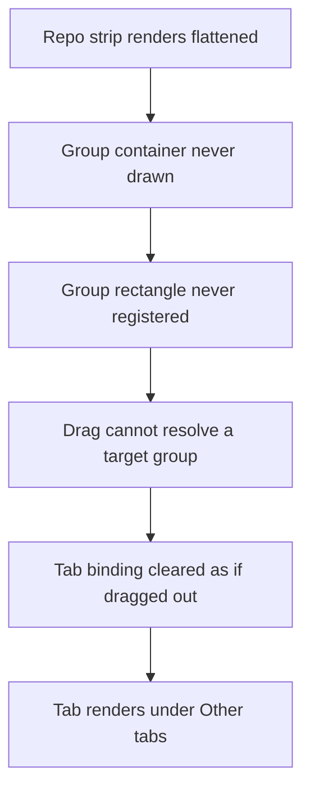
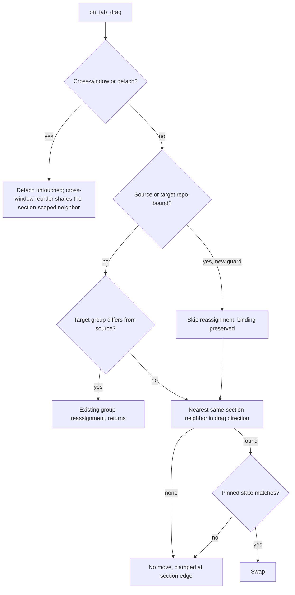

# Repo Mode Tab Reorder - Plan

## Goal Capsule

- **Objective:** Dragging a terminal tab up or down inside a repository's tab strip reorders it within that repository and never moves it to "Other tabs".
- **Authority:** The Product Contract below wins on behavior. The Planning Contract wins on mechanism within those constraints. Units override neither.
- **Product authority:** This plan owns drag behavior for repo-bound tabs wherever the shared drag path runs: the repo-mode Repositories tree — the repository strip and the "Other tabs" section — and reorder in the horizontal tab bar, which mutates the same tab order (KTD6). Cross-section drag semantics and persistence of tab order are named non-goals, not undecided scope.
- **Execution profile:** One bounded fix in the workspace drag path plus its unit tests. Three units, dependency-ordered, landable as one PR.
- **Stop conditions:** Stop and ask if the fix would require changing how repository membership is assigned anywhere outside the drag path, or if the section rule turns out to change drag behavior in any build with repo mode off.
- **Tail ownership:** The implementer owns tests, `./script/presubmit`, and the PR.
- **Open blockers:** None.

---

## Product Contract

**Preservation:** Product Contract changed — R6 rewritten, R8, R9, AE6, and AE7 added. Document review found that the plan's mechanism already reached the horizontal tab bar (the neighbor search and the drag guard both sit in axis-shared code) while the contract claimed vertical-only authority, so an implementer had to either drop a build step or ship behavior the contract forbade. The added requirements state the behavior the plan was already going to produce rather than widening the work; KTD6 records the decision and the alternative it was chosen over. R1–R5 and R7 are unchanged in meaning. The three questions previously listed under Outstanding Questions are resolved by KTD1–KTD4 and removed rather than left standing.

### Summary

Dragging a tab within the selected repository's strip reorders it and keeps its repository binding. A drag that reaches the strip's edge clamps to the nearest valid slot instead of escaping the section, in both directions: repository tabs stay in the repository, loose tabs stay in "Other tabs".

### Problem Frame

Repo mode renders the selected repository's tabs flattened under its row — the repository row already names the context, so the tab group's own header and container are not drawn. The container is also the only element that registers the group's on-screen rectangle.

The drag path resolves which group a dragged tab belongs to by looking that rectangle up. In repo mode the lookup finds nothing, which the path reads as "the tab was dragged out of every group" and so clears the tab's group binding. A tab with no repo-bound group renders as loose, and loose tabs render under "Other tabs". Every vertical drag inside a repository therefore ejects the tab from the repository, which reads to the user as reorder being unimplemented.

The cost is not only the misplaced tab. The route back is the tab context menu's "Move to group", which is offered only while the repository's group still has a member. Drag out the last tab and the group is pruned, leaving the tab with no in-product way back to its repository.

### Key Decisions

- KD1. **Clamp the drag inside its section rather than allowing a free drag that reverts on release.** A gesture that can travel anywhere but only ever succeeds in one band spends effort on outcomes that cannot happen. (session-settled: user-directed — chosen over free drag with revert on out-of-bounds release: a long drag that resolves to nothing reads as a failure, not as a boundary.) Governs R2, R4.
- KD2. **Clamp loose tabs symmetrically.** A loose tab is bound to no group, so nothing stops its position from landing mid-strip and splitting a repository's run. (session-settled: user-directed — chosen over leaving loose-tab drag untouched and recording the split as a known gap.) Governs R4, R5.
- KD3. **Membership stays static.** This work adds no way to bind or rebind a tab to a repository by dragging; it only stops drag from unbinding one. Carries forward the static-membership decision in `docs/plans/2026-07-19-001-feat-repo-mode-sidebar-plan.md`.

### Requirements

**Drag inside a repository**

- R1. Dragging a tab up or down inside the selected repository's tab strip reorders it within that repository and leaves its repository binding unchanged.
- R2. A drag that reaches either end of the repository's strip clamps the insertion to the nearest slot still inside that strip; releasing anywhere else within the panel lands the tab at that clamped slot, still bound to the repository. Releases outside the panel belong to R6.
- R3. During the drag the tab's own live position in the strip is the slot it will land in, and it never leaves the repository's strip. A tab reorder draws no separate insertion overlay — the row reorders under the cursor; the panel's insertion overlay belongs to the deferred pane-drop path. While the drag is clamped and the cursor is outside the section, the dragged row keeps the active-drag treatment it carries mid-drag until release, so a held drag never reads as a rest state or as a dropped one.

**Drag inside "Other tabs"**

- R4. A tab in "Other tabs" is clamped to that section for the whole drag and never acquires a repository binding by being dragged.
- R5. After any drag, each repository's tabs remain one contiguous run in the workspace tab order.

**Behavior that must not change**

- R6. A horizontal drag out of the vertical tabs panel still detaches the tab into another window. The section clamp never blocks that detach gesture; it constrains reorder decisions only.
- R7. Drag behavior with repo mode off is unchanged. With repo mode on, the section clamp applies regardless of which repository is expanded — expansion state never enters section identity — so a loose tab is clamped by R4 even when no strip is rendered.

**Drag in the horizontal tab bar**

- R8. With repo mode on, a repo-bound tab's reorder in the horizontal tab bar clamps to its own repository's run and never swaps past a loose tab. Both bars reorder the one workspace tab order R5 governs, so leaving this bar unclamped would break R5 for the panel that renders it. Unlike the flattened repository strip, the horizontal bar draws each group as its own container, so the clamp stops at a boundary the user can already see.
- R9. Wherever a repo-bound group does render its own container — today the horizontal tab bar — dragging a tab into that container no longer binds the tab to that repository. This removes a gesture that works today, deliberately: it is KD3's static membership and KTD1's "no absorption into a repository by drag" applied to the one surface where the binding gesture currently resolves a target.

### Key Flows

- F1. Reorder inside a repository
  - **Trigger:** User presses a tab in the expanded repository's strip and drags along the panel's vertical axis.
  - **Steps:** The tab moves between sibling slots in that strip as the cursor crosses each same-section neighbor's midpoint; on release it keeps the slot it reached.
  - **Outcome:** New order inside the repository; binding, the "Other tabs" section, and every other repository are untouched.
  - **Covered by:** R1, R3
- F2. Drag past the strip's edge
  - **Trigger:** During F1 the cursor travels past the first or last tab of the strip — onto another repository's row, into "Other tabs", or into empty panel space.
  - **Steps:** The tab stops at the strip's first or last slot and stays there while the cursor is outside.
  - **Outcome:** On release the tab lands at that slot with its binding intact; nothing moves between sections.
  - **Covered by:** R2, R5
- F3. Detach to another window
  - **Trigger:** During F1 the cursor leaves the panel sideways.
  - **Steps:** The existing cross-window drag takes over.
  - **Outcome:** Unchanged from today — the tab detaches into a window.
  - **Covered by:** R6

### Acceptance Examples

- AE1. **Covers R1, R3.** Given repository A is expanded with tabs T1, T2, T3 and "Other tabs" holds L1. When T3 is dragged above T1 and released. Then A's strip reads T3, T1, T2; all three are still under A; "Other tabs" still holds only L1.
- AE2. **Covers R2, R3.** Given the same state. When T1 is dragged downward past T3 and on into the "Other tabs" section, then released there. Then T1 never left A's strip during the drag and lands last in A, still bound to A.
- AE3. **Covers R4, R5.** Given the same state. When L1 is dragged upward into the middle of A's strip and released. Then L1 is still in "Other tabs", still bound to no repository, and A's tabs are still one contiguous run.
- AE4. **Covers R1, R2.** Given repository A is expanded with exactly one tab T1. When T1 is dragged up and down across the whole panel and released outside the strip. Then T1 is still A's only tab and A's group still exists.
- AE5. **Covers R6.** Given repository A is expanded with T1, T2. When T1 is dragged sideways out of the panel. Then it detaches into a window exactly as it does today.
- AE6. **Covers R8, R5.** Given repo mode is on with vertical tabs off, so the horizontal tab bar shows repository A's tabs T1, T2 as one group with loose tab L1 beside them. When T2 is dragged toward L1 and released past it. Then T2 stays inside A's run, A's tabs are still one contiguous run in the workspace tab order, and L1 has not moved into A.
- AE7. **Covers R9.** Given the same horizontal bar. When L1 is dragged onto A's group container and released there. Then L1 is still bound to no repository and A's membership is unchanged.

### Scope Boundaries

- Cross-section drag with meaning — dragging a tab onto another repository's row to move it there, or into "Other tabs" to detach it deliberately. Deferred; after this fix both gestures clamp inside the source section instead of carrying the tab between sections, and neither is signposted at the moment the user attempts it. The context menu keeps both directions: "Move to group" binds a tab into a repository's group (`move_tab_to_group` takes a group, so it never unbinds), and "Remove from group" takes it back out. Surfacing those routes at the point of a refused drag is deferred with the gesture itself.
- Persisting per-repository tab order across restarts.
- A recovery path for tabs already stranded in "Other tabs" by this defect. The only route stays the tab context menu's "Move to group", and it disappears once the repository's group has lost its last member.
- Removing the flattened repo render path so repo mode reuses the standard grouped-tab container. Attractive for the long run because future tab-group features would then reach repo mode for free, but it touches every `in_repo_accordion` branch in the panel render and carries visual-regression risk out of proportion to this fix.

#### Deferred to Follow-Up Work

- The sibling defect on the pane-drop path: `refine_hovered_tab_index` resolves no group in repo mode for the same missing-rectangle reason, so a pane dropped onto a repository's tab row lands ungrouped under "Other tabs". Same root cause, different entry point, and no unit here touches it.
- Integration coverage that drives a real pointer gesture through the panel. The units below prove the decision functions; they do not prove the gesture end to end.

### Dependencies / Assumptions

- The defect requires both `FeatureFlag::RepoMode` and `FeatureFlag::GroupedTabs` on. Group reassignment during drag is skipped entirely when grouped tabs are off.
- The accordion renders tabs for the selected repository only, so at most one repository strip is on screen during a drag. Clamping has one strip to bound, not many.
- Repository binding is group-based and static, per `docs/plans/2026-07-19-001-feat-repo-mode-sidebar-plan.md`. Nothing here reads a terminal's live working directory.

### Sources / Research

- `app/src/workspace/view/vertical_tabs.rs:2015-2036` — the flattened repo path renders members directly and skips the grouped-tab container.
- `app/src/workspace/view/vertical_tabs.rs:3334` — the grouped-tab container is the only place the group's rectangle is registered.
- `app/src/workspace/view.rs:29534-29556` — group targeting during drag resolves by looking that rectangle up, and yields nothing when it is absent.
- `app/src/workspace/view.rs:29147-29223` — an unresolved target differs from the source group, so the tab's group is cleared.
- `app/src/workspace/view.rs:29401-29434` — the vertical reorder is a neighbor swap over flat tab indices.
- `app/src/workspace/view/repo_mode_model.rs:1125-1148` — a tab with no repo-bound group is partitioned as loose.
- `app/src/workspace/view/repo_sidebar.rs:280-299` — loose tabs render under "Other tabs".
- `app/src/workspace/view.rs:12533-12582` — a repository group is pruned once its last tab leaves.
- `app/src/workspace/view.rs:7700` — "Move to group", the only route that rebinds an existing tab.
- `docs/plans/2026-07-28-001-fix-repo-mode-remediation-plan.md` — RC2 and KTD2 record that group contiguity is assumed by consumers and enforced nowhere, which is what R5 guards.

---

## Planning Contract

### Key Technical Decisions

- KTD1. **Repo-bound groups neither gain nor lose members through drag.** The drag path stops resolving a target group when the source tab or the candidate target belongs to a repo-bound group, so binding cannot change. (session-settled: user-directed — chosen over registering a rendered rectangle for the flattened strip: the rectangle leaves R2 broken past the strip's edge, buys nothing for the indicator, which reads `tab.group_id` directly, and would newly let a loose tab be absorbed into a repository.) Governs R1, R2, R4.
- KTD2. **Section identity is one rule for every mode.** A tab's section is its repo-bound group's root when that root is a registered repository entry — the same ownership test `repo_mode_tab_partition` applies, via `repo_mode_bound_tab_owner` — and loose otherwise. Two states resolve to loose that a naive "does the group carry a root" test would get wrong: a root whose entry was removed in another window (the tab renders under "Other tabs", so it must be sectioned there too), and any build with repo mode off, since session restore copies `repo_root` unconditionally at `view.rs:4171` — the accessor gates on the flag exactly as the line above it gates `pinned`. With the flag off every tab therefore resolves to the same section and today's behavior falls out with no branch in the drag path. (session-settled: user-approved — chosen over an `if repo_mode` branch: one code path, and R7 holds by construction rather than by a second implementation.) The accessor gates on both `FeatureFlag::RepoMode` and `FeatureFlag::GroupedTabs`. The second gate is load-bearing rather than defensive: U1's guard sits inside the drag path's `groups_enabled` branch and never runs with grouped tabs off, but U2's neighbor search runs unconditionally — so without it a restored `repo_root` would clamp reordering in a grouped-tabs-off build, a behavior change no requirement covers. Governs R4, R7.
- KTD3. **The neighbor search skips foreign-section tabs rather than stopping at them.** A swap targets the nearest same-section tab in the drag direction; the absence of one is the clamp. Stopping at the first foreign tab would freeze loose reordering whenever a repository tab sits between two loose tabs in flat order. Governs R2, R3, R4, R5.
- KTD4. **The pinned clamp and the section clamp compose; a swap needs both.** The existing pinned-state check at `view.rs:29236` stays as written and runs against the section-resolved neighbor. Governs R2.
- KTD5. **Section-neighbor resolution and the drag guard are pure functions over the tab list.** No workspace test drives `Presenter::build_scene`, so the position cache stays empty under `App::test` and every geometry lookup resolves to `None` — which is why no test today touches `on_tab_drag` or either `calculate_updated_tab_index` variant. Both decisions must therefore be testable without geometry; the geometry-dependent callers keep only the midpoint comparison and the target-group lookup. Governs the test strategy for U1 and U2.
- KTD6. **The section clamp applies on both axes; only detach stays axis-scoped.** One neighbor function is wired into `calculate_updated_tab_index` and its vertical variant, because both reorder the single tab order R5 governs and repo mode reaches the horizontal bar through the shared filter in `visible_tab_slot_inputs`. Chosen over clamping the vertical panel alone and recording R5 as unenforced in the horizontal bar: the two bars are two views of one order, so split enforcement lets one bar break the invariant the other renders. The horizontal bar registers a real container rect per group, so unlike the flattened strip its clamp boundary is already drawn. Governs R5, R6, R8.

### High-Level Technical Design

The drag path keeps its current shape. Two gates change: the reassignment branch gains a repo-bound guard, and the neighbor lookup becomes section-scoped. Reassignment returns before the neighbor search, so only the guarded and no-group-change paths reach it.

### Assumptions

- A user-created tab group carries no `repo_root`, so it is loose by section identity and keeps today's drag-in and drag-out behavior inside "Other tabs".
- Swapping two same-section tabs never splits a third section's run, because the swap moves no tab outside those two indices.
- Where a pinned tab sits inside a repository strip, the pinned-region clamp and the section clamp both apply and the more restrictive one wins (KTD4).

### Implementation Constraints

- `script/check_no_inline_test_modules` forbids inline `#[cfg(test)]` modules. Tests go in `app/src/workspace/view_tests.rs` and `app/src/workspace/view/repo_mode_model_tests.rs`.
- `assign_tab_to_group` has one production call site today, the drag path at `view.rs:29199`; "Move to group" goes through `move_tab_to_group` (`view.rs:7700`) and never calls it. Keep the guard at that call site so the method stays a general membership primitive for future callers.

---

## Implementation Units

### U1. Section identity and the repo-group drag guard

- **Goal:** Repo-bound groups stop gaining or losing members through drag.
- **Requirements:** R1, R4, R9; KTD1, KTD2, KTD5
- **Dependencies:** none
- **Files:** `app/src/workspace/view.rs`, `app/src/workspace/view_tests.rs`
- **Approach:**
  1. Add a section accessor on `Workspace` that maps a tab index to its section: the repo-bound group's root resolved through `repo_mode_bound_tab_owner` against the registry entry paths, and loose otherwise — so an unregistered root, a repo-mode-off build, and a grouped-tabs-off build all read as loose (KTD2). Taking `entry_paths: &[PathBuf]` as a parameter keeps it a pure function (KTD5).
  2. Extract the guard itself into a pure predicate over the tab list, the group map, the dragged index, the already-resolved target group, and `entry_paths` — geometry stays in the caller, so the predicate is testable (KTD5).
  3. Resolve **both** sides of that predicate through the section accessor, not through a bare `repo_root.is_some()` test. Session restore copies `repo_root` unconditionally at `view.rs:4171`, so a bare target-side test would fire in a repo-mode-off build restored from a repo-mode session and stop a tab binding to a group it joins today — the behavior change R7 forbids and the Goal Capsule names as a stop condition.
  4. Call the predicate from the reassignment branch condition in `on_tab_drag` (`view.rs:29147-29223`); skip reassignment when it returns true.
  5. Leave `assign_tab_to_group` and every non-drag caller untouched.
- **Patterns to follow:** `group_members` and `setup_group_with_intruding_tab` in `app/src/workspace/view_tests.rs`; the repo fixture in `app/src/workspace/view/repo_mode_model_tests.rs` built from `select_repo_mode_entry` and `new_repo_mode_loose_tab`.
- **Test scenarios:**
  - Section accessor returns the repository root for a tab in a repo-bound group and loose for a tab in a user-created group.
  - Section accessor returns loose for every tab when no group carries a `repo_root`.
  - Section accessor returns loose for a tab whose group carries a `repo_root` that is not a registered entry, matching where `repo_mode_tab_partition` renders it.
  - Section accessor returns loose for every tab with `FeatureFlag::RepoMode` overridden off, even with a repo-bound group present.
  - Section accessor returns loose for every tab with `FeatureFlag::GroupedTabs` overridden off and repo mode on, even with a repo-bound group present.
  - Covers AE1. The guard predicate returns true — reassignment skipped, `group_id` preserved — for a repo-bound source tab whose drag resolves no target group.
  - Covers AE3, AE7. The guard predicate returns true for a loose source tab whose drag resolves a repo-bound target group, so the tab stays ungrouped.
  - The guard predicate returns false for a loose tab dragged into a user-created group inside "Other tabs", so that tab still joins it.
  - Covers R7. With `FeatureFlag::RepoMode` overridden off and a group carrying a restored `repo_root`, the guard predicate returns false, so a tab dragged into that group still joins it.
- **Verification:** `cargo nextest run -p warp workspace::view::tests` passes, and the guard predicate is exercised directly rather than through `on_tab_drag`, whose target lookup cannot resolve a group under `App::test` (KTD5).

### U2. Section-scoped neighbor resolution

- **Goal:** The neighbor swap targets the nearest same-section tab on both axes, which clamps the drag at each section's edge.
- **Requirements:** R2, R3, R5, R7, R8; KTD3, KTD4, KTD5, KTD6
- **Dependencies:** U1
- **Files:** `app/src/workspace/view.rs`, `app/src/workspace/view_tests.rs`
- **Approach:**
  1. Extract the neighbor choice into a pure function over the tab list, the current index, and the direction, returning the nearest index in the same section.
  2. Have `calculate_updated_tab_index_vertical` (`view.rs:29401`) ask that function for the neighbor above and below, then apply the existing midpoint test against that neighbor's rect through `neighbor_drag_rect`.
  3. Wire the same function into `calculate_updated_tab_index` (`view.rs:29361`) on the horizontal axis, per R8 and KTD6. Repo mode reaches that bar through the shared filter in `visible_tab_slot_inputs`, and both bars reorder the one tab order R5 governs, so a vertical-only clamp would let the horizontal bar split a repository's run. That bar compares against neighbor edges rather than midpoints, so a non-adjacent same-section neighbor is reached only once the cursor passes that neighbor's far edge; confirm the resulting feel in the manual check.
  4. Return the current index when the direction holds no same-section tab.
  5. `calculate_updated_tab_index_vertical` also serves the cross-window `ReorderInSource` branch (`view.rs:28994`), which returns before the detach block. The section clamp intentionally applies to that placeholder reorder too; its existing pinned and contiguity guards stay as written.
  6. Leave the pinned-state check and the collapsed-group hop that follow the swap decision as written.
- **Execution note:** Write the pure function test-first; the geometry-dependent caller stays thin enough to read.
- **Test scenarios:**
  - Covers AE1. In `[A1, A2, A3]` all bound to one repository, the neighbor above A3 is A2 and the neighbor below A1 is A2.
  - Covers AE2. In the same list, the neighbor above A1 is absent and the neighbor below A3 is absent.
  - Covers AE3. In `[L0, A1, L2]`, the neighbor below L0 is L2, skipping the repository tab between them.
  - Covers AE4. In a list whose only repository tab is A1, both neighbors of A1 are absent.
  - Covers R5. After swapping two same-section tabs across an interleaved run, every group is still contiguous.
  - Covers R7. With no repo-bound group present, the neighbor above and below is always the adjacent index, matching the pre-change result.
  - Covers R7. With repo-bound roots present but `FeatureFlag::RepoMode` overridden off, the neighbor is still always the adjacent index — the restored `repo_root` must not clamp a flag-off build.
  - The cross-window placeholder reorder resolves the same section-scoped neighbor, so a repo-bound tab's placeholder never crosses into the loose run.
  - Covers R8, AE6. A repo-bound tab does not swap past an adjacent loose tab in the horizontal tab bar.
  - Covers R7. With `FeatureFlag::GroupedTabs` overridden off and repo-bound roots present, the neighbor is still always the adjacent index — the neighbor search runs outside the drag path's `groups_enabled` branch, so a restored `repo_root` must not clamp a grouped-tabs-off build.
  - A pinned tab and an unpinned tab in the same section still refuse to swap.
- **Verification:** `cargo nextest run -p warp workspace::view::tests` passes, and the neighbor function returns the adjacent index for every position in a list with no repo-bound group.

### U3. Repo-mode drag regression coverage

- **Goal:** Pin the end state the user reported, at the level the test harness can reach.
- **Requirements:** R1, R4, R5
- **Dependencies:** U1, U2
- **Files:** `app/src/workspace/view/repo_mode_model_tests.rs`
- **Approach:**
  1. Build a repo fixture with one registered repository holding three tabs plus one loose tab, using `select_repo_mode_entry` and `new_repo_mode_loose_tab`.
  2. Drive the reorder decision through the same entry points U1 and U2 expose, then assert placement through `repo_mode_tab_partition` rather than through rendering.
  3. Assert the loose tab never appears under the repository entry and no repository tab appears in the loose list.
- **Test scenarios:**
  - Covers AE1. Reordering inside the repository changes the order returned for that entry and leaves the loose list untouched.
  - Covers AE2. A reorder decision that would leave the repository's run returns no move, and the tab is still partitioned under its entry.
  - Covers AE3. A reorder decision for the loose tab never places it under the repository entry.
  - Covers AE4. A repository holding one tab survives a drag decision in either direction with its group intact.
- **Verification:** `cargo nextest run -p warp workspace::view::repo_mode_model::tests` passes with `FeatureFlag::RepoMode` and `FeatureFlag::GroupedTabs` overridden on.

---

## Verification Contract

| Gate | Command | Applies to |
|---|---|---|
| Unit tests, workspace view | `cargo nextest run -p warp workspace::view::tests` | U1, U2 |
| Unit tests, repo mode | `cargo nextest run -p warp workspace::view::repo_mode_model::tests` | U3 |
| Full presubmit | `./script/presubmit` | before the PR |

`./script/presubmit` runs `./script/format --check`, `script/check_no_inline_test_modules`, clippy with `-D warnings`, and the full nextest workspace run. Clippy denies warnings, so an unused helper left behind by the extraction in U2 fails the gate.

R6 has no unit-level gate. The detach branch returns before the group-reassignment block, so no unit here reaches it; confirm by reading `view.rs:28971-29031` and `view.rs:29040-29141` — the first is the cross-window reorder arm U2 step 5 covers, the second the detach branch itself — and by a manual sideways drag out of the panel before the PR.

R3, AE1, and AE2 have no unit-level gate for the rendered gesture either. Before the PR, in a build with `FeatureFlag::RepoMode` and `FeatureFlag::GroupedTabs` on, drag a tab within an expanded repository's strip and then past its lower edge into "Other tabs"; confirm the tab reorders inside the repository, stays visibly inside the strip for the whole gesture, never appears under "Other tabs", and keeps its group.

R3's held-state clause, R8, and R9 have no unit-level gate for the rendered result. In the same build, with vertical tabs turned off so the horizontal bar renders: drag a repository tab toward an adjacent loose tab and confirm it refuses to swap past it (R8, AE6), then drag that loose tab onto the repository's group container and confirm it does not join (R9, AE7). Back in the vertical panel, hold a clamped drag with the cursor outside the strip — and repeat it for a repository holding a single tab (AE4) — and confirm the dragged row keeps its active-drag treatment rather than settling as if dropped. The units assume the existing `Draggable` treatment already persists through a clamped drag; if it does not, the held state needs a render change in `app/src/workspace/view/vertical_tabs.rs`, which no unit currently carries.

---

## Definition of Done

- R1, R2, R4, R5, R7, and R8 each have a passing test named in U1, U2, or U3.
- A tab dragged inside a repository's strip keeps its `group_id` and changes position; the manual check covering R3, AE1, and AE2 has been run in a build with both feature flags on.
- R6 confirmed by the manual sideways drag described in the Verification Contract.
- R3's held state, R8, and R9 confirmed by the horizontal-bar and clamped-hold manual checks described in the Verification Contract.
- `./script/presubmit` passes.
- No helper, feature flag, or debug logging introduced while exploring the fix remains in the diff.
