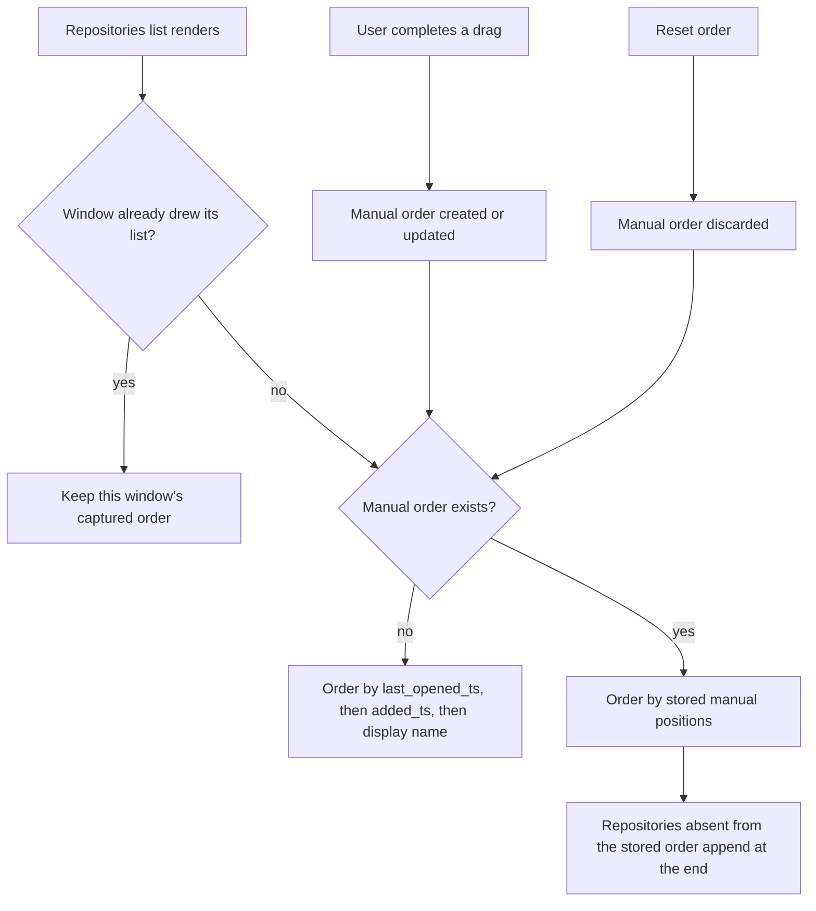
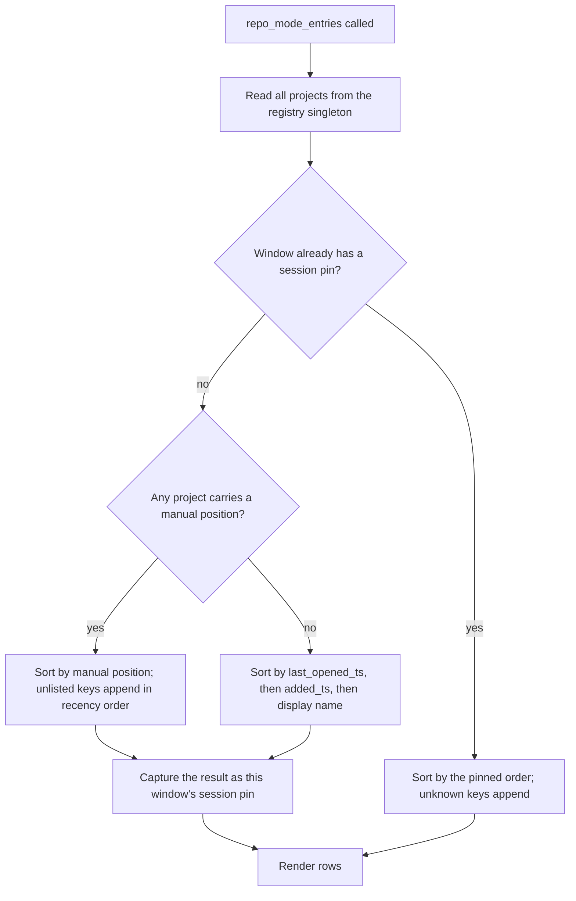
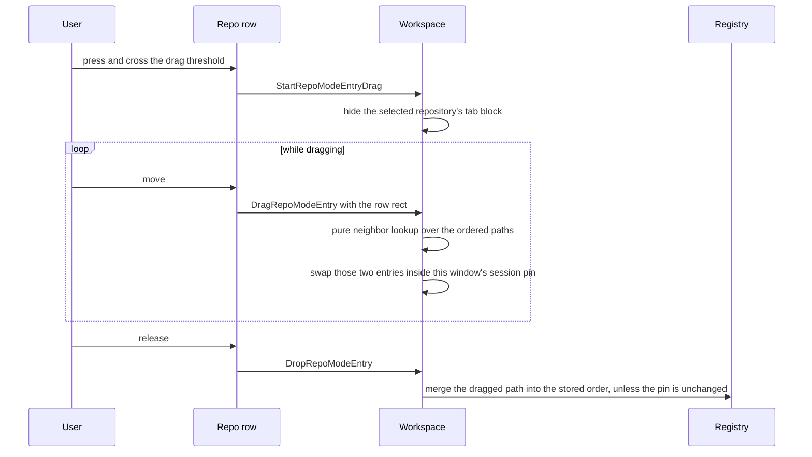

# Repo Mode Repository Reorder - Plan

## Goal Capsule

- **Objective:** A repository's position in the repo-mode Repositories list is owned by the user — set by dragging the row, kept across restarts, reversible.
- **Authority:** The Product Contract wins on behavior. The Planning Contract wins on mechanism within those constraints. Units override neither.
- **Product authority:** This plan owns the order of repository rows in the repo-mode Repositories list. Tab order inside a repository is owned by `docs/plans/2026-08-05-001-fix-repo-mode-tab-reorder-plan.md` and is not active scope here.
- **Execution profile:** Six units, dependency-ordered. One schema migration, one registry change, three behavior changes in the repo-mode view, one action-wiring change. Landable as one PR.
- **Stop conditions:** Stop and ask if the manual order turns out to need a home outside the `projects` registry, or if collapsing the tab block during a drag conflicts with the tab drag path rather than sitting beside it.
- **Tail ownership:** The implementer owns tests, `./script/presubmit`, and the PR.
- **Open blockers:** None outstanding. The need was unvalidated (see Dependencies / Assumptions) and the plan asked for the requester's confirmation that manual ordering — rather than the filter-or-hotkey direction under Scope Boundaries — is what they want. Directing this plan into implementation on 2026-08-07 is that confirmation. The list-length question behind it is unresolved and now sits in Open Questions, where it drives whether drag alone suffices.

---

## Product Contract

**Preservation:** Product Contract changed — R2 and R7 rewritten, R13–R19 added, Key Decision on drag-time collapse added. Research found that R2 and R7 as written could not both hold: a shared order observed by every window would re-sort a window that R7 says must not move. The rewrite states the rule once, scoped per window, and drops the inaccurate "at launch" framing — the session pin is created lazily on the first call to `repo_mode_entries` (`app/src/workspace/view/repo_mode_model.rs:207-213`), not at process start. R13–R15 record behavior the brainstorm did not reach: a repository row drag runs over a click handler that can spawn an SSH session, over rows whose registry key is not yet settled, and over an accordion that breaks the neighbor-distance rule. R16–R19 came out of document review, all of them gaps a pointer gesture cannot be built without: the drag threshold is 5px, so ordinary click jitter crossed it and handed the whole list over on a drag that moved nothing (R16); release was the only terminal state the contract described, with cancel left undefined (R17); the contract asserted off-screen positions were unreachable while the risk register said off-screen rows kept cached rects (R18); and hiding the tab block reflows every row below it under a cursor anchor `Draggable` freezes at mouse-down (R19). R1, R3–R6, R8–R12 are unchanged in meaning. The storage question and the drag-feedback question previously under Outstanding Questions are resolved by KTD1 and KTD5 and removed rather than left standing.

**2026-08-07 document review.** One Product Contract change: R15 now states the tab block appears and disappears instantly. That is a constraint R19's single cursor correction already depended on — an animated fold would leave the correction stale mid-transition — so it makes an existing dependency explicit rather than changing what the product does. No other requirement changed in meaning. Everything else the review produced landed in the Planning Contract, the units, or Open Questions: KTD7b was added, KTD9 was restated, and three product-scope judgment calls were recorded under Open Questions rather than decided.

### Summary

Dragging a repository row in the repo-mode Repositories list moves it, and the resulting order survives restarts. The order lives on the repository registry itself; the first drag hands the whole list over to it, and a Reset order action gives the list back to recency.

### Problem Frame

The Repositories list orders itself. Entries sort by `last_opened_ts` descending, then `added_ts` descending, with display name only as a final tiebreaker (`app/src/workspace/view/repo_mode_model.rs:196`). That order is captured once per window and pinned for the session, so selecting a repository bumps its recency for the *next* launch instead of reshuffling the list under the user.

Position is therefore a function of when a repository was last touched, which is not the same as how much it matters. Repositories added in one batch and never opened share a timestamp and fall through to the name tiebreaker, which reads as alphabetical ordering and reinforces the sense that position is arbitrary rather than owned.

The gesture is already in the user's hands one level down: tabs and tab groups are wrapped in `Draggable` and `DropTarget` (`app/src/workspace/view/vertical_tabs.rs:2643`, `:3298`), while no repository row in `app/src/workspace/view/repo_sidebar.rs` is.

### Key Decisions

- **Manual order replaces recency for the whole list, not for a pinned subset.** One concept and one gesture, matching the tab bar the request was reasoning from; a pinned block above a recency-ordered remainder would add a second zone, a divider, and an unpin gesture. (session-settled: user-directed — chosen over a pinned-subset hybrid: fewer concepts, and the hybrid remains reachable later from this shape.) Governs R2, R3, R4.
- **The order is global, and a window adopts it when it first draws its list.** Keeps the existing settles-at-first-draw guarantee, so a list never reshuffles under a window whose user is doing nothing. (session-settled: user-directed — chosen over live cross-window propagation and over per-window orders.) Governs R6, R7.
- **Manual order is reversible.** Without a way back, one accidental drag strands a long list in a half-sorted order permanently. (session-settled: user-approved — chosen over no escape hatch.) Governs R8.
- **Recency keeps being recorded after the handover.** It is what Reset restores to; dropping it would make Reset produce an arbitrary order rather than a useful one. Governs R9.
- **The open repository's tabs fold away while a row is dragged.** With the tab block in place, consecutive repository rows are separated by an arbitrarily tall region and the row reads as stuck until the drag crosses all of it. (session-settled: user-directed — chosen over comparing neighbor edges instead of midpoints, and over accepting the stuck feel.) Governs R15.

### Requirements

**Reordering the list**

- R1. Dragging a repository row within the Repositories list moves it to the drop position, and the list renders in the new order immediately.
- R2. Once a drag completes, the manual order determines the list order for the dragging window immediately and for every window from the moment it first draws its list; recency no longer reorders the list.
- R3. Before any manual order exists, the list orders by recency exactly as it does today.
- R4. A repository added while a manual order is in effect appends at the end of the list.
- R5. Removing a repository drops it from the manual order; adding it again appends it at the end.

**Where the order lives**

- R6. The manual order is shared by every window and persists across restarts.
- R7. A window that has already drawn its Repositories list keeps that order for the rest of its session, whatever another window does.

**Returning to recency**

- R8. A Reset order action discards the manual order and returns the list to recency ordering.
- R9. Recency is still recorded while a manual order is in effect.

**Drag boundaries**

- R10. A drop position resolves to a boundary between repository rows.
- R11. The "Other tabs" section stays below the Repositories list and does not take part in repository reordering.
- R12. A repository row whose path is unreachable, rendered dimmed, is draggable on the same terms as any other row.
- R13. A drag that crosses the drag threshold never selects the repository it moves; a press and release below the threshold still selects, as today.
- R14. A remote repository row whose first probe has not resolved is not draggable. Its existing "Connecting…" label is the only signal; cursor and styling are unchanged, and the state lasts about as long as one probe.
- R15. While a repository row is being dragged, the selected repository's tab block is hidden, so every row in the list has the same height. The block appears and disappears instantly, with no transition or animation: R19's cursor correction is captured once, so a reflow spread across several frames would leave that correction stale mid-transition and reintroduce the drift R19 exists to prevent.
- R16. A drag that ends with the row at the index it started from writes nothing: no manual order is created, and an existing one is left untouched.
- R17. A repository drag has no cancel. Releasing anywhere — over the "Other tabs" section, outside the sidebar, outside the window — commits the order the list is currently showing, and Escape is not bound. This matches the tab drag, where release is the only terminal state.
- R18. Swaps reach only repository rows that are on screen. A row scrolled out of the viewport is not a swap target, so a drag clamps at the topmost and bottommost visible row rather than moving the dragged row somewhere the user cannot see.
- R19. A drag that starts while a repository is selected keeps the dragged row under the cursor across the tab-block collapse of R15, and decides its first swap against post-collapse row positions.

### Key Flows

- F1. First drag hands the list over
  - **Trigger:** User drags a repository row while no manual order exists.
  - **Steps:** The tab block folds away; the row moves as it passes each neighbor's midpoint; on release the resulting order is written to the registry.
  - **Outcome:** Recency no longer moves rows. Covers R1, R2, R6, R15.
- F2. Reset gives the list back
  - **Trigger:** User picks Reset order from a repository row's context menu.
  - **Steps:** The stored manual order is discarded; the list re-sorts by recency using the timestamps recorded throughout.
  - **Outcome:** The list behaves as it did before the first drag. Covers R8, R9.
- F3. A repository joins a manually ordered list
  - **Trigger:** User adds a repository while a manual order is in effect.
  - **Steps:** The new row appends at the end of the list and stays there until dragged.
  - **Outcome:** No existing position moves. Covers R4.

### Acceptance Examples

- AE1. **Covers R2, R6.** Given a manual order set by dragging, when the app is quit and relaunched, then the list renders in that manual order.
- AE2. **Covers R3.** Given no manual order exists, when the app is relaunched after several repositories are opened, then the list renders in recency order.
- AE3. **Covers R4.** Given a manual order is in effect, when a repository is added, then it renders at the end of the list, not at the top.
- AE4. **Covers R7.** Given two windows are open and a row is dragged in the first, then the second window's list is unchanged until it is relaunched.
- AE5. **Covers R8, R9.** Given a manual order is in effect and several repositories have been selected since it was set, when Reset order is chosen, then the list re-sorts by recency and reflects those selections.
- AE6. **Covers R10, R15.** Given a repository is selected and its tabs are visible, when another repository row is dragged past it, then the moving row passes whole repository rows and never lands among the tabs.
- AE7. **Covers R5.** Given a repository in the middle of a manual order is removed and later added again, then it renders at the end of the list.
- AE8. **Covers R13.** Given a repository that is not selected and has no bound tab, when its row is pressed, dragged past the threshold, and released, then no terminal or SSH session is started for it.
- AE9. **Covers R14.** Given a remote repository row still showing "Connecting…", when it is pressed and moved, then it stays where it is and no order is written.
- AE10. **Covers R16.** Given no manual order exists, when a row is pressed, jostled past the drag threshold, and released without passing any neighbor's midpoint, then the list still orders by recency and no manual position is stored.
- AE11. **Covers R17.** Given a row has been dragged two positions up, when the pointer is released over the "Other tabs" section, then the order the list is showing is committed rather than reverted.
- AE12. **Covers R18.** Given a Repositories list taller than its viewport, when the topmost visible row is dragged upward past the viewport edge, then it stops there rather than swapping with a row scrolled out of view.
- AE13. **Covers R19.** Given a repository with several open tabs is selected, when a row below it is dragged past the threshold, then the dragged row stays under the cursor as the tab block folds away, and no swap fires from the collapse alone.

### Scope Boundaries

- A filter box or hotkey for jumping to a repository. It solves "I cannot find my repository" rather than "this repository belongs here", and it layers on top of any order rather than competing with one.
- A pinned subset above a recency-ordered remainder.
- A sort-mode chooser offering by-name, by-recency, and manual.
- Live propagation of an order change to windows that are already open.
- Reordering repository rows from the keyboard. The repo-mode sidebar plan already defers the full keyboard and accessibility pass.
- Autoscrolling the Repositories tree while a drag is in progress. The tree sits in a `ClippedScrollable` (`app/src/workspace/view/vertical_tabs.rs:1673-1688`) and tabs share the same limit. R18 makes the consequence explicit rather than assuming it away: on a list taller than its viewport, moving a repository across the fold takes more than one gesture.
- A telemetry event for reorder or reset. Repo mode emits none today, and adding the first one is separable work.
- Fixing the raw connection string a row with an *unreadable* key still puts on screen. `remote_list_entry` returns `remote: None` for a key that does not parse (`app/src/workspace/view/repo_mode_model.rs:1401-1409`), so `render_entry_row` takes its local-path branch and sets both the secondary line and the hover text from the raw key (`app/src/workspace/view/repo_sidebar.rs:439-451`). The row's *name* was fixed; its secondary and tooltip were not. Pre-existing, and R12 and U5 knowingly extend drag and hover affordances over exactly those rows. Tracked outside this plan.
- A signal that the list has left recency ordering. Once a manual order exists nothing on screen says so, and a user whose list has "stopped updating" has no path from that symptom back to Reset order. Accepted cost of the settled whole-list handover.
- A proportional undo for a single drag. Reset order is whole-list-only, so recovering from one misplaced drag inside an established manual order means re-dragging that row. The reversibility decision covers the first drag, not every drag after it.
- Persisting per-repository tab order across restarts, a named non-goal in `docs/plans/2026-08-05-001-fix-repo-mode-tab-reorder-plan.md`.

### Dependencies / Assumptions

- **The need is unvalidated, and so is the list length.** It rests on the requester's judgment. The brainstorm established no repository count, no named repository sitting in the wrong place, and no workaround anyone had built. List length matters more than it looks: with no autoscroll and no keyboard reorder, R18 caps the gesture's reach at one viewport, so a list well past the fold is where this feature is weakest and a filter would be strongest. If that turns out to be thin, the filter-or-hotkey direction under Scope Boundaries addresses the likeliest underlying complaint at a fraction of the cost and deserves a second look before this is built.
- Repo mode is gated twice: `FeatureFlag::RepoMode` (`crates/warp_features/src/lib.rs:872`) behind the `repo_mode` cargo feature (`app/src/features.rs:453`), plus `FeatureFlag::GroupedTabs` (`crates/warp_features/src/lib.rs:868`), which the section logic also depends on (`app/src/workspace/view/repo_mode_model.rs:1168-1174`). Every new handler needs the same `Workspace::repo_mode_enabled()` early return the existing ones use (`app/src/workspace/view/repo_mode_model.rs:109`).
- The context menu on a repository row renders one item today, "Remove from Repositories" (`app/src/workspace/view/repo_mode_model.rs:964-991`). Reset order is a list-level action landing in a per-row menu; accepted as the cheapest surface that already exists.
- In repo mode the selected repository's tabs render flattened directly beneath its row with no group container (`app/src/workspace/view/repo_sidebar.rs:260-275`, `app/src/workspace/view/vertical_tabs.rs:2015-2035`). That missing container is what let a tab drag unbind its repository before `591bae7a3`; a row-level drag runs over the same tree.
- There is no "All" row in the Repositories list. "All" is reachable only through the picker menu (`app/src/workspace/view/repo_mode_model.rs:1005`) and by clicking the already-selected row to deselect it (`app/src/workspace/view/repo_sidebar.rs:406`), so it needs no position in the order.

---

## Planning Contract

### Key Technical Decisions

- KTD1. **The manual order lives on the `projects` registry, not in a settings entry.** A registry key is a full SSH connection string — user, host, port, remote path, and the local private-key path — which the code refuses to log, and which a row whose key parses never displays (`app/src/workspace/view/repo_mode_model.rs:1394-1400`); `projects` already stores those keys, so no new file gains secrets. A settings home would have been worse than a second copy: Warp cloud-syncs a settings subset (`app/src/settings/cloud_preferences_syncer.rs`), so connection strings could have left the machine. Deleting a repository deletes its row, which prunes the order for free. (session-settled: user-approved — chosen over a private settings list: same durability, no second store holding connection strings.) Governs R5, R6.
- KTD2. **Reorder reuses the continuous neighbor-swap drag path rather than drop-time index machinery.** Successive adjacent swaps during `on_drag` already produce insertion semantics across any distance, and `DropTab` does only cleanup and telemetry today (`app/src/workspace/view.rs:25531-25571`). Governs R1.
- KTD3. **The drop-index math is a pure function over the ordered path list; geometry stays in the caller.** `section_neighbor` is factored this way because no test can populate the position cache (`app/src/workspace/view.rs:29425-29430`), and `repo_sidebar_tests.rs` tests only pure helpers. Governs R10.
- KTD4. **Repository drags are keyed by registry path, not list index.** The tab path carries a documented staleness hazard from index-keyed capture and recovers by rescanning for the dragging element (`app/src/workspace/view.rs:28948-28971`); repo mode already uses the path as identity everywhere else, so keying by path avoids inheriting the hazard.
- KTD5. **The selected repository's tab block is hidden for the duration of a repository-row drag.** Uniform row heights let the existing midpoint rule apply unchanged and avoid the oscillation the vertical variant was written to prevent (`app/src/workspace/view.rs:29517`). (session-settled: user-directed — chosen over comparing neighbor edges: the edge rule reintroduces the oscillation midpoint comparison exists to stop.) Governs R15.
- KTD6. **The per-window session pin wins over the shared manual order for a window that has already captured one — until that window itself changes the order.** `repo_mode_launch_order` (`app/src/workspace/view.rs:1245`) already freezes a window's order; consulting the shared order only when the pin is absent satisfies R7 without a cross-window invalidation path. (session-settled: user-approved — chosen over broadcasting the change to every open window.) Governs R7.
- KTD7. **The session pin is the drag's mutable list, and it is what makes the acting window move.** Because the pin is re-applied last in `repo_mode_entries` (`app/src/workspace/view/repo_mode_model.rs:207-223`), a window that has drawn its list renders the pin and nothing else — so writing only the registry would leave R1's "renders in the new order immediately", R2's "immediately", and R8's reset all invisible until relaunch. The drag-move handler swaps adjacent entries inside the pin, and reset sets the pin to `None` so the next render recaptures from recency. This adds a fourth pin-maintenance point beside the three existing removal sites. Governs R1, R2, R8.
- KTD7b. **The drop merges the dragged path into the stored order; it does not overwrite that order with the pin.** KTD6 guarantees a second window's pin is still the order it captured before any of this window's drags, so writing the whole pin makes the shared order last-writer-wins across every row: a ten-repository arrangement made in one window is discarded by a one-row drag in another, invisibly until the next relaunch, and a reset is undone by any drag in an already-open window. The drop handler instead reads the registry's current order, removes the dragged path, and re-inserts it at the index it now holds in the pin. This keeps R7's per-window isolation intact without adding the cross-window propagation KTD6 settled against. Governs R2, R6, R8.
- KTD8. **The viewport clamp is an explicit rect test, not a side effect of the position cache.** `ClippedScrollable` does not cull: `paint_internal` opens a clip layer and paints its whole child (`crates/warpui_core/src/elements/gui/clipped_scrollable.rs:283-299`), so a row scrolled out of view is still painted and still publishes a correct rect every frame. R18 therefore needs its own test. Save the *scrollable's* rect under a fixed id — outside the `ClippedScrollable`, since the tree column inside it is painted at full content height — so the drag-move handler reads the viewport from the same cache it reads row rects from, and rejects any neighbor whose rect does not intersect it. Governs R18.
- KTD8b. **Repository rows still take `SavePosition::for_single_frame()`** (`crates/warpui_core/src/elements/gui/stack/save_position.rs:30`). The indefinite cache is never cleared (`crates/warpui_core/src/presenter.rs:168`), so a row that stops being painted mid-drag — removed from the registry by another window, or resolved from a pending remote key to a different one — would keep answering the neighbor lookup at a rect nothing occupies. Per-frame positions retire that rect on the next frame. This addresses staleness only; it is not the clamp.
- KTD9. **The drag re-anchors once, by the dragged row's own observed rect shift — which is zero whenever nothing reflowed.** `Draggable` freezes `mouse_offset` at mouse-down and never recomputes it (`crates/warpui_core/src/elements/gui/drag/draggable.rs:622-627`), while hiding the tab block shifts every row below it upward — so without correction the midpoint comparison runs a pre-collapse ghost against post-collapse neighbors and cascades swaps the user did not ask for. Define `anchor_delta` as the difference between the dragged row's rect at drag-start and its rect on the first frame that rect moves, and subtract it from every incoming rect for the life of the drag. Two properties make this the definition rather than "the first move frame after the collapse": it yields exactly zero in the three cases where no collapse happens — no repository selected, a selected repository with no open tabs, and a row dragged from above the tab block, which does not move (`app/src/workspace/view/repo_sidebar.rs:262-275`) — and it does not depend on detecting which frame the collapse landed on. `on_drag_start` and `on_drag` arrive on separate mouse events with no guaranteed render between them (`crates/warpui_core/src/elements/gui/drag/draggable.rs:670-698`), so a rule keyed to "the first move frame" can capture pre-collapse geometry and leave the comparison skewed by the tab block's height for the rest of the drag. Governs R19.
- KTD10. **Repository rows get no `DropTarget`.** Nothing in this plan reads drop-target data — the swap is resolved from the row rect — and `Draggable` only computes it when `with_accepted_by_drop_target_fn` is set (`crates/warpui_core/src/elements/gui/drag/draggable.rs:652-658`), which the tab `Draggable` this mirrors never sets. Reusing `VerticalTabsPaneDropTargetData` to fill the parameter would make every repository row a valid pane-header drop target (`app/src/pane_group/pane/view/header/mod.rs:1047-1060`), which is worse than having none.
- KTD11. **Tab-block visibility is derived from the drag state map, not restored by the drop handler.** `DraggableState` returns to not-dragging on mouse-up on every path; keying the hidden tab block off "any repository drag is active" means no terminal path can leave the selected repository's tabs invisible. Governs R15, R17.

### High-Level Technical Design

Order resolution gains one step. The recency sort and the session pin stay where they are; the manual order sits between them and is read only when the pin has not yet been captured.

A repository-row drag is the tab drag's shape with a different identity and one extra step at the start.

The tab block is not restored by a step of the drop. It is hidden for exactly as long as the drag state map reports a drag, so every terminal path — drop, release outside the list, release outside the window — brings it back (KTD11).

### Assumptions and Constraints

- A repository-row `Draggable` paints its child on an overlay layer at the cursor and vacates the laid-out slot (`crates/warpui_core/src/elements/gui/drag/draggable.rs:572-581`). Both existing callers fill the hole with a background placeholder (`app/src/workspace/view/vertical_tabs.rs:2667-2673`); a repository row needs the same.
- `SavePosition` caches a rect indefinitely (`crates/warpui_core/src/presenter.rs:168`) and `ClippedScrollable` paints its whole child rather than culling to the viewport (`crates/warpui_core/src/elements/gui/clipped_scrollable.rs:283-299`). Two separate consequences, settled separately: a row that stops being painted leaves a stale rect (KTD8b), and a row that is merely scrolled out of view publishes a perfectly fresh rect the drag would otherwise happily swap against (KTD8). `neighbor_drag_rect` (`app/src/workspace/view.rs:29703`) is the caller-side shape to follow for the `None` result.
- `ProjectManagementModel` holds a `HashMap` (`app/src/projects.rs:37`), so a column alone does not give an ordered read — U2 adds the ordered accessor.
- **Clearing the column cannot go through `save_project`.** `Project` derives `AsChangeset` without `#[diesel(treat_none_as_null = true)]` (`crates/persistence/src/model.rs:224-230`), and diesel skips `Option::None` fields on update, so the existing upsert (`app/src/persistence/sqlite.rs:1636-1647`) would silently leave stale positions in the database and the manual order would return on the next launch. The codebase opts in explicitly where it needs NULL writes (`crates/persistence/src/model.rs:1649`, `app/src/persistence/block_list.rs:63`); reset needs its own event and a direct `diesel::update`.
- `should_save_app_state_on_action` is an exhaustive match with the wildcard deliberately avoided (`app/src/workspace/action.rs:966-969`); AGENTS.md forbids wildcard `_` arms. Every new action variant must be placed there.
- Tests live in a sibling `<file>_tests.rs` wired by `#[cfg(test)] #[path = "…"] mod tests;` (`app/src/workspace/view/repo_mode_model.rs:1465`); `script/check_no_inline_test_modules` runs inside `./script/presubmit` and enforces it.
- Read `.agents/skills/gui-ui-guidelines/SKILL.md` before U5 — it governs UI code in `app/`, including reuse of shared theme colors over ad-hoc values.
- **No new call site may log a registry path.** A key can be a full SSH connection string — including the path to a local private key — and Info-and-above log lines upload to Sentry as breadcrumbs, which `.agents/skills/logging-and-error-reporting/SKILL.md` says must never carry secrets. This plan threads the raw key through four action variants, two registry mutators, a `DraggableState` key, and a `SavePosition` id — and U6's unknown-path branch is exactly where the instinct is to log the path that was not found. The rule covers three call shapes, not one: a registry path must not appear in a `log::*` message, in a `safe_*` macro's `safe:` arm, or in a `report_error!` `extra:` block. It may appear only inside a `safe_*` `full:` arm, which is what stays on the machine — note that the logging skill's own canonical example puts a path in an `extra:` block, so the wrong shape is the one nearest to hand. The comment KTD1 cites exists because this mistake was already made once here.

### Sequencing

U1 → U2 → U3. U4 has no dependencies and can start at any time. U6 needs U2 and U4; U5 needs U4 and U6. U3 and U4 are independent of each other.

**U5 and U6 land as one commit.** Their dependency is two-way at compile time, so neither is independently landable: U6's drag-move handler reads the repository-row and tree-viewport `SavePosition` ids that U5 step 4 creates, while U5's `Draggable` callbacks dispatch the action variants U6 adds. Sequencing U6 first is about writing the actions before the element tree that fires them, not about landing them separately — U6's "a drag moves the rows in the acting window" cannot be demonstrated until U5 makes a row draggable. The Goal Capsule already scopes the whole plan to one PR.

---

## Implementation Units

### U1. Store a manual position on the projects registry

- **Goal:** The `projects` table can hold a user-defined position per repository.
- **Requirements:** R6.
- **Dependencies:** None.
- **Files:**
  - `crates/persistence/migrations/<YYYY-MM-DD-HHMMSS>_add_manual_order_to_projects/up.sql` (create)
  - `crates/persistence/migrations/<YYYY-MM-DD-HHMMSS>_add_manual_order_to_projects/down.sql` (create)
  - `crates/persistence/src/schema.rs`
  - `crates/persistence/src/model.rs`
  - `app/src/persistence/sqlite.rs`
  - `app/src/projects.rs`
  - `app/src/workspace/view/repo_mode_model_tests.rs`
  - `app/src/workspace/view_tests.rs`
- **Approach:**
  1. Add a nullable integer column to `projects`. Null means "no manual position".
  2. Regenerate the `table!` entry and add the field to the `Project` struct, which already derives `Insertable`, `Queryable`, and `AsChangeset` (`crates/persistence/src/model.rs:223-230`).
  3. Carry the field through the upsert and select-all sites (`app/src/persistence/sqlite.rs:1636-1647`, `:1649-1656`). The delete site needs no change — deleting the row removes the position with it. `save_project` and `get_all_projects` themselves need no edit — `Insertable`/`Queryable` pick the column up once the struct field order matches `schema.rs`.
  4. Add the new field to every `Project` struct literal. There are 19 construction sites and none use `..Default::default()`: `app/src/projects.rs:78`, seventeen in `app/src/workspace/view/repo_mode_model_tests.rs`, and one at `app/src/workspace/view_tests.rs:4036`. Without this the unit does not compile, so its own verification cannot run — the compiler enumerates any the count misses.
- **Patterns to follow:** `crates/persistence/migrations/2026-07-29-035801_add_team_uid_to_windows/` is the most recent add-column migration and shows the full change set it required.
- **Test scenarios:** Test expectation: none — schema-only. Ordering behavior is proved by U2 and U3.
- **Verification:** The app starts and reads existing project rows with the new column absent from older databases.

### U2. Give the registry an ordered read and manual-order mutators

- **Goal:** `ProjectManagementModel` can report projects in manual order and can set or clear that order.
- **Requirements:** R4, R5, R6, R8.
- **Dependencies:** U1.
- **Files:**
  - `app/src/projects.rs`
  - `app/src/persistence/mod.rs`
  - `app/src/persistence/sqlite.rs`
  - `app/src/projects_tests.rs` (create if absent, wired with the sibling-module pattern)
- **Approach:**
  1. Add a read that yields projects with a manual position first, in that order, followed by the rest.
  2. Add a mutator that assigns positions from an ordered list of paths, and one that clears every position.
  3. The clearing mutator cannot reuse `save_project` — see the `treat_none_as_null` constraint above. Add a `ModelEvent::ClearProjectManualOrder` variant in `app/src/persistence/mod.rs` and handle it in `app/src/persistence/sqlite.rs` with a direct `diesel::update(projects).set(manual_position.eq(None::<i32>))`.
  4. Leave `upsert_project` and `remove_project` alone — a new project gets a null position and sorts to the end; a removed project takes its position with it.
- **Patterns to follow:** Path canonicalization at `app/src/projects.rs:29-34`; existing mutator shape at `:68` and `:91`; the explicit NULL-write opt-in at `crates/persistence/src/model.rs:1649`.
- **Test scenarios:**
  - Setting an order over three projects, then reading back, yields exactly that order.
  - A path in the order list that is not in the registry is ignored rather than panicking.
  - A project with no manual position sorts after every project that has one.
  - Removing a project drops it from the ordered read without renumbering the survivors.
  - Clearing the order makes every project report no manual position.
  - Clearing the order survives a round-trip through the database, not just the in-memory `HashMap` — a project written with a position, then cleared, then re-read from sqlite reports none.
- **Verification:** `cargo nextest run -p warp projects` passes.

### U3. Resolve section order through the manual order

- **Goal:** The Repositories section renders the manual order when one exists and the window has not already pinned an order.
- **Requirements:** R2, R3, R4, R6, R7, R9.
- **Dependencies:** U2.
- **Files:**
  - `app/src/workspace/view/repo_mode_model.rs`
  - `app/src/workspace/view/repo_mode_model_tests.rs`
- **Approach:**
  1. In the ordering block (`app/src/workspace/view/repo_mode_model.rs:196-223`), branch before the recency sort: when the registry reports manual positions, order by them and leave unlisted entries in recency order at the end.
  1b. Keep projected pending-remote entries ahead of the manual order rather than letting them fall into that unpositioned tail. A pending remote key is deliberately never in the registry (R14, and see Risks), so the tail is where it would otherwise land — putting a "Connecting…" row at the bottom of the list, possibly below the fold with nothing to scroll it into view, when today it appears at the top. Those entries are projected in with a `now` timestamp precisely so they sort to the top (`:134-156`); a manual order should not silently invert that. R4 governs registry additions and R14 only makes the row undraggable, so neither decides this — it is settled here.
  2. Leave the session-pin capture below it unchanged, so a window that already pinned an order keeps it (KTD6). The pin stays authoritative for the acting window because U6 mutates it in place during the drag (KTD7) — not because the manual order is re-read.
  3. Leave the three existing pin-maintenance points alone (`:570`, `:599`, `:644`) — they operate on the session pin, not the persisted order. U6 adds the fourth.
- **Patterns to follow:** The existing `sort_by_key` with `unwrap_or(usize::MAX)` at `:220-223` is the shape for "unlisted entries go last"; it is stable, so recency order survives among them.
- **Execution note:** Add the ordering test before the branch — `test_recency_order_settles_at_launch` (`app/src/workspace/view/repo_mode_model_tests.rs:925`) is the template and must keep passing unchanged.
- **Test scenarios:**
  - Covers AE2. With no manual positions set, the section renders in recency order.
  - Covers AE1. With manual positions set, the section renders in that order rather than recency order.
  - Covers AE3. A project added after the manual order exists renders last.
  - Covers AE4. A window that has already captured a session pin renders the pinned order even after the manual order changes.
  - Covers AE5. Selecting repositories while a manual order is in effect bumps their recency in the registry without moving any row.
  - Covers AE7. Removing a mid-order project and re-adding it renders it last.
- **Verification:** `cargo nextest run -p warp repo_mode` passes, including the pre-existing ordering tests.

### U4. Extract the repository-row neighbor math as a pure function

- **Goal:** The reorder step is decided by a function over the ordered path list plus a caller-supplied rect, so it is testable.
- **Requirements:** R10, R11.
- **Dependencies:** None.
- **Files:**
  - `app/src/workspace/view/repo_mode_model.rs`
  - `app/src/workspace/view/repo_mode_model_tests.rs`
- **Approach:**
  1. Take the ordered paths, the dragged path, and the direction; return the index to swap with, or none at the ends. No geometry inside.
  2. The caller resolves the neighbor rect and compares midpoints, mirroring the vertical tab variant (`app/src/workspace/view.rs:29505-29533`).
  3. The function never yields an index outside the repository list, which is what keeps "Other tabs" out of reach (R11).
- **Patterns to follow:** `section_neighbor` (`app/src/workspace/view.rs:29436`) for the signature shape and for the rule that `None` is the clamp; `neighbor_drag_rect` (`:29703`) for the caller-side rect fallback.
- **Placement note:** The function lives in `repo_mode_model.rs` rather than beside its caller in `view.rs` because `repo_mode_model_tests.rs` is the harness that can exercise it — `view.rs` has no equivalent for a pure helper. Organizational only; no behavior depends on it.
- **Test scenarios:**
  - Moving up from the middle returns the index above; moving down returns the index below.
  - Moving up from the first row returns none; moving down from the last row returns none.
  - A single-row list returns none in both directions.
  - A path absent from the list returns none rather than panicking.
- **Verification:** `cargo nextest run -p warp repo_mode` passes.

### U5. Make repository rows draggable

- **Goal:** A repository row can be picked up, moved, and dropped, with the tab block folded away for the duration.
- **Requirements:** R1, R10, R12, R13, R14, R15, R17, R18.
- **Dependencies:** U4, U6.
- **Files:**
  - `app/src/workspace/view/repo_sidebar.rs`
  - `app/src/workspace/view/repo_sidebar_tests.rs`
  - `app/src/workspace/view/vertical_tabs.rs` (one wrap at `:1679-1688`, step 3 — nothing else in this file changes)
- **Approach:**
  1. Give `RepoSidebarState` (`app/src/workspace/view/repo_sidebar.rs:51`) a per-key `DraggableState` map alongside `entry_rows`, and extend `prune_to` (`:72`) so departed keys drop their drag state.
  2. Wrap the row built at `:482`–`:671` in the tab path's order minus the drop target (KTD10): `SavePosition::for_single_frame()` keyed by registry path (KTD8b) outermost, then the placeholder `Container`, then `Draggable` with `DragAxis::VerticalOnly`.
  3. Publish the viewport rect the clamp needs (KTD8, R18). It must be saved *outside* the `ClippedScrollable`, not around the tree column: the column is painted at `origin - scroll_start` at its full content height, so wrapping it yields content bounds, not the visible window. Wrap `scrollable_groups` (`app/src/workspace/view/vertical_tabs.rs:1679-1688`) in a `SavePosition` under a fixed id, gated on `Workspace::repo_mode_enabled()` so the non-repo-mode path is untouched. The drag-move handler then reads it the same way `neighbor_drag_rect` reads row rects.
  4. Add the row's `SavePosition` id helper in `repo_sidebar.rs` beside the row rendering, and the viewport id beside the wrap — the tab-side helpers are a naming pattern to copy.
  5. For a pending remote row, skip only the `Draggable` (R14). Keep the `SavePosition` and the placeholder `Container`: a row with no published rect is invisible to the neighbor lookup, so an unwrapped pending row would clamp every drag that has to cross it. U3 step 1b keeps those rows at the top of the list, but the reasoning does not depend on that — a pending row is unwrapped wherever it sits, and every row beyond it becomes unreachable. Leave dead rows fully wrapped (R12).
  6. Suppress the tab block at `:262-275` whenever the drag state map reports an active repository drag (R15, KTD11) — not on a signal the drop handler clears.
  7. Rely on `Draggable` suppressing child events once dragging starts for R13, and add the pure-helper test that guards it.
- **Patterns to follow:** Tab wrapping order at `app/src/workspace/view/vertical_tabs.rs:2643-2694` and placeholder container at `:2667-2673` — read-only references; `SavePosition` id naming at `app/src/tab.rs:1921` and `app/src/workspace/view/vertical_tabs.rs:143`.
- **Execution note:** Read `.agents/skills/gui-ui-guidelines/SKILL.md` before touching this unit.
- **Test scenarios:**
  - Covers AE9. A pending remote entry reports as not draggable; a resolved one and a dead one report as draggable.
  - `prune_to` removes drag state for a key that has left the registry and keeps it for one that has not.
  - Covers AE6. With a repository selected, the tab block is reported hidden while a repository drag is active and visible otherwise.
  - Covers AE8. A row that crosses the drag threshold reports its click handler as suppressed, so no selection and no session spawn is dispatched; a press and release below the threshold still reports as a selection.
  - A pending remote entry still publishes a position id, so a list with a pending row at index 0 reports every row below it as a reachable swap target.
- **Verification:** `cargo nextest run -p warp repo_sidebar` passes. Manually, in a `repo_mode`-enabled build: a row drags; the tab block folds and returns; releasing over "Other tabs" commits rather than reverts (R17); on a list taller than the viewport the drag stops at the edge instead of moving a row out of sight (R18); a drag started below a selected repository does not jump when the tab block folds (R19).

### U6. Wire the reorder and reset actions

- **Goal:** Dragging moves the rows in the acting window and writes the new order, and Reset order clears it from the row context menu.
- **Requirements:** R1, R2, R8, R16, R17, R18, R19.
- **Dependencies:** U2, U4.
- **Files:**
  - `app/src/workspace/action.rs`
  - `app/src/workspace/view.rs`
  - `app/src/workspace/view/repo_mode_model.rs`
  - `app/src/workspace/view/repo_mode_model_tests.rs`
  - `app/src/workspace/view/repo_sidebar.rs` (read-only for the `SavePosition` id helpers U5 step 4 adds — the drag-move handler resolves rects through them)
- **Approach:**
  1. Add the drag-start, drag-move, drop, and reset variants next to the existing repo-mode variants (`app/src/workspace/action.rs:263-289`), each carrying a registry path rather than an index (KTD4).
  2. Split the four across the two arms of the exhaustive `should_save_app_state_on_action` match (`:969`), following the tab drag path rather than the repo-mode block: drag-start and drag-move go in the `=> false` arm beside `StartTabDrag` and `DragTab { .. }` (`:1135-1138`); only drop and reset go in the `=> true` arm, beside `DropTab` (`:987`) and the other repo-mode variants (`:1029-1037`). Putting the per-frame drag-move variant in the `true` arm serializes the whole app state on every mouse-move frame of every drag.
  3. Add the handlers beside the existing repo-mode arms (`app/src/workspace/view.rs:24507-24517`), each with the `repo_mode_enabled` early return. The drag-move handler reads the neighbor's rect from the position cache under U5's repository-row `SavePosition` id, compares midpoints as the vertical tab variant does (`:29505-29533`), calls U4's pure function, and swaps that pair inside `self.repo_mode_launch_order` (`:1245`) — this is the fourth pin-maintenance point and what makes the rows move (KTD7). Do **not** call `neighbor_drag_rect` (`:29703`): every branch of it is keyed to the tab list — it indexes `self.tabs`, falls back to `vtab_group_position_id`, then reads `tab_position_id(neighbor_index)` — so calling it here compiles and never panics but compares the dragged repository row against a *tab's* rect, producing swaps at arbitrary thresholds. It is the caller-side shape to follow for the `Option` result, not a function to reuse. The unit's test scenarios feed rects to the pure function directly and would not catch this.
  4. Capture `anchor_delta` as the shift in the dragged row's own rect between drag-start and the first frame that rect moves, and subtract it from every incoming rect for the rest of the drag (KTD9, R19). Carry the drag-start rect on the drag-start action variant: `Draggable` passes it to `on_drag_start` (`crates/warpui_core/src/elements/gui/drag/draggable.rs:689-691`) and computes `mouse_down_offset` once at mouse-down, carrying it into `DragState::Dragging` unchanged (`:622-626`, `:674-681`, `:417-421`), so nothing else corrects for the reflow. Before any swap fires, a change in that rect is the tab-block collapse and nothing else — and when no collapse happens the rect does not move, so the correction is zero rather than an accumulated pointer offset.
  5. Before comparing midpoints, reject any neighbor whose rect does not intersect the tree viewport rect U5 publishes (KTD8, R18) — treat it as the clamp, exactly as the end of the list. A neighbor with no rect at all is a row that stopped being painted (KTD8b); same clamp.
  6. The drop handler merges the dragged path's new placement into the registry's current order — read that order, remove the path, re-insert it at the index it now holds in the pin — rather than writing the whole pin over it (KTD7b). It writes nothing when the pin is unchanged from where the drag started (R16): capture a clone of the pin in the drag-start handler and compare against it at drop. A moved flag set by the first successful swap answers "did a swap fire?", not R16's "is the row back where it started?", so a drag that goes down three rows and back up three would set the flag and write. There is no cancel path to write (R17) — release is the only terminal action.
  7. The reset handler sets `self.repo_mode_launch_order` to `None` so the next `repo_mode_entries` call recaptures from recency, and clears the stored positions through U2's clearing mutator.
  8. Add a separator and a Reset order item to the row context menu (`app/src/workspace/view/repo_mode_model.rs:978-982`), rendered only when a manual order exists.
- **Patterns to follow:** `MoveTabGroupUp`/`MoveTabGroupDown` (`app/src/workspace/action.rs:239-240`, handlers `app/src/workspace/view.rs:24478-24479`) is the closest reorder-action precedent for the discrete drop and reset variants; `DragTab`/`StartTabDrag` (`:1135-1138`) is the precedent for the per-frame ones. `MenuItem::Separator` usage at `app/src/workspace/view.rs:7188`.
- **Test scenarios:**
  - Covers AE5. Dispatching reset clears every manual position, drops the session pin, and the section returns to recency order in the acting window without a relaunch.
  - Covers AE1's immediacy half. Dispatching a drag-move reorders the rendered entries in the acting window on the next `repo_mode_entries` call, with no relaunch.
  - Covers AE10. A drag that starts and ends at the same index writes no manual position, and an existing manual order is left byte-identical.
  - A drag that passes several neighbors and returns to its starting index also writes nothing — the there-and-back case a moved flag would miss (R16).
  - A drop merges only the dragged path into the stored order: given a stored order set by another window and a pin that differs from it in more than the dragged row, the write moves the dragged path and leaves every other stored position in its existing relative order (KTD7b).
  - The Reset order item is absent from the menu when no manual order exists and present when one does.
  - Dispatching a reorder for a path that is no longer in the registry leaves the order unchanged.
  - The drag-move variant returns `false` from `should_save_app_state_on_action` and the drop variant returns `true`.
  - Covers AE12. A drag-move whose neighbor rect falls outside the supplied viewport rect leaves the order unchanged, the same as a drag at the end of the list; the same neighbor inside the viewport swaps.
  - A drag-move whose neighbor has no rect at all leaves the order unchanged rather than panicking.
  - Covers AE13. With an `anchor_delta` applied, a drag-move whose incoming rect shifted by exactly the tab block's height fires no swap.
  - `anchor_delta` is zero when the dragged row's rect never moves, so a drag with no repository selected swaps at the same pointer distance as one with the tab block collapsed (KTD9). Cover the three no-collapse cases: no repository selected, a selected repository with no open tabs, and a row dragged from above the tab block.
  - Every new variant is covered by the exhaustive save-state match — a missing arm fails to compile, which is the intended guard.
- **Verification:** `cargo nextest run -p warp repo_mode` passes; `cargo clippy -p warp --all-targets --tests -- -D warnings` is clean.

---

## System-Wide Impact

- **Schema.** U1 adds a column to a shipped table. Older databases open without it until the migration runs at startup (`app/src/persistence/sqlite.rs:444`); the column is nullable so no backfill is needed.
- **Exhaustive matching.** Four new `WorkspaceAction` variants must appear in `should_save_app_state_on_action`. The wildcard is deliberately absent, so a miss is a compile error rather than a silent bug. The compiler enforces presence but not correctness: the per-frame drag variants belong in the `false` arm and only the drop and reset variants in the `true` arm (U6 step 2).
- **Drag surface.** This is the second draggable element type in the Repositories tree. The tab block is a sibling of the repository row, not a child (`app/src/workspace/view/repo_sidebar.rs:248`, `:262-275`), so the two `Draggable`s are not nested today. If that layout ever changes, `with_defer_to_handled_child_mouse_down` (`crates/warpui_core/src/elements/gui/drag/draggable.rs:330`) becomes mandatory.

---

## Risks & Dependencies

- **Stale position cache.** Closed by KTD8b for rows that stop being painted. Rows merely scrolled out of view were never the stale case — `ClippedScrollable` repaints them every frame with correct rects — and are handled by KTD8's explicit viewport test instead. The residual cost is R18: moving a repository across the fold of a long list takes more than one gesture.
- **A repository added under a manual order can land off screen.** R4 puts it at the end, where today's recency ordering would have put it at or near the top. Nothing scrolls it into view. Accepted; revisit if the requester reports losing track of repositories they just added.
- **Pending remote keys.** A remote entry can register under a key different from the one shown while connecting (`app/src/workspace/view/repo_mode_model.rs:549-574`). R14 keeps those rows out of the drag path, so no order entry can be written against a key that is about to change.
- **Feature-flag coupling.** Both `RepoMode` and `GroupedTabs` gate the section logic. Tests must override both, as the existing repo-mode tests do.

---

## Open Questions

### Product scope — decide before or alongside U5

These three came out of document review as judgment calls, not defects. They change what gets built, so they are recorded rather than resolved here. None blocks U1–U4.

- **Does drag alone suffice, or does the row menu also need Move up / Move down?** R18 clamps swaps at the visible edge, and both autoscroll and keyboard reorder are out of scope, so on a list taller than the pane a repository cannot be placed in one gesture — and the first partial attempt already hands the whole list over (R2). The plan's own Dependencies note calls a long list this feature's weakest case. Adding the two menu items would follow `MoveTabGroupUp`/`MoveTabGroupDown` (`app/src/workspace/action.rs:239-240`), which U6 already cites as its closest precedent, and would reuse U2's mutator and U6's pin maintenance. Deferred because it widens the Product Contract the brainstorm settled.
- **Should the list show that it has left recency ordering?** Scope Boundaries accepts that nothing on screen says so, and Reset order renders only once a manual order exists — so a user who dragged by accident has no route from the symptom back to the fix. Reversibility was settled specifically to stop one accidental drag stranding a long list; that decision holds in code but is hard to reach in practice. Resolving this means adding a requirement and dropping the matching scope entry.
- **Is a still-connecting row's total lack of drag feedback an accepted cost?** R14 fixes cursor and styling as unchanged, so a press-and-pull on a pending remote row produces no response at all; during a slow probe that reads as the app hanging. The cost is asserted but never weighed. Recording it as accepted is enough — no behavior need change.

### Deferred to implementation

- The drag-move handler mutates `self.repo_mode_launch_order` in place. Confirm whether that alone repaints, or whether the handler needs the `ctx.notify()` every neighbouring repo-mode handler makes. The drag's own repaint may cover the move case; reset (U6 step 7) has no such cover.
- All three existing pin-maintenance sites guard with `if let Some(order) = …as_mut()`. Follow that shape in the swap and drop handlers rather than assuming the pin is populated.
- Decide where `anchor_delta` and the drag-start pin snapshot live on `Workspace`, and what clears them on a terminal path that never reaches the drop handler. KTD11 covers tab-block visibility only.
- The pin is pruned only by the acting window, so a repository another window removed can still be in it at drop time. U2's mutator ignores unknown paths, so the write is safe, but the assigned positions will carry gaps.
- KTD11 relies on a `LeftMouseUp` always reaching the row's `Draggable`. If the vertical tabs panel stops rendering mid-drag, none arrives and the drag state never clears, leaving the selected repository's tabs hidden. `prune_to` only covers keys that left the registry.
- Whether the tree-viewport `SavePosition` should be `for_single_frame()`. As written it caches indefinitely, so a viewport rect would survive the panel closing and reopening at a different size.

---

## Verification Contract

| Gate | Command | Applies to |
|---|---|---|
| Targeted tests | `cargo nextest run -p warp repo_mode` | U3, U4, U6 |
| Targeted tests | `cargo nextest run -p warp projects` | U2 |
| Targeted tests | `cargo nextest run -p warp repo_sidebar` | U5 |
| Formatting | `./script/format` | All units |
| Lint | `cargo clippy -p warp --all-targets --tests -- -D warnings` | All units |
| Full gate | `./script/presubmit` | Before the PR |

`./script/presubmit` also runs `script/check_no_inline_test_modules`, which fails the build if any test module is declared inline rather than in a sibling `_tests.rs` file.

---

## Definition of Done

**Global**

- Every requirement R1–R19 is either implemented or covered by an explicit test. R17–R19 are pointer-behavior requirements verified manually in U5; every other requirement has an automated scenario.
- No new `log::*`, `safe_*`, or `report_error!` call site in the diff puts a registry path in a log message, in a `safe:` arm, or in an `extra:` block. A registry path may appear only inside a `safe_*` `full:` arm.
- `./script/presubmit` passes.
- No dead-end or experimental code from abandoned approaches remains in the diff.
- The PR follows the repository template and carries the changelog prefix AGENTS.md requires.

**Per unit**

- U1 — the migration applies and reverts cleanly, and the app reads existing project rows.
- U2 — the ordered read and both mutators are covered by the scenarios above, and the cleared value is proved to survive a database round-trip.
- U3 — the pre-existing ordering tests still pass unchanged, and the new branch is covered.
- U4 — the neighbor function is pure, and both clamp directions are tested.
- U5 — a row drags in a `repo_mode` build, the tab block folds and returns on every terminal path, pending remote rows do not move but do not block the rows around them, and the five manual checks in the unit's Verification all hold. Checked once U6 is in place: the two units land as one commit (see Sequencing).
- U6 — a drag moves the rows in the acting window without a relaunch, reset clears the order and the session pin, a drag that returns to its starting index writes nothing, a drop merges the dragged row into the stored order rather than overwriting it, the menu item appears only when a manual order exists, and every new action variant is placed in the correct arm of the exhaustive save-state match. The drag-behaviour half is demonstrated once U5 makes a row draggable.

---

## Sources / Research

- `app/src/workspace/view/repo_mode_model.rs:196-223` — the recency sort and the session-pin re-sort; the insertion point for U3.
- `app/src/workspace/view.rs:1245` — `repo_mode_launch_order`, the per-window session pin.
- `app/src/workspace/view.rs:29436`, `:29505`, `:29703` — `section_neighbor`, its vertical variant, and the neighbor-rect fallback; the model for U4.
- `app/src/workspace/view.rs:28948-28971` — the documented index-staleness hazard KTD4 avoids.
- `crates/warpui_core/src/elements/gui/drag/draggable.rs:274`, `:302`, `:356-374`, `:572-581` — the `Draggable` constructor, axis builder, callbacks, and overlay paint.
- `app/src/workspace/view/vertical_tabs.rs:2643-2694` — the complete wrapping order U5 mirrors.
- `crates/persistence/migrations/2026-07-29-035801_add_team_uid_to_windows/` — the most recent add-column migration and its full change set.
- `app/src/workspace/view/repo_mode_model.rs:1394-1400` — the rule that a remote registry key is never logged or displayed; the basis for KTD1.
- `app/src/workspace/view/repo_mode_model.rs:713-769` — what selecting a repository does, including the SSH reprobe and terminal spawn that R13 keeps out of the drag path.
- `app/src/workspace/view/repo_mode_model_tests.rs:925`, `:1834`, `:2178` — the ordering test template, the existing neighbor tests, and the `drag_step` helper.
- `docs/plans/2026-07-19-001-feat-repo-mode-sidebar-plan.md:50` — R3, the requirement that order settles at launch.
- `docs/plans/2026-08-05-001-fix-repo-mode-tab-reorder-plan.md:111`, `:150` — the tab-order non-goal and the both-axes section clamp.
