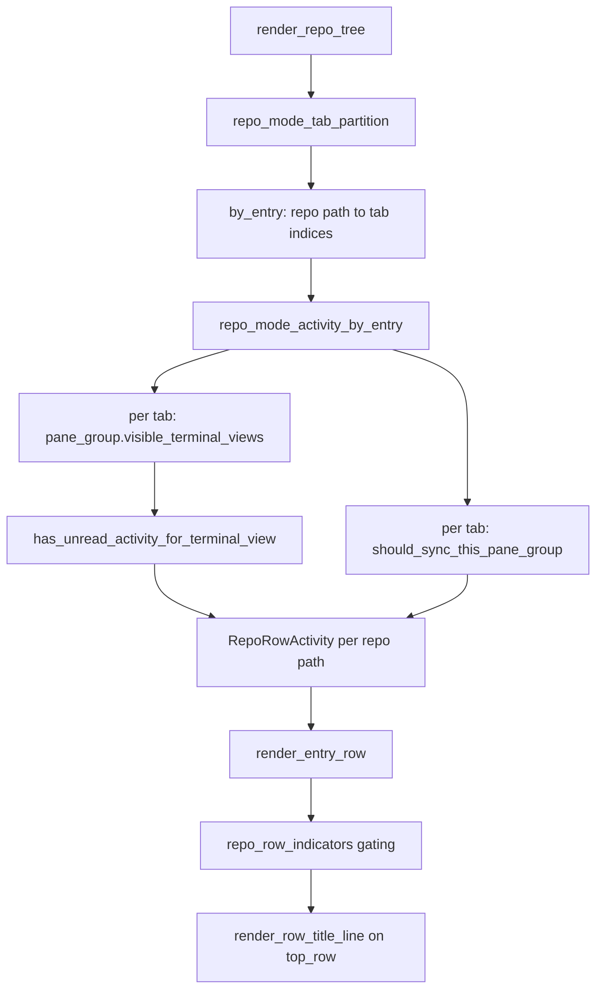

# Repo Mode Post-Sync Remediation - Plan

## Goal Capsule

- **Objective:** Close the three defects a post-sync review left open — repository rows carrying no activity indicator, a Linux editor launch that reports success without opening anything, and a macOS panic on a non-UTF-8 path — plus one naming mismatch in the migration directory.
- **Authority hierarchy:** Requirements (R-IDs) govern behavior. Key Technical Decisions govern mechanism within those requirements. Unit Approach fields carry unit-local detail only.
- **Execution profile:** Six independent-to-lightly-ordered units. U4 targets Linux-only code that cannot be compiled on a darwin host — land it as its own PR so a Linux CI failure does not block the rest.
- **Stop conditions:** Each names its own observation point, because neither is otherwise evaluatable from this host. **Render cost:** stop and surface if the rollup sweep departs from the bound `repo_mode_badges_by_entry`'s own comment already sets — one sweep across all entries per frame, never an N×M per-row walk; any per-row walk is the trigger. **Linux launch:** Linux CI is the evaluation point, and U4's tests must enumerate the field-code-less `Exec` shapes (`editor`, `%c`-only, `%%`-only) whose fallback behavior is being accepted; stop and surface if a `.desktop` entry that legitimately opens without a path argument turns out to reach the new error path.
- **Tail ownership:** The implementer owns test authoring per unit. Verification commands are in the Verification Contract.

---

## Product Contract

### Summary

Repository rows in the Repositories sidebar gain a rollup of the unread-activity and synced-inputs state of the tabs they hide when collapsed. The Linux `.desktop` launcher learns to tell whether the target path actually reached the command, so a launch that opened an empty editor stops being reported as a success. The macOS JetBrains launcher stops panicking on a path that is not valid UTF-8. The `manual_position` migration directory is renamed to say so.

### Problem Frame

Upstream PR #14697 added a synced-inputs link indicator to vertical-tab rows. Repo mode predates it and renders repository rows through its own path, so those rows carry neither the new indicator nor the older unread-activity dot.

That gap is not cosmetic. Selecting a repository collapses every other repository's tab block, and `repo_mode_visible_tab_indices` filters the horizontal tab strip down to the selected repository. For a terminal living in a repository the user has not selected, the nested row that would carry its indicator is not rendered, and the horizontal tab that would carry it is filtered out. What survives differs by state: unread activity is still carried by the notification mailbox — a global unread badge on the Inbox button plus an "All tabs" list whose entries navigate straight to the terminal — so what repo mode loses there is per-repository locality. Synchronized inputs has no such fallback: once the strip is filtered, that state is represented on no surface at all.

Separately, two defects sit in the external-editor launch paths. On Linux, `DesktopEntry::build_command` substitutes the target path only where the `Exec` string contains a `%f`/`%F`/`%u`/`%U` field code, and `process_field_code` pushes nothing when the substitution fails — a non-UTF-8 path for `%f`, or a `canonicalize` failure for `%u`. Either way `build_command` returns `Ok`, the spawn succeeds, and `open_file_path_with_line_and_col` returns `OpenOutcome::Editor`. The user sees an empty editor window, the file-manager fallback is skipped, and `telemetry_target_for` records a successful IDE launch. On macOS, `jetbrains_command` calls `.to_str().expect("full path exists")` — the only place in that module that does not use `to_string_lossy()`.

Finally, the migration directory that adds the `manual_position` column is named `2026-08-07-000000_add_manual_order_to_projects`, so a reader searching the migrations tree by column name cannot find it.

### Requirements

**Sidebar activity rollup**

- R1. A collapsed live repository row shows the unread-activity dot when any terminal in the tabs bound to that repository has unread activity.
- R2. A collapsed live repository row shows the synced-inputs link icon when any pane group among those tabs has synchronized inputs enabled and tab indicators are turned on. When synchronized inputs are enabled window-wide (`SyncedPanes::All`), that condition holds for every pane group in the window, so the icon appears on every live collapsed row at once — it reports a window-level state, not a per-repository one.
- R3. The rollup counts only terminals that would render their own row if the repository were expanded.
- R4. An expanded repository row shows no rollup — its nested rows carry their own indicators.
- R5. A dead repository row shows no rollup.
- R6. A row with nothing to roll up renders exactly as it does today.

**External editor launch integrity**

- R7. On Linux, an editor launch whose command never received the target path is treated as a failed launch: the file-manager fallback runs and no editor launch is recorded.
- R8. On macOS, launching a JetBrains IDE with a path that is not valid UTF-8 does not panic.

**Repository hygiene**

- R9. The migration directory that adds `manual_position` names that column.

### Scope Boundaries

#### Deferred to follow-up work

- **Consolidating `render_pane_row`'s non-terminal branch into `render_row_title_line`** (`app/src/workspace/view/vertical_tabs.rs:3633-3665`). The branch duplicates the helper's layout, so an indicator added to the helper later would silently skip Settings, Notebook, and Code rows. It is latent only — `shows_synced_inputs_indicator` short-circuits on `is_terminal_row`, so no indicator can reach those rows today. Consolidating is not free: with no indicator to show, the branch wraps the title in a `MainAxisSize::Max` `SpaceBetween` row with a `Shrinkable`, while the helper returns the title unwrapped. That is the common case on a visible surface, so the change trades a real layout-regression risk for a benefit that does not exist yet.
- **The macOS non-UTF-8 path in `command_executable_and_arguments` and `jetbrains_command`.** R8 removes the panic in `jetbrains_command`, but both functions still lossily convert a path they cannot represent and launch anyway — the silent-no-op class R7 removes on Linux. Making either launcher decline such a path would require the function to return a failure the caller can act on, which ripples into `Editor::open`. Out of scope here.

#### Examined and deliberately not changed

- **The drag-versus-reset guard** (`app/src/workspace/view/repo_mode_model.rs:1067`). A window that never rendered a stored order keeps `repo_mode_saw_stored_order` false for its lifetime, so a drag in that window after another window resets the order writes the whole session pin. That pin is what the window displays, and `merge_dragged_row` documents the behavior: with nothing stored, the pin is the order the user is looking at. Suppressing it recreates the bug commit `071b51a6e` fixed.
- **Migration ordering.** `2026-07-19-000000_add_repo_mode_columns` sorts before upstream's `2026-07-29-035801_add_team_uid_to_windows`, so a database upgraded through both ends up with a different physical column order than a freshly created one. Harmless — Diesel emits explicit column lists and no raw SQL targets these tables. This is a different directory from the one U6 renames, and KTD7's reasoning applies to it equally: re-timestamping it would make it pending again and its `ADD COLUMN` would fail.
- **`Project`'s `AsChangeset` without `treat_none_as_null`.** Clearing `manual_position` through `save_project` would no-op, but the only clearing path is `clear_project_manual_order`, which writes the NULL directly.
- **`repo_row_position_id`'s fixed-key SipHash** (`app/src/workspace/view/repo_sidebar.rs:143`). A fixed-key 64-bit hash is not one-way against a guessable candidate set, but no code path emits element ids.
- **Unread activity originating in off-tree child-agent panes.** R3 and KTD2 exclude it from the rollup, so a background sub-agent's unread state — including a `Blocked` agent waiting on approval — puts no dot on its repository row and stays reachable only through the notification mailbox. KTD2 accepts this deliberately: including it would put a dot on a collapsed row that vanishes with nothing behind it once the user expands.

#### Outside this plan

- `skills-lock.json`'s uncommitted hash bump. A working-tree decision, not implementation work.

---

## Planning Contract

### Key Technical Decisions

- KTD1. **Gate the rollup on `is_selected`, not `repo_tab_block_visible`.** Governs R4. `repo_tab_block_visible(is_selected, entry_drag_active)` also folds every block away for the duration of a repository drag, per the existing repository-drag behavior. Keying the rollup on it would make indicators appear on every row mid-gesture, changing row content while the user is dragging. `is_selected` is the expansion state alone.

- KTD2. **Source the rollup from `PaneGroup::visible_terminal_views`, not `terminal_views`.** Governs R3. `terminal_views` includes off-tree child-agent panes, which never render a row. Using it would put a dot on a collapsed row that vanishes with nothing behind it once the user expands. `visible_terminal_views` matches what `render_groups` renders. Note this diverges from `repo_mode_badges_by_entry`, which uses `terminal_views`; the badge sweep answers a different question (git state of the repo's terminals) where off-tree panes are legitimate contributors.

- KTD3. **Compute the rollup in its own sweep, not by extending `RepoModeEntryBadges`.** The badge sweep is skipped entirely when both badge settings are off, and it filters out dead and remote entries. An activity rollup must inherit neither restriction: it is not user-configurable, and a remote repository's bound tabs carry unread state like any other.

- KTD4. **Live rows route `top_row` through `render_row_title_line`; dead rows keep today's shape.** Governs R5, R6. The helper returns its title untouched when both indicator flags are false, so a live row with nothing to show renders byte-identically to today. Dead rows already own their trailing edge with an `Expanded` spacer and the "Remove" button, and already skip the meta line — they keep the existing construction.

- KTD5. **On Linux, the field-code processor reports whether it substituted the target path, and `build_command` fails when it did not.** Governs R7. The processor is the only code that knows whether a path argument was pushed; `build_command` is the only code that can turn that into a launch failure. Returning an error there routes through `folder_command`'s existing `report_error!` arm and `open_file_path_with_line_and_col`'s existing fallback — no new failure plumbing. (session-settled: user-directed — chosen over leaving both external-editor defects for upstream: fixing them in a fork costs recurring merge conflicts in files upstream touches often, but a known defect left in place is the larger cost.)

- KTD6. **On macOS, use `to_string_lossy()`.** Governs R8. This is the module's established idiom — `command_executable_and_arguments`'s directory branch (`mac.rs:165`) and `format_file_path_with_line_and_column` (`mac.rs:320`) both use it. `jetbrains_command` is the sole outlier. Note what this does and does not buy: APFS and HFS+ enforce UTF-8 filenames, so the inputs that actually reach the `expect` come from volumes macOS mounts but does not police — exFAT, FAT32, SMB, NFS. On exactly those, `to_string_lossy()` substitutes U+FFFD and hands JetBrains a path that does not exist, trading a panic for a launch that silently opens nothing. That is the right trade for R8 (a panic is strictly worse), but it leaves a residual in the same failure class R7 removes on Linux — see the Scope Boundaries deferral.

- KTD7. **The migration rename touches the descriptive suffix only; the `2026-08-07-000000` prefix is untouched.** Governs R9. Diesel derives the stored version from the prefix digits with separators stripped — verified against `crates/integration/tests/data/three_tabs.sqlite`, which stores `20240327185228` for directory `2024-03-27-185228_…`. A changed prefix makes the migration pending again on every database that already ran it, and `ALTER TABLE projects ADD COLUMN manual_position` then fails with `duplicate column name`, propagating out of `setup_database` so the app cannot open its database. (session-settled: user-approved — chosen over re-timestamping the directory while renaming it: a fresh prefix would read as tidier, but tidiness is cosmetic and the failure mode is not.)

- KTD8. **Split the rollup gating into a pure function.** Both test files in this area test pure functions with no `AppContext` — `vertical_tabs_tests.rs` covers `shows_synced_inputs_indicator`, `repo_sidebar_tests.rs` covers `repo_tab_block_visible`, `repo_row_is_draggable`, and `repo_row_click_action`. A gating decision entangled with the pane walk would be untestable in this repo's style.

### High-Level Technical Design

Rollup gating, as a total function of the row's state:

| `is_dead` | `is_selected` | `show_indicators` | any unread | any synced | Dot | Link icon |
|---|---|---|---|---|---|---|
| true | — | — | — | — | no | no |
| false | true | — | — | — | no | no |
| false | false | — | true | — | yes | — |
| false | false | true | — | true | — | yes |
| false | false | false | — | true | — | no |
| false | false | — | false | false | no | no |

The link icon follows `show_indicators` because `shows_synced_inputs_indicator` does; the unread dot does not, because `render_row_title_line`'s callers pass `has_unread_activity` ungated. The rollup mirrors the row behavior rather than inventing its own.

Data flow for one render of the sidebar:

### Assumptions

- A repository's bound tabs are discoverable entirely through `repo_mode_tab_partition`. No tab reaches a repository row by another route.
- Walking `visible_terminal_views` once per bound tab per render is cheap enough at sidebar scale. The badge sweep already performs a comparable walk, and the existing comment on it records that per-row walks were the shape that was too slow.

---

## Implementation Units

### U1. Roll up unread and synced-inputs state per repository entry

**Goal:** Produce, for each registered repository, whether any of its bound tabs has unread terminal activity and whether any has synchronized inputs enabled.

**Requirements:** R1, R2, R3

**Dependencies:** U2 — `has_unread_activity_for_terminal_view` is private in `vertical_tabs.rs` and U1 cannot compile until U2 promotes it.

**Files:**
- `app/src/workspace/view/repo_mode_model.rs` (add `RepoRowActivity` and `Workspace::repo_mode_activity_by_entry`)
- `app/src/workspace/view/repo_mode_model_tests.rs` (tests)

**Approach:**
1. Add a `RepoRowActivity { any_unread: bool, any_synced: bool }` value type deriving `Clone`, `Copy`, `Debug`, `Default`.
2. Add `pub(super) fn repo_mode_activity_by_entry(&self, entry_paths: &[PathBuf], app: &AppContext) -> HashMap<PathBuf, RepoRowActivity>`, placed next to `repo_mode_badges_by_entry` and following its sweep shape: partition once, then walk each entry's tab indices.
3. For each tab index, resolve `self.tabs.get(index)`, then walk `tab.pane_group.as_ref(app).visible_terminal_views(app)` per KTD2, and OR in `has_unread_activity_for_terminal_view(terminal_view.id(), app)`.
4. For the synced flag, read `SyncedInputState::as_ref(app).should_sync_this_pane_group(tab.pane_group.id(), tab.pane_group.window_id(app))` once per tab — a tab has exactly one pane group.
5. Short-circuit per entry once both flags are true.
6. Import `has_unread_activity_for_terminal_view` from `vertical_tabs`, which U2 promotes to `pub(super)`. Do not duplicate the notification lookup, and do not perform the promotion here — it belongs to U2, and doing it in both units produces conflicting diffs on the same line.

**Patterns to follow:** `repo_mode_badges_by_entry` (`repo_mode_model.rs:1590`) for the sweep shape and the `app: &AppContext`-last parameter convention used throughout these files. `build_vertical_tabs_summary_data` (`vertical_tabs.rs:3884`) for the `has_unread_activity |= …` rollup idiom.

**Test scenarios:**
- A repository with one bound tab whose terminal has unread activity reports `any_unread`.
- A repository with several bound tabs reports `any_unread` when only the last tab's terminal has activity.
- A repository with bound tabs and no unread activity anywhere reports neither flag.
- A repository with no bound tabs is absent from the returned map, and the caller reads a default `RepoRowActivity` for it.
- A tab whose pane group has synchronized inputs enabled sets `any_synced` for its repository and not for a sibling repository.
- An entry path that is not in the partition is absent from the returned map rather than present with default flags.

The off-tree child-agent exclusion is **not** tested here. Constructing such a pane needs `PaneGroup::insert_terminal_pane_hidden_for_child_agent` (private) or `create_hidden_child_agent_conversation` (`pub(crate)` inside the private `mod child_agent`), neither of which is visible from `repo_mode_model_tests`. The case is already pinned one layer down, at the function KTD2 delegates to: `pane_group/mod_tests.rs::test_insert_hidden_child_agent_pane_keeps_focus_and_active_session` asserts `visible_terminal_views` excludes the hidden child pane. Cite that as the backing coverage.

**Verification:** `repo_mode_activity_by_entry` returns flags consistent with what the nested rows would show for the same repository when expanded.

---

### U2. Expose the row-indicator helpers to the repo sidebar

**Goal:** Make PR #14697's indicator helpers reachable from `repo_sidebar.rs` without duplicating their layout.

**Requirements:** R1, R2, R6

**Dependencies:** none

**Files:**
- `app/src/workspace/view/vertical_tabs.rs` (visibility changes only)

**Approach:**
1. Change `render_row_title_line`, `shows_synced_inputs_indicator`, and `has_unread_activity_for_terminal_view` from `fn` to `pub(super) fn`.
2. Leave `row_shows_synced_inputs_indicator` private — it takes `PaneProps`, which a repository row has no way to construct.
3. Leave `render_title_indicator` and `render_synced_inputs_indicator` private — U3 reuses the whole cluster through `render_row_title_line` rather than assembling the icons itself.
4. Add nothing else. This unit changes no behavior.

**Patterns to follow:** the existing `pub(super)` exports this module already provides to `repo_sidebar.rs` — `render_git_branch_text`, `render_passive_terminal_diff_stats_badge`, `terminal_pull_request_badge_label`, `render_terminal_pull_request_badge`, and `METADATA_ROW_HEIGHT`.

**Test scenarios:** Test expectation: none — visibility-only change with no behavioral surface. The existing `shows_synced_inputs_indicator` tests in `vertical_tabs_tests.rs` continue to cover it.

**Verification:** `cargo check -p warp --lib` passes with no new warnings, in particular no dead-code warning for a helper that became `pub(super)` without a caller yet.

---

### U3. Render the activity rollup on collapsed repository rows

**Goal:** Show the rolled-up indicators on a live repository row whose tab block is collapsed.

**Requirements:** R1, R2, R4, R5, R6

**Dependencies:** U1, U2

**Files:**
- `app/src/workspace/view/repo_sidebar.rs`
- `app/src/workspace/view/repo_sidebar_tests.rs`

**Approach:**
1. Add a pure gating function beside `repo_tab_block_visible` per KTD8:
   `pub(super) fn repo_row_indicators(is_dead: bool, is_selected: bool, show_indicators: bool, activity: RepoRowActivity) -> RepoRowIndicators`, implementing the decision table in the Planning Contract. Declare `RepoRowIndicators { synced: bool, unread: bool }` alongside it in `repo_sidebar.rs`, deriving `Clone`, `Copy`, `Debug`, `Default`, `PartialEq` so tests can assert on it whole. Route the synced arm through `shows_synced_inputs_indicator` rather than re-deriving its condition, passing `true` for its `is_terminal_row` parameter: every tab `repo_mode_activity_by_entry` walks reaches the rollup through a repo-mode tab group, which repo mode's own tab-creation path always seeds with a terminal.
2. In `render_repo_tree`, call `repo_mode_activity_by_entry` once for all entry paths — not per row, and not gated on the badge settings that gate `badge_paths`.
3. Read `show_indicators` as `*TabSettings::as_ref(app).show_indicators.value()` — it is a settings value, not a bare bool — hoisted alongside the existing `show_diff_stats` and `show_pr_link` reads.
4. Thread **both** the per-entry `RepoRowActivity` and the hoisted `show_indicators: bool` into `render_entry_row` as new parameters — the function's signature ends at `app_appearance: &Appearance` and carries no `AppContext`, so neither value is reachable at that call site otherwise. It already carries `#[allow(clippy::too_many_arguments)]`.
5. In `render_entry_row`, compute the indicators and build `top_row`'s first child as `render_row_title_line(leading.finish(), indicators.synced, indicators.unread, theme)` per KTD4. Leave the `is_dead` branch that follows unchanged.

**Technical design (directional):** for a live row the composition becomes `top_row := Flex::row(Max, Center, spacing 6) [ render_row_title_line(leading, synced, unread, theme) ]`. When both flags are false the helper returns `leading` unwrapped and the row is structurally what it is today.

**Patterns to follow:** the meta line at `repo_sidebar.rs:829-833` for the `SpaceBetween` + `Shrinkable` trailing-edge shape, which is the same shape `render_row_title_line` produces. Test naming follows the sentence style already in `repo_sidebar_tests.rs` (`a_dead_rows_body_click_never_removes_the_entry`).

**Test scenarios:**
- A collapsed live row with unread activity and no synced inputs shows the dot and not the link icon.
- A collapsed live row with synced inputs and indicators enabled shows the link icon.
- A collapsed live row with synced inputs and indicators disabled shows no link icon, and still shows the dot when there is unread activity.
- A selected (expanded) row shows neither indicator regardless of the activity flags.
- A dead row shows neither indicator regardless of the activity flags.
- A collapsed live row with no activity produces the same indicator state as a row with default `RepoRowActivity` — neither flag set.
- Both flags set produces both indicators.

**Verification:** With repo mode on and a repository unselected, a terminal in that repository receiving agent activity puts a dot on its repository row; selecting the repository moves the dot to the nested terminal row and clears it from the parent.

---

### U4. Treat a Linux editor launch that never received the path as a failure

**Goal:** Stop reporting a successful editor launch when the target path never reached the spawned command.

**Requirements:** R7

**Dependencies:** none

**Files:**
- `app/src/util/file/external_editor/linux.rs`
- `app/src/util/file/external_editor/linux_tests.rs`

**Approach:**
1. Add a `DesktopExecError` variant for the case — the target path was never substituted into the command.
2. Change `build_command`'s `field_code_processor` bound so the closure reports whether it substituted the target path. Only the `f`/`F`/`u`/`U` codes report true, and only on success: `%f`/`%F` fail on a non-UTF-8 path, `%u`/`%U` fail when `canonicalize` fails.
3. In `build_command`, track whether any processed field code reported a substitution, and return the new error when none did. This also covers an `Exec` string carrying no path field code at all.
4. Update all three `build_command` closures: `build_default_command`'s call to `process_field_code`, `build_jetbrains_command`'s inline match, and `build_sublime_command` (`linux.rs:297`, live for `Editor::Sublime` at `linux.rs:591`), which drops the path on the same `file_path.to_str()` failure. Changing `build_command`'s `field_code_processor` bound breaks all three types, so all three must move together. Change `process_field_code`'s signature to return the flag rather than adding a parallel function — the `c`/`i`/`k` arms return false.
5. `process_field_code` matches on a `char`, so its existing catch-all arm cannot be made exhaustive: turn `_ => {}` into `_ => false` rather than enumerating. Elsewhere in the new code, avoid a `_` wildcard per the repo's exhaustive-matching convention.

**Execution note:** Write the `build_command` tests first. The behavior is a pure function of the `Exec` string and the path, `linux_tests.rs` already covers `tokenize_exec` and command building, and the code cannot be exercised by hand on a darwin host.

**Patterns to follow:** the existing `DesktopExecError` variants and their `thiserror` messages; the existing `build_command` tests in `linux_tests.rs`.

**Test scenarios:**
- An `Exec` of `editor %f` with a valid path builds a command carrying that path.
- An `Exec` of `editor` with no field code returns the new error rather than a command.
- An `Exec` of `editor %c` (localized name only) returns the new error.
- An `Exec` of `editor %u` with a path that does not exist returns the new error, because `canonicalize` fails.
- An `Exec` of `editor %i %f` with an icon set builds a command carrying both the icon arguments and the path.
- The JetBrains variant with `Exec` carrying no path field code returns the new error.
- The Sublime variant with `Exec` carrying no path field code returns the new error.
- An `Exec` of `editor %%` (literal percent) returns the new error — a literal percent is not a path substitution.

Test at the `build_*_command` layer, which is where a crafted `Exec` string is injectable — the shape every existing test in `linux_tests.rs` already uses, building metadata directly with `EditorMetadata::try_new`. Do **not** test through `folder_command`: it resolves metadata through the process-global `INSTALLED_EDITOR_METADATA` `OnceLock`, which is filled by scanning real `.desktop` files, so on a runner with no editor installed it returns `None` for the ordinary missing-editor reason and the assertion passes without exercising the new error path at all.

**Verification:** `folder_command` returns `None` when `build_command` errors, which makes `open_file_path_with_line_and_col` fall through to `ctx.open_file_path`, returning `OpenOutcome::FileManager` — so `telemetry_target_for` records the file manager rather than the IDE.

---

### U5. Stop the macOS JetBrains launcher panicking on a non-UTF-8 path

**Goal:** Remove the only `expect` in the macOS editor-launch path.

**Requirements:** R8

**Dependencies:** none

**Files:**
- `app/src/util/file/external_editor/mac.rs`
- `app/src/util/file/external_editor/mac_tests.rs`

**Approach:** Replace `full_path.to_str().expect("full path exists").to_string()` in `jetbrains_command` with `full_path.to_string_lossy().into_owned()`, per KTD6. The `expect` message describes existence, which is not what `to_str` checks — removing the call removes the misleading message with it.

**Patterns to follow:** `command_executable_and_arguments`'s directory branch (`mac.rs:165`) and `format_file_path_with_line_and_column` (`mac.rs:320`), which already convert paths this way.

**Test scenarios:**
- `jetbrains_command` with a path built from invalid UTF-8 bytes returns a command rather than panicking. Build the path with `std::os::unix::ffi::OsStrExt::from_bytes` — `jetbrains_command` is private but `mac_tests.rs` is a child module of `mac.rs`, so it is reachable.
- The same call with a line number returns `--line`, the number, and the path, in that order.

**Verification:** `cargo nextest run -p warp --lib` passes and no `expect` remains in `mac.rs`'s command construction.

---

### U6. Rename the manual-position migration directory to match its column

**Goal:** Make the migration findable by the column name it adds.

**Requirements:** R9

**Dependencies:** none

**Files:**
- `crates/persistence/migrations/2026-08-07-000000_add_manual_order_to_projects/` → `crates/persistence/migrations/2026-08-07-000000_add_manual_position_to_projects/`

**Approach:** Rename the directory with `git mv`, keeping the `2026-08-07-000000` prefix exactly as-is per KTD7. Move both `up.sql` and `down.sql` unchanged. No source file references the directory name — `MIGRATIONS` is an `EmbeddedMigrations` built by macro from the directory tree, so the rename is picked up on rebuild.

**Test scenarios:** Test expectation: none — a directory rename with no content change and no code reference.

**Verification:** The stored migration version is unchanged, so an existing database reports no pending migrations. Confirm by opening a database that already ran the migration and checking that `__diesel_schema_migrations` still holds `20260807000000` and no `ALTER TABLE` runs.

---

## Verification Contract

| Gate | Command | Applies to |
|---|---|---|
| Compile | `cargo check -p warp --lib` | U1, U2, U3, U5, U6 |
| Tests | `cargo nextest run -p warp --lib --no-fail-fast` | U1, U3, U5 |
| Format | `./script/format` | all |
| Pre-PR | `./script/presubmit` | all |
| Linux CI | repository CI on a Linux runner | U4 |

`cargo test` is not the gate here. This repo relies on `cargo nextest` for process isolation; running the app crate's suite under `cargo test` produces roughly a dozen failures from shared global state in `experiments`, `server::telemetry`, and `terminal::view` that do not reproduce under nextest.

**U4 cannot be verified on a darwin host.** `app/src/util/file/external_editor/linux.rs` is gated `#[cfg(any(target_os = "linux", target_os = "freebsd"))]`, and the only installed target is `aarch64-apple-darwin`. Cross-checking would need `rustup target add` plus a cross C toolchain for the bundled native dependencies. Land U4 as its own PR so a Linux CI failure does not hold up the other units.

---

## Definition of Done

**Global**

- Every requirement R1-R9 is satisfied or explicitly deferred in this document.
- `cargo check -p warp --lib` passes with no new warnings.
- `cargo nextest run -p warp --lib --no-fail-fast` passes.
- `./script/format` produces no diff.
- No abandoned or experimental code from approaches that did not work out remains in the diff.
- The changelog entry follows `.github/pull_request_template.md`.

**Per unit**

| Unit | Done when |
|---|---|
| U1 | The rollup sweep returns flags matching what expanded nested rows show; the child-agent-pane exclusion rides on the existing `visible_terminal_views` coverage in `pane_group/mod_tests.rs`. |
| U2 | The three helpers are `pub(super)`, nothing else changed, and no dead-code warning appears. |
| U3 | Collapsed live rows show the rollup, expanded and dead rows do not, and a row with no activity renders as before. |
| U4 | A command that never received the path is an error in all three `build_*_command` closures, `folder_command` returns `None` for it, and the new tests pass on Linux CI. |
| U5 | A non-UTF-8 path builds a command instead of panicking, and no `expect` remains in `mac.rs` command construction. |
| U6 | The directory is renamed, the stored migration version is unchanged, and no migration re-runs. |
