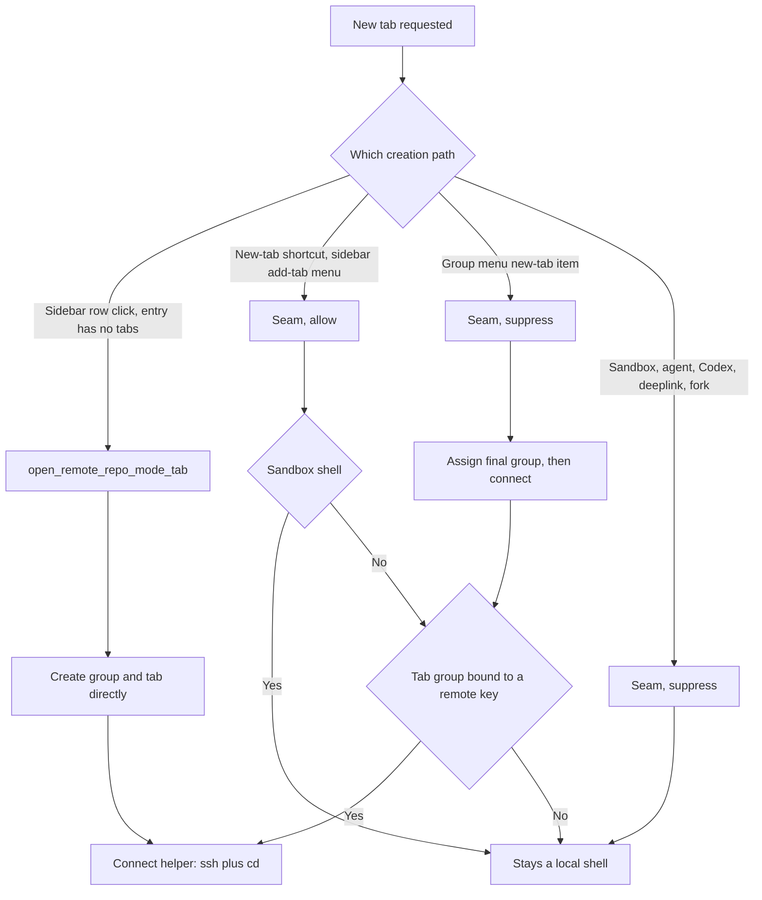

# Remote Repository New Tab - Plan

## Goal Capsule

- **Objective:** Every terminal the user opens under a remote repository entry runs on that remote host, not only the first one — and nothing else does.
- **Product authority:** This plan owns tab creation under a selected remote entry. It does not revisit how the first tab connects, how remote entries are added or probed, or how remote rows render.
- **Authority hierarchy:** Product Contract requirements win on behavior. Key Technical Decisions win on mechanism within those requirements. Implementation Units override neither.
- **Execution profile:** Bounded fix inside repo mode. Four units, dependency-ordered. Behavior is gated by the existing `FeatureFlag::RepoMode`; no new flag, no new dependency, no migration.
- **Stop conditions:** Stop and report if the fix cannot stay inside the repo-mode glue inventory recorded in `docs/plans/2026-07-19-001-feat-repo-mode-sidebar-plan.md` (R9) — that inventory exists to keep rebases onto upstream master routine. Stop if the shared seam turns out to fire for the entry's first tab, since that would mean a double `ssh` rather than a missing one.
- **Tail ownership:** Work ends at a commit on this branch. This checkout does not open pull requests.
- **Open blockers:** None.

---

## Product Contract

**Product Contract preservation:** restructured; one scoped amendment. R8 and R9 were added to state behavior the original contract left unstated — which tabs must *not* connect, and which group a group-menu tab connects to. R6 was narrowed by user decision: it read as though deselecting an entry forces the next tab local, which the default tab placement does not do; see the Key Decision governing it. R1-R5 and R7 are unchanged in wording and meaning.

### Summary

Make remote repository entries behave like the machine they name: a terminal the user opens under a selected remote entry connects to that entry's host and lands in its remote path. Today only the entry's very first tab does, so every tab after it is a local shell filed under a remote row. Tabs that another feature creates on the user's behalf — a sandboxed shell, an agent session, an external link — stay local.

### Problem Frame

Remote repository support was specified around a single moment — selecting an entry opens a tab that connects to the host and ends up in the entry's path (`docs/plans/2026-07-23-001-feat-remote-repository-ssh-plan.md:70`). Tab creation *after* that first tab was never specified, and the connect sequence was wired only into the branch of entry-selection that runs when the entry has no tabs yet.

The result is not a missing feature but a mislabeled one. New-tab creation independently routes a tab into the selected entry's group, so a tab created by the keyboard shortcut or the sidebar's add-tab menu appears nested under the remote repository row, carries its name, and filters with it — while running a local shell. The user asks for a second terminal on a machine and gets one on their laptop, with nothing in the UI saying so.

The gap is reached by ordinary use, not an edge case: a second terminal on a working repository is routine, and every route to one fails the same way.

### Key Decisions

- **Connect automatically instead of adding a separate "new remote terminal" command.** (session-settled: user-directed — chosen over an explicit menu item: a remote entry names a machine, so a tab opened under it belongs on that machine.) Governs R1, R2.
- **Group membership is the trigger, not the affordance.** The behavior keys off a new tab resolving into a remote entry's group, so it covers every way the user can open a terminal rather than being patched into each one. Governs R2, R9.
- **The user must have asked for a terminal.** Automatic connection follows from the user opening a terminal, not from a tab happening to land in a remote group. A tab another feature creates keeps whatever shell that feature intended. Governs R8.
- **Landing in a remote group is what counts, however the tab got there.** (session-settled: user-directed — chosen over having deselection force the next tab local: a tab that inherits a remote group renders inside that group, so leaving it local would reproduce the bug this plan fixes.) A tab that inherits the active tab's remote group connects even with no entry selected. Governs R6, AE11.
- **Reuse the first tab's connect-and-land sequence unchanged.** This work changes when that sequence fires, not what it does, so warpification handling and quoting stay as shipped. Governs R4.

### Requirements

**Connecting new tabs**

- R1. A tab created while a remote repository entry is selected connects to that entry's host and lands in its remote path, whether or not the entry already has tabs.
- R2. R1 holds for every affordance that files a new tab into the selected entry's group, including the new-tab keyboard shortcut, the sidebar add-tab menu, and the tab group menu's new-tab item.
- R3. A tab connected under R1 belongs to the entry's tab group exactly as the entry's first tab does, and filters with it.
- R4. Landing in the remote path uses the same route the entry's first tab uses, including its behavior when SSH warpification is disabled.

**Behavior at the boundary**

- R5. Selecting a remote entry that already has tabs activates its most recently used tab and creates nothing.
- R6. A tab created while no repository entry is selected and no grouped tab is active stays a local shell outside every entry group, including one opened from the sidebar's "Other tabs" section. Deselecting an entry does not by itself make the next tab local: under the default tab placement a new tab still inherits the active tab's group, and a tab that lands in a remote group connects under R1.
- R7. An `ssh` session the user starts by typing it into a terminal joins no entry group.

**Tabs that must not connect**

- R8. A tab created on another feature's behalf never connects, even when it lands in a remote entry's group. This covers a sandboxed shell, an agent-seeded session, a session opened from an external link, and a forked conversation.
- R9. A tab created from a tab group's menu connects to the group it ends up in, never to the entry that happened to be selected when it was created, and connects at most once.

### Acceptance Examples

- AE1. **Covers R1, R2.** Given a remote entry with one connected tab is selected, when the user presses the new-tab shortcut, then the new tab connects to the same host and lands in the entry's remote path.
- AE2. **Covers R2.** Given a remote entry is selected, when the user opens a tab from the sidebar add-tab menu, then that tab connects to the entry's host.
- AE3. **Covers R3.** Given a tab created under AE1, when the sidebar renders, then that tab appears under the entry's row like the entry's first tab.
- AE4. **Covers R4.** Given SSH warpification is disabled, when a second tab opens under a remote entry, then it reaches the entry's remote path by the same route the first tab uses.
- AE5. **Covers R5.** Given a remote entry with two tabs, when the user clicks its sidebar row, then the most recently used of those tabs is activated and no tab is created.
- AE6. **Covers R6.** Given no repository entry is selected and a loose tab is active, when the user presses the new-tab shortcut, then a local shell opens outside every entry group.
- AE7. **Covers R7.** Given the user types `ssh` by hand to the same host and path, when that session starts, then it appears outside every entry group.
- AE8. **Covers R8.** Given a remote entry is selected, when a Docker sandbox tab opens, then it runs its sandbox shell and no `ssh` is sent to it.
- AE9. **Covers R8.** Given a remote entry is selected, when a tab opens from an external `warp://` link, then it runs locally and no `ssh` is sent to it.
- AE10. **Covers R9.** Given remote entry A is selected, when the user picks the group menu's new-tab item on remote entry B's group, then exactly one connection is made and it goes to B.
- AE11. **Covers R1, R6.** Given a remote entry's tab is active but the entry's sidebar row is not selected, when the user presses the new-tab shortcut, then the new tab joins that entry's group and connects to its host.

### Scope Boundaries

- **Sharing one SSH connection across a remote entry's tabs.** Warp's SSH wrapper keys its control path to the session id (`app/assets/bundled/bootstrap/bash_body.sh:1039`), so each tab opens its own master. Five remote tabs means five handshakes, and a passphrase-protected key can prompt on each. Accepted for this fix. Note this cost is created here: today a remote entry has exactly one connecting tab, so a passphrase prompt fires once per entry.
- **Split panes inside a remote tab.** A pane opened beside a remote shell stays local. This plan covers tabs only.
- **A tab dragged into a remote entry's group after it was created.** The connect decision is made at creation; a later regrouping does not re-run it.
- **Tabs that carry no terminal.** A cloud-agent tab and the tab-config surface bypass the seam this plan hooks, so no code excludes them explicitly.
- **Restoring remote tabs as connected sessions after a relaunch.** Unchanged. Restore does not route through the connect decision.
- **How remote entries are added, probed, or rendered.** Unchanged.

### Dependencies / Assumptions

- Assumes the shipped first-tab connect-and-land sequence is correct as-is. If it is not, that is a separate defect against the remote SSH plan, not this one.
- Assumes a remote entry's tab group is bound to its remote key, so a tab's group identifies the host and path to connect to. Verified: `TabGroup.repo_root` (`app/src/workspace/tab_group.rs:36`) holds the registry key verbatim for remote entries.
- The connect decision is opt-in per call site (KTD6), so a tab-creation route added later stays local until someone adds it to the allowlist. That is the intended failure direction.

### Outstanding Questions

**Deferred to Planning — resolved**

- What a connecting tab shows before the remote shell is ready. Resolved: identical to the first tab, because U1 reuses that sequence rather than adding a second one.
- Whether a new tab should react to the entry's last probe having failed. Resolved: it attempts the connection regardless and lets `ssh` report the failure, matching the first-tab path, which also does not gate on probe state.
- Whether the sidebar's "New tab group" item should produce a remote tab under a selected remote entry. Resolved: no. It creates a fresh group with no `repo_root`, so it is not on the allowlist.

**Deferred to implementation**

- Whether a tab created under a remote entry while the default session mode is Agent should enter agent view over the connected shell, or fall back to a plain terminal like the entry's first tab. The seam enters agent view after the connect call, so today it would be agent view over the remote shell. Confirm during the smoke; change only if it reads wrong.

### Sources / Research

- `docs/plans/2026-07-23-001-feat-remote-repository-ssh-plan.md` — the remote SSH plan. R12 (line 70) specifies only entry *selection*; R14 and R15 (lines 72-73) own the grouping rules R3 and R7 preserve here. KTD10 (line 175) records the command-injection defect that was found and fixed in the interactive `ssh` line, and the quoting rule that resulted.
- `docs/plans/2026-07-19-001-feat-repo-mode-sidebar-plan.md:66-91` — R9, the repo-mode glue inventory. Its `app/src/workspace/view.rs` row already sanctions "new-tab routing" as a thin flag-gated call site with logic in additive modules.
- `app/src/workspace/view/repo_mode_model.rs:1247-1311` — entry selection; the remote connect path is reached only from the branch that runs when the entry has no tabs.
- `app/src/workspace/view/repo_mode_model.rs:1392-1474` — the connect-and-land sequence R4 reuses.
- `app/src/workspace/view.rs:13294` — where a new tab resolves its group; a selected repo-mode entry captures new tabs regardless of the tab-placement setting.
- `app/src/workspace/view.rs:5072`, `:5105`, `:13102`, `:13176`, `:19756`, `:19904`, `:24642` — every direct caller of the seam. All seven pass `DefaultSessionModeBehavior::Ignore`, so no existing parameter separates user-opened terminals from feature-opened ones.
- `app/src/workspace/view.rs:13205-13210` — `is_docker_sandbox`, already computed inside the seam.
- `app/assets/bundled/bootstrap/bash_body.sh:1029-1064` — the SSH wrapper's control-master handling, behind the first Scope Boundaries item.
- `crates/repo_mode/src/entry.rs:407-464` and `crates/repo_mode/src/entry_tests.rs:485` — the command builders and the test pinning the KTD10 quoting fix. This plan moves where those builders are called, never how they build.

---

## Planning Contract

### Key Technical Decisions

- KTD1. **Connect at the shared new-terminal-tab seam, not at each affordance.** Hook `add_new_session_tab_internal_with_default_session_mode_behavior` (`app/src/workspace/view.rs:13188`) right after it creates the tab, beside the existing docker-sandbox post-creation block at `view.rs:13245-13261`. That one site is downstream of every terminal-bearing creation route, including all three affordances R2 names. It has seven direct callers, so which of them connect is a separate decision — KTD6. The seam is also safe from double emission on the first-tab path: `open_remote_repo_mode_tab` reaches `add_tab_with_pane_layout` directly through `create_repo_mode_group_with_tab` (`app/src/workspace/view/repo_mode_model.rs:1357`) and never passes through it. Governs R1, R2.
- KTD2. **Read the remote target from the new tab's resolved group, not from `selected_repo_root`.** `activate_tab_internal` runs `sync_repo_mode_selection_to_active_tab` (`app/src/workspace/view/repo_mode_model.rs:1194`), which can clear the selection during tab creation, so the selection is not a reliable source at the seam. The group is: `TabGroup.repo_root` carries the registry key, and `parse_remote_key` turns it into a `RemoteTarget`. Governs R2, R3.
- KTD3. **The group menu suppresses the seam and connects after its own assignment.** A tab created by `new_tab_in_group` (`app/src/workspace/view.rs:7888`) does not merely lack a group at seam time — it can carry the *wrong* one. `new_tab_index_and_group` hands it the selected entry's group, or the active tab's group, never the group the menu targeted. Connecting at the seam would therefore reach the wrong host and then reach the right one, producing two `ssh` lines and two `cd` subscriptions in one shell. So `new_tab_in_group` suppresses the seam connect and calls the connect once, after `group_id` is final, in every branch. Governs R9.
- KTD4. **Extract the connect step from `open_remote_repo_mode_tab` into a helper both paths call.** Split its terminal lookup, warpification branch, and command emission (`app/src/workspace/view/repo_mode_model.rs:1400-1427`) into a helper that acts on the active tab. The first-tab path keeps calling it after creating its group; the new-tab path calls the same helper. One implementation means R4 holds by construction. Governs R4.
- KTD5. **Test the target-resolution decision; verify emission by smoke.** (session-settled: user-approved — chosen over asserting the emitted `ssh` command: nothing in the test harness observes `execute_command_or_set_pending`, and no existing test asserts SSH emission.) Tests assert that a given tab resolves to the expected `RemoteTarget` and lands in the right group; that the command then ran is confirmed by the manual smoke. Where a test would otherwise need to count emissions, it asserts the structural precondition instead — whether the connect call site is reached at all. Governs R1, R2, R4, R9.
- KTD6. **Auto-connect is opt-in per call site, with the allowlist enumerated here.** The seam serves seven callers, and the only parameter that might have separated them does not: all seven pass `DefaultSessionModeBehavior::Ignore`. Without an explicit opt-in, a Docker sandbox tab would `ssh` out of the sandbox it exists to provide, and a tab opened from a `warp://` deeplink or the Codex modal would get an `ssh` line queued into a terminal an agent is about to drive — a link click could open an authenticated session to a production host. So the seam takes a new two-valued parameter defaulting to suppress, passed through `add_new_session_tab_with_default_mode`, and set to allow at exactly three sites: the new-tab keyboard action, the sidebar add-tab menu's terminal item, and the sidebar's shell-picker item. Every other caller passes suppress, and the seam additionally refuses to connect when its already-computed `is_docker_sandbox` is true. Governs R8.

### High-Level Technical Design

Two gates decide whether a new tab connects: did the user ask for a terminal, and did the tab land in a remote group.

The connect helper at `E` is the shipped sequence, unchanged. The new work is the two gates and the edges that reach them.

### Assumptions

- The seam's caller set is the seven sites listed in Sources, verified against the current tree. KTD6's allowlist names three of them; the other four are suppressed explicitly rather than by omission, so adding an eighth caller later fails closed.
- `active_tab_pane_group` returns the newly created tab at the seam. `add_tab_with_pane_layout` activates the new tab before returning, which is what the two existing post-creation consumers at that site already rely on.

---

## Implementation Units

### U1. Extract the remote connect step into a shared helper

- **Goal:** Make the first tab's connect-and-land sequence callable against whatever tab is currently active.
- **Requirements:** R4. KTD4.
- **Dependencies:** none.
- **Files:**
  - `app/src/workspace/view/repo_mode_model.rs`
  - `app/src/workspace/view/repo_mode_model_tests.rs`
- **Approach:**
  1. Move the body of `open_remote_repo_mode_tab` after `create_repo_mode_group_with_tab` — terminal lookup, warpification read, `land_in_remote_path_when_connected`, command emission — into a private helper taking the `RemoteTarget`.
  2. Leave `open_remote_repo_mode_tab` as group creation plus a call to the helper.
  3. Keep the existing `log::warn!` for the no-terminal case inside the helper so both callers report it the same way.
- **Patterns to follow:** the existing post-creation terminal lookup shape used at `app/src/workspace/view.rs:13245-13261`.
- **Test scenarios:**
  - Selecting a remote entry with no tabs still creates a group whose `repo_root` equals the remote key and binds the new tab to it — the existing assertion in `test_remote_entry_opens_a_tab_bound_to_its_key` continues to pass unchanged.
  - Selecting the same remote entry twice reuses the one bound group rather than creating a second.
- **Verification:** `open_remote_repo_mode_tab` contains no emission logic of its own, and the repo-mode test module passes with no edits to its existing expectations.

### U2. Resolve a remote target from a tab group

- **Goal:** Answer "is this tab's group bound to a remote host, and which one" from a `TabGroupId`.
- **Requirements:** R2, R3. KTD2, KTD5.
- **Dependencies:** none.
- **Files:**
  - `app/src/workspace/view/repo_mode_model.rs`
  - `app/src/workspace/view/repo_mode_model_tests.rs`
- **Approach:**
  1. Add a model method that reads `TabGroup.repo_root` for the given group and returns `Option<RemoteTarget>` via `parse_remote_key`.
  2. Return `None` when repo mode is disabled, matching the guard every other repo-mode entry point opens with.
  3. Keep it visible to the workspace module only; the view layer calls it, nothing else needs it.
- **Patterns to follow:** the group-to-`repo_root` reads at `app/src/workspace/view/repo_mode_model.rs:1750-1754` and `:1805`; the `parse_remote_key` fork at `:1302-1305`; the `Self::repo_mode_enabled()` guard at `:1248`.
- **Test scenarios:**
  - A group bound to a remote key resolves to a target carrying that key's host, port, user, and remote path.
  - A group bound to a local repository path resolves to `None`.
  - A group with no `repo_root` resolves to `None`.
  - An unknown group id resolves to `None`.
  - With the repo-mode flag off, a group bound to a remote key resolves to `None`.
- **Verification:** each case above asserts on the returned `Option<RemoteTarget>` directly, with no terminal or command involved.

### U3. Connect user-opened terminal tabs at the shared seam

- **Goal:** A terminal the user opens by shortcut or from the sidebar add-tab menu connects when it lands in a remote entry's group — and nothing else does.
- **Requirements:** R1, R2, R3, R4, R6, R8. KTD1, KTD2, KTD6.
- **Dependencies:** U1, U2.
- **Files:**
  - `app/src/workspace/view.rs`
  - `app/src/workspace/view/repo_mode_model.rs`
  - `app/src/workspace/view/repo_mode_model_tests.rs`
- **Approach:**
  1. Add a two-valued parameter to `add_new_session_tab_internal_with_default_session_mode_behavior` and to `add_new_session_tab_with_default_mode`, which passes it through. Suppress is the value every existing call site gets by default.
  2. Set it to allow at the three sites KTD6 names: the new-tab keyboard action (`view.rs:13051`), the sidebar add-tab menu's terminal item (`view.rs:24642`), and the shell-picker item (`view.rs:13156`). Pass suppress explicitly at the other four direct callers and at `create_new_tab_group` and `create_local_fork`.
  3. Add one flag-gated model method that reads the active tab's `group_id`, resolves it through U2, and calls U1's helper when a target comes back.
  4. Call it once from the seam, after the tab is created, when the parameter allows and the seam's existing `is_docker_sandbox` is false.
- **Execution note:** the parameter threading is mechanical and wide; the decision logic is not. Land the threading first as a no-op change with every site suppressed, confirm the build is clean, then add the model method and flip the three allow sites. The repo-mode glue inventory asks for thin call sites in `view.rs` with logic in additive modules — each call site here is one argument token plus one call.
- **Patterns to follow:** the flag-gated repo-mode call already present in `new_tab_index_and_group` (`app/src/workspace/view.rs:13294-13298`).
- **Test scenarios:**
  - Covers AE1. With a remote entry selected and one tab already bound to it, creating another terminal tab binds it to the same group and resolves it to the entry's remote target.
  - Covers AE2. The same holds for a tab created through the sidebar add-tab menu's terminal action.
  - Covers AE6. With no entry selected and a loose tab active, a new terminal tab carries no group and resolves to no target.
  - Covers AE11. With no entry selected but a remote entry's tab active, a new terminal tab inherits that group and resolves to its remote target.
  - Covers AE8. A tab created with a Docker sandbox shell while a remote entry is selected reaches no connect call, even though its group resolves to a remote target.
  - Covers AE9. A tab created through the deeplink path while a remote entry is selected reaches no connect call.
  - With a *local* entry selected, a new terminal tab joins that entry's group and resolves to no target.
  - The first-tab path still emits exactly once: opening a remote entry that has no tabs does not route through the seam, so no second connect is attempted.
  - With the repo-mode flag off, a new terminal tab carries no group and resolves to no target.
- **Verification:** the new tab's group binding, its allow-or-suppress value, and its resolved target match the entry in each case. Existing tab-placement and group-inheritance tests in `app/src/workspace/view_tests.rs` still pass.

### U4. Connect tabs created through the group menu

- **Goal:** The group menu's new-tab item connects to the group it targeted, once, whatever entry was selected at the time.
- **Requirements:** R2, R9. KTD3, KTD5.
- **Dependencies:** U3.
- **Files:**
  - `app/src/workspace/view.rs`
  - `app/src/workspace/view/repo_mode_model_tests.rs`
- **Approach:**
  1. Pass suppress from `new_tab_in_group` (`app/src/workspace/view.rs:7888`) so the seam never connects a tab this path created — including the branch where the tab inherited the target group already.
  2. After `group_id` is final in both branches, call the same model method U3 added.
- **Patterns to follow:** the existing late-assignment branch at `app/src/workspace/view.rs:7911-7917`.
- **Test scenarios:**
  - Covers AE10. With remote entry A selected, the group menu's new-tab item on remote group B leaves the tab bound to B and resolving to B's target — not A's.
  - The same action on a local repository group resolves to no target.
  - The seam is not the connect site for this path: a tab created by the group menu carries suppress, so the number of connect call sites reached stays one regardless of which branch assigned the group.
- **Verification:** each case asserts the tab's final `group_id` and its resolved target. The once-only property is asserted structurally, per KTD5 — the tab carries suppress at the seam, so only the post-assignment call site can connect it. Emission itself is proven by the group-menu smoke steps.

---

## Verification Contract

| Gate | Command | Applies to |
|---|---|---|
| Repo-mode unit tests | `cargo nextest run -p warp repo_mode` | U1, U2, U3, U4 |
| Workspace tab tests | `cargo nextest run -p warp workspace::view` | U3, U4 |
| Command-builder tests | `cargo nextest run -p repo_mode` | U1 — pins the quoting invariants the emission depends on |
| Format | `./script/format` | all |
| Lint | `cargo clippy --workspace --all-targets --all-features --tests -- -D warnings` | all |
| Full presubmit | `./script/presubmit` | before commit |

**Manual smoke (required — covers AE1, AE2, AE4, AE6, AE8, AE9, AE10, AE11).** Automated tests stop at target resolution per KTD5, so the connections themselves are proven by hand against a real host. Steps 6-8 are the ones no automated gate can reach.

1. Add a remote repository entry and select it. Confirm the first tab connects and lands in the entry's path.
2. Press the new-tab shortcut. Confirm the second tab connects to the same host and lands in the same path.
3. Open a third tab from the sidebar add-tab button. Confirm the same.
4. Turn off `warpify.ssh.enable_ssh_warpification`, open another tab, and confirm it still reaches the entry's remote path.
5. Activate a loose tab under "Other tabs", then open a new tab. Confirm it is a local shell outside every entry group.
6. Add a second remote entry. With the first selected, use the second's group menu new-tab item. Confirm exactly one `ssh` runs and it goes to the second entry's host.
7. With a remote entry selected, open a Docker sandbox tab. Confirm it runs its sandbox shell and no `ssh` is sent.
8. With a remote entry selected, open a tab from a `warp://` link. Confirm it runs locally and no `ssh` is sent.
9. Click a remote entry's tab so the tab is active but the sidebar row is not selected, then open a new tab. Confirm it joins that entry's group and connects.

---

## Definition of Done

**Global**

- R1 through R9 hold, with R5 and R7 verified as unchanged rather than newly implemented.
- Every gate in the Verification Contract passes, including all nine manual smoke steps.
- All decision and emission logic lives in `app/src/workspace/view/repo_mode_model.rs`. The `app/src/workspace/view.rs` diff is the two connect call sites U3 and U4 add, plus the mechanical allow-or-suppress argument on the seam's callers — no branching logic in any of them.
- No new feature flag, cargo feature, dependency, or migration.
- No abandoned experimental code remains in the diff.

**Per unit**

- U1: `open_remote_repo_mode_tab` delegates its connect half to the shared helper, and the existing remote-entry tests pass without edits to their expectations.
- U2: all five resolution cases pass.
- U3: a second user-opened tab under a selected remote entry resolves to that entry's target; sandbox and deeplink tabs reach no connect call; a tab created with no entry selected and no grouped tab active resolves to none; the first-tab path does not route through the seam.
- U4: the group menu's new-tab item resolves to the target group's remote entry even when a different remote entry is selected, and the seam is not a connect site for that path.
